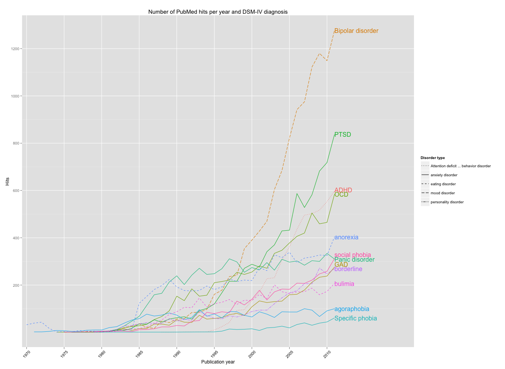

## Introduction

I an earlier post I used `ggplot2` to plot publication count by
year for different psychotherapy orientations. I'm using an updated
version of that R-code in this post to plot publication count for
several major DSM-IV disorders. It's basically like a very simple
discourse analysis.

## The search string

I searched for the following disorders: Depression, Bipolar disorder,
Post-Traumatic Stress Disorder (PTSD), Attention-Deficit/Hyperactivity
Disorder (ADHD), Obsessive-Compulsive Disorder (OCD), Anorexia nervosa,
Bulimia nervosa, Social phobia, Panic disorder, Generalized anxiety
disorder (GAD), Borderline personality disorder, Agoraphobia and
Specific phobia. The following PubMed queries were used:

*PubMed Search String*

-   Depression[Title/Abstract] (186815 hits)
-   Bipolar disorder[Title/Abstract] (12341 hits)
-   Post-Traumatic Stress Disorder[Title/Abstract] (4294 hits)
-   Attention-Deficit/Hyperactivity Disorder[Title/Abstract] (5121 hits)
-   Obsessive-Compulsive Disorder[Title/Abstract] (7172 hits)
-   Anorexia nervosa[Title/Abstract] (8634 hits)
-   Bulimia nervosa[Title/Abstract] (3547 hits)
-   "Social phobia" OR "social anxiety disorder"[Title/Abstract] (3418
    hits)
-   "Panic disorder" OR "panic attack"[Title/Abstract] (8542 hits)
-   Generalized anxiety disorder[Title/Abstract] (2965 hits)
-   Borderline personality disorder[Title/Abstract] (3116 hits)
-   Agoraphobia[Title/Abstract] (2352 hits)
-   Specific phobia[Title/Abstract] (424 hits)

## Results — the plots



*Figure 1*. ggplot with DSM-IV Axis 1 disorders PubMed publication
count by year.

Depression removed and plot zoomed in.  
 

*Figure 1*. ggplot with DSM-IV Axis 1 disorders PubMed publication
count by year (depression removed).

## Conclusion

The word depression is really mentioned much much more often than the
other disorders in articles title/abstracts. Among the other disorders
there seem to be that some disorders have become more popular in the
last decade. Bipolar disorder, PTSD, ADHD and OCD seem to have gotten
some extra attention compared to the remaining disorders. Especially
bipolar disorder appear to really have become the "it" diagnosis in the
last decade. From what I've heard from psychologists and psychiatrists
working in the swedish psychiatry there seem to be some validity to this
conclusion.

## Changes to the R code

I made some changes to the R code since.
Since I'm importing and reading publication year from individual data
files for each disorder, I changed the code to bind each new disorder to
the previous one, generating one variable in `long format`. It would
have made a lot of redundant code to plot each disorder on it's own
`ggplot2-layer`. I also updated the `scrape.pubmed()`-function to now
accept two arguments, where I specified disorder and disorder type (like
mood disorder or anxiety disorder). Another change is that I'm now using
`direct.label()` to remove the legend from `ggplot` and add labels
direct to the plot.

## The actual code used

```r
library(stringr) # used for str_extract()
library(ggplot2) # used for plotting
library(plyr) # used for count()
 
#########################
#### Scrape function ####
#########################
scrape.pubmed <- function(x,y) {
  results <- pubmed_result[5]
  results <- results[results != "ShortDetails"]
  year <- str_extract(results, "(19[0-9]{2}|20[0-1][0-9])")
  count <- count(year[year < 2012])
  count$cat <- x
  count$type <- y
  return(count)
}
 
########################
#### scrape pubmed #####
########################
 
# read.delim is used on some files because the csv wouldn't be read
# correctly. Excel was used to save the csv-files as tab delim. files.
 
# borderline
pubmed_result <- read.delim("~/Downloads/pubmed_borderline.txt")
data.long <- scrape.pubmed("borderline","personality disorder")
 
# ADHD
pubmed_result <- read.csv("~/Downloads/pubmed_ADHD.csv", row.names = NULL)
data.long <- rbind(data.long, 
             scrape.pubmed("ADHD","Attention deficit ... behavior disorder"))
 
# Depression
pubmed_result <- read.delim("~/Downloads/pubmed_depression.txt")
data.long <- rbind(data.long, scrape.pubmed("depression","mood disorder"))
 
# Bulimia
pubmed_result <- read.csv("~/Downloads/pubmed_bulimia.csv", row.names = NULL)
data.long <- rbind(data.long, scrape.pubmed("bulimia","eating disorder"))
 
# Anorexia
pubmed_result <- read.csv("~/Downloads/pubmed_anorexia.csv", row.names = NULL)
data.long <- rbind(data.long, scrape.pubmed("anorexia", "eating disorder"))
 
# GAD
pubmed_result <- read.csv("~/Downloads/pubmed_gad.csv", row.names = NULL)
data.long <- rbind(data.long, scrape.pubmed("GAD", "anxiety disorder"))
 
# PTSD
pubmed_result <- read.csv("~/Downloads/pubmed_ptsd.csv", row.names = NULL)
data.long <- rbind(data.long, scrape.pubmed("PTSD", "anxiety disorder"))
 
# OCD
pubmed_result <- read.csv("~/Downloads/pubmed_ocd.csv", row.names = NULL)
data.long <- rbind(data.long, scrape.pubmed("OCD", "anxiety disorder"))
 
# Specific phobia
pubmed_result <- read.csv("~/Downloads/pubmed_specific_phobia.csv", 
                          row.names = NULL)
data.long <- rbind(data.long, scrape.pubmed(
                              "Specific phobia", "anxiety disorder"))
 
# Agoraphobia
pubmed_result <- read.csv("~/Downloads/pubmed_agoraphobia.csv", row.names = NULL)
data.long <- rbind(data.long, scrape.pubmed("agoraphobia", "anxiety disorder"))
 
# Panic disorder
pubmed_result <- read.csv("~/Downloads/pubmed_panic.csv", row.names = NULL)
data.long <- rbind(data.long, scrape.pubmed("Panic disorder", "anxiety disorder"))
 
# Bipolar disorder
pubmed_result <- read.delim("~/Downloads/pubmed_bipolar.txt")
data.long <- rbind(data.long, scrape.pubmed("Bipolar disorder", "mood disorder"))
 
# Social phobia
pubmed_result <- read.csv("~/Downloads/pubmed_socialphobia.csv", row.names = NULL)
data.long<- rbind(data.long, scrape.pubmed("social phobia", "anxiety disorder"))
 
###############
#### plot #####
###############
 
# Used for a plot without depression.
data.long <- data.long[data.long$cat != "depression",]
 
# Custom linetypes
line.type <- c("anxiety disorder" = "solid",
               "mood disorder" = "longdash",
               "eating disorder" = "dashed",
               "personality disorder" = "twodash",
               "Attention deficit ... behavior disorder" = "dotted"
               )
 
# Ggplot syntax, saved in 'p' for use with direct.label()
p <- ggplot(data.long, aes(x, freq, group = cat, color = cat, linetype=type)) + 
  geom_line() +
  scale_x_discrete(breaks = seq(1900,2011,5), 
                   limits=as.character(seq(1970,2021))) +
  opts(title="Number of PubMed hits per year and DSM-IV diagnosis",
       axis.text.x=theme_text(angle=45)) +
  xlab("Publication year") +
  ylab("Hits") +
  scale_linetype_manual("Disorder type", values=line.type)
 
# Use direct.label with the saved ggplot-syntax, to get direct labels after
# each line. 
direct.label(p, "last.bumpup")
```

