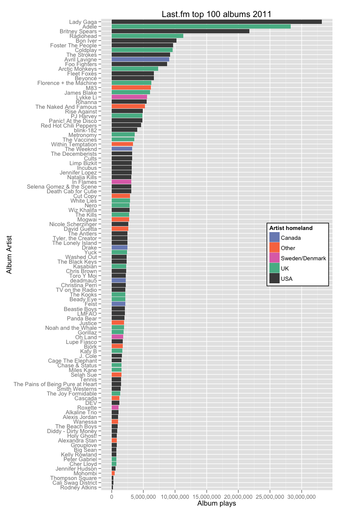

I found out that last.fm had made data files available for their Best of 2011 artist list, and I thought it’d be a great opportunity to learn some more about data management in R and Ggplot2.
I began by downloading and importing the `tab separated data file` from last.fm (TSV).

```r  
# read data
lastfm <- read.delim("~/Downloads/bestof_2011_tsv/bestof_2011_releases.tsv")
```  

Then I did some data cleanup, because one row just contained junk and
some columns were unnecessary. I also removed all entries after row
100. 

```r  
# remove row 541 'cause it's just junk
lastfm <- lastfm[-541,] 
# remove unnecessary columns
lastfm <- lastfm[-c(3, 5)]
# remove all rows after 100
lastfm <- lastfm[-c(101:nrow(lastfm)) , ]
```

I did a search for missing values, but none were found. 

```r  
which(lastfm == "NULL", arr.ind = TRUE)
which(is.na(lastfm), arr.ind = TRUE)
```  

The XML-file contained information about artists location. So I loaded
it and cleaned it up a bit. The location column was a bit messy so I
edited manually in *statas* data editor, I figured it was the easiest
way. I then read the edited data file back into R and combined that
`data.frame` with the rest of the data from the TSV-file.  

```r  
library(XML)
last.xml <- xmlToDataFrame("~/Downloads/bestof_2011_xml/bestof_2011_releases.xml")
last.xml <- last.xml[-c(101:nrow(last.xml)) , ]
last.xml <- last.xml[-c(1,4,5,6,7,8,9)]
write.dta(last.xml, "stata", version = 7L)
 
# read stata-file
library(foreign)
last.xml <- read.dta(file="/Users/Kris/stata.dta")
# combine data.frames
lastfm <- cbind(lastfm, location = last.xml$location)
```

I tried plotting this `data.frame` with ggplot but the location
variable contained 17 countries, which made a messy plot. Therefore I
choose to group some countries under the label "other".  

```r  
lastfm$location <- as.character(lastfm$location)
lastfm$location[lastfm$location %in% c("Denmark", "Sweden")] <- "Sweden/Denmark"
lastfm$location[lastfm$location %in% c("Germany",
                                       "France","Paris","Australia",
                                       "New Zealand",
                                       "Iceland","Brazil", "Scotland",
                                       "Democratic Republic of the Congo",
                                       "Romania","Belgium",
                                       "Netherlands")] <- "Other"
```  

I still wasn't satisfied with the plot, because it wasn't sorted after
album plays. I tried quite a lot of different methods of sorting the
`data.frame` before figuring out how to do it successfully with
`reorder()`.  

```r  
lastfm$artist.name <- reorder(lastfm$artist.name, rowSums(lastfm[4]))
```  

I wanted my plot to have readable decimal notation so I created my own
x-breaks.  

```r  
library(scales)
x.breaks <- cbreaks( 
  c(0, max(lastfm$album.plays)), #range: 0 to album.plays max
  pretty_breaks(10), # 10 ticks
  labels = comma_format()) # create labels with commas, ie 10,000. 

```

I also used my own custom colors for the plots legend, which I saved in
a list before initiating `ggplot2`.  

```r  
location.color <- c("Canada" = "#7b8dbf",
                    "Other" = "#f97850",
                    "Sweden/Denmark" = "#df72b6",
                    "UK" = "#57b894",
                    "USA" = "#4a4a4a"
                    )
)  
```

Then, at last, I drew the plot with `ggplot2`.

```r  
library(ggplot2)
ggplot(lastfm, aes(artist.name,album.plays, fill=location)) + 
  geom_bar(stat="identity") + 
  coord_flip() + # flip x and y
  xlab("Album Artist") + 
  ylab("Album plays") +  
  # Use the labels and breaks I defined earlier
  scale_y_continuous(breaks = x.breaks$breaks, labels = x.breaks$labels) + 
  # Add a plot title
  opts(title = "Last.fm top 100 albums 2011", 
       # Move the legend inside the plot to save space. 
       legend.position=c(.85, .5), 
       # Change it's background to white. 
       legend.background=theme_rect(fill="#ffffff")) +
  # Use my custom color scale which I defined earlier.        
  scale_fill_manual("Artist homeland", values = location.color)
```  


We can see that the plot is dominated by USA and UK and that Adele and
Lady Gaga got exponentially more album plays than the rest. To give a
summary of `$location` I used `summary()`.  

```r  
summary(as.factor(lastfm$location)) 
```  

Which gave the following:  
```rout 
Canada          Other     Sweden/Denmark      UK            USA 
  5             13              4             24             54 
```
