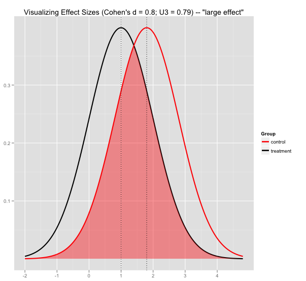
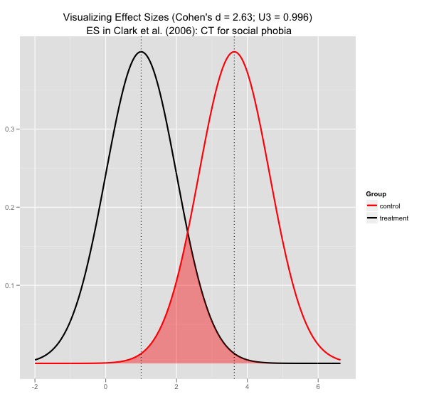

**Update:** I have created an interactive effect size visualization [here](http://rpsychologist.com/d3/cohend)

Introduction to effect sizes
----------------------------

Many times you read in a study that “x and y were significantly
different, *p* < .05”, which is another way of saying that “assuming
that the null hypothesis is true, the probability of getting the
observed value simply by chance alone is less than 0.05” But that’s not
really that interesting, though is it? Say you are reading an
intervention study that are comparing a treatment group to a control
group, I bet you are more interested in finding out the amount of
difference between the groups, rather than the chances of the
differences popping up under the null hypothesis. Luckily it’s getting
more and more common to also report effect sizes in addition to
*p*-values. Effect sizes, in this case, are metrics that represent the
amount of differences between two sample means. One of the most common
effect size measure in psychology is Cohen’s *d* or *the standardized
mean difference*. As you can see by the name it’s a measure of the
standardized difference between two means. Commonly Cohen’s *d* is
categorized in 3 broad categories: 0.2–0.3 represents a small effect, ~0.5 a medium effect and over 0.8 to infinity represents a large effect. What that means is that with two samples with a standard
deviation of 1, the mean of group 1 is 0.8 sd away from the other
group’s mean if Cohen’s *d* = 0.8. That might sound very intuitive to
some, but I find it’s more explanatory to present different *d* values
visually. Which is really easy to do in R statistical software.

Some quick R code to visualize Cohen’s *d*
------------------------------------------

The thing I actually wanted to try out here was to shade the overlapping
area of the two distributions. It turned to be pretty easy to do in R.  

```r
require("ggplot2")
 
# Standardized Mean Difference (Cohen's d)
ES <- 0.8
# get mean2 depending on value of ES from d = (u1 - u2)/sd
mean1 <- ES*1 + 1
# create x sequence
x <- seq(1 - 3*1, mean1 + 3*1, .01)
# generate normal dist #1
y1 <- dnorm(x, 1, 1)
# put in data frame
df1 <- data.frame("x" = x, "y" = y1)
# generate normal dist #2
y2 <- dnorm(x, mean1, 1)
# put in data frame
df2 <- data.frame("x" = x, "y" = y2)
# get y values under overlap
y.poly <- pmin(y1,y2)
# put in data frame
poly <- data.frame("x" = x, "y" = y.poly)
 
# Cohen's U3, proportion of control > 50th perc. treatment
u3 <- 1 - pnorm(1, mean1,1)
u3 <- round(u3,3)
 
# plot with ggplot2
ggplot(df1, aes(x,y, color="treatment")) +
  # add line for treatment group
  geom_line(size=1) + 
  # add line for control group
  geom_line(data=df2, aes(color="control"),size=1) +
  # shade overlap
  geom_polygon(aes(color=NULL), data=poly, fill="red", alpha=I(4/10),
               show_guide=F) +
  # add vlines for group means
  geom_vline(xintercept = 1, linetype="dotted") + 
  geom_vline(xintercept = mean1, linetype="dotted") + 
  # add plot title
  opts(title=paste("Visualizing Effect Sizes 
      (Cohen's d = ",ES,"; U3 = ",u3,")", sep="")) +
  # change colors and legend annotation
  scale_color_manual("Group", 
           values= c("treatment" = "black","control" = "red")) +
  # remove axis labels
  ylab(NULL) + xlab(NULL)
```

And some plots of the different effect size values
--------------------------------------------------





A "large" effect size really look insignificant compared to the
ridiculously large effect size reported by Clark et al. (2006) in their
study *Cognitive Therapy Versus Exposure and Applied Relaxation in
Social Phobia: A Randomized Controlled Trial*

