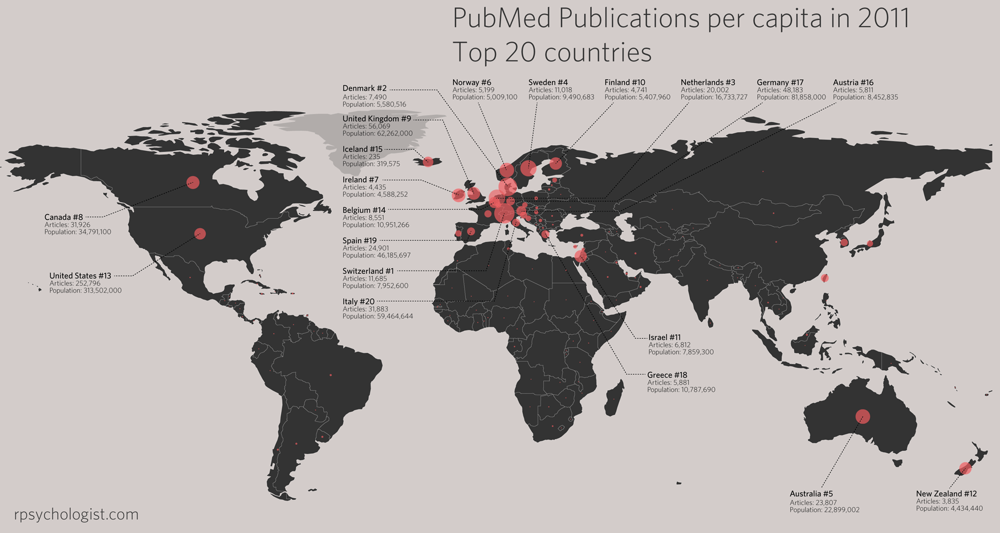

Introduction
------------

I had this idea that it’d be fun to look at all PubMed's articles from
2011 and extract country affiliation for each individual country. So I
set out to do just that, but in addition to just look at 2011 I also
looked at proportional change in publication 1980–2010 for the top 20
countries. The data for 2011 is visualized on a world map both as a
bubble plot and as a heat map.

It turned that this project weren’t as straightforward as I first had
anticipated. Mainly because PubMed’s affiliation field is a veritable
mess with no apparent reporting standard. I imagine there are databases
who are much more suited to this task than PubMed.

Method
------

There were 986 427 articles published in PubMed in 2011; so I,
naturally, used R to extract national publication counts. I did this by
downloading all citations into one 8.37 Gb XML-file, imported the
affiliation strings into `MySQL` and then used R to extract country
affiliation using `grep` and `regular expressions`.

To avoid unnecessary manual work I used lists of country names, U.S
state & university names, India states and Japan universities. I also
looked at word frequencies for the affiliations strings that couldn’t be
matched, and used this to make additional pattern lists. Lastly, I also
used mail-suffixes to extract affiliation.

Reliability
-----------

To find out how many mismatches my script perfomed, I drew a random
sample (n = 2000) and manually screened for errors. 22 errors were
found, and all of them entailed the string being matched to the correct
country plus one incorrect country, i.e. this string were matched to
both UK and US (because "Bristol" is matched to UK):

`Department of Biotransformation, Bristol-Myers Squibb, Route 206 and Province Line Road, Princeton, NJ 08543, USA. anthony.barros@bms.com`

It’s not really a big problem since it only occurs in 1.1 % of the
sample. The following countries had erroneous extra matches in my random
screening sample:

```
                 x  freq
    2    Australia    1
    3      Austria    1
    4        China    3
    5       France    1
    6        India    2
    7        Japan    1
    8         Oman    1
    9  Saint Lucia    2
    10          UK    8
    11         USA    2
```

Moreover 1.8% of the affiliation strings couldn’t be matched to any
country, by analyzing the word frequencies for the unmatched strings, I
concluded there didn’t appear to be any words that could be used to
identify an significant amount of countries.

Additionally, I compared the number of hits for my top 20 countries to
the corresponding hits when searching PubMed using rudimentary country
queries. These were the results:

                                                                       search      R PubMed   dif error
    1  United States of America[ad] OR United States[ad] OR US[ad] OR USA[ad] 252796 242050 10746  0.04
    2                                                               China[ad]  77614  76359  1255  0.02
    3                             UK[ad] OR United Kingdom[ad] OR England[ad]  56069  54661  1408  0.03
    4                                                               Japan[ad]  51740  48518  3222  0.06
    5                                          Germany[ad] OR Deutschland[ad]  48183  44405  3778  0.08
    6                                                              Canada[ad]  31926  29386  2540  0.08
    7                                                               Italy[ad]  31883  30971   912  0.03
    8                                                              France[ad]  31233  28832  2401  0.08
    9                                                               Spain[ad]  24901  21268  3633  0.15
    10                                                          Australia[ad]  23807  22891   916  0.04
    11                                                              Korea[ad]  23796  23778    18  0.00
    12                                                              India[ad]  23371  23093   278  0.01
    13                                                        Netherlands[ad]  20002  19602   400  0.02
    14                                               Brazil[ad] OR Brasil[ad]  18868  18223   645  0.03
    15                                                             Taiwan[ad]  12324  12321     3  0.00
    16                                                        Switzerland[ad]  11685  10320  1365  0.12
    17                                                             Sweden[ad]  11018  10506   512  0.05
    18                                                            Belgium[ad]   8551   8146   405  0.05
    19                                                             Poland[ad]   7914   6526  1388  0.18

The measurement error is a bit high in countries like Poland,
Switzerland and Spain. Nonetheless, I decided to use these PubMed quires
to look at annual publications for these countries 1980–2010, using my
[PubMed trend script][]

Results
-------

In total 202 countries were extracted, with the publication distribution
looking like this:  


## The same plot as above, but with the bubble size representing publications per capita.  

 

And a plot of the top 20 countries publication percentages 1980–2010


<del>I really don't know why USA had such a boost in the 1990s, perhaps it
got something to do with PubMed's indexing or maybe it's a consequence
of the ["1990s United States boom"][]?</del> The reason for the sudden
increase in US citations in the 90s is that prior to 1995 MEDLINE did
only record institution, city, and state including zip code for authors
affiliated with the US. So naturally, my queries will miss most US
publications prior to 1995. However, the apparent question is: when will
china surpass US in scientific output?

PS 1. Thanks to Allan Just for telling me how to extract centroid values
from the country polygons.

PS 2. My plan is to do some more in-depth analyzes if this data, e.g. to
look at publications per capita (in a vain attempt to increase Sweden's
rankings) and some traditional statistical analysis. **Update:**
Publications per capita added.

  [PubMed trend script]: http://rpsychologist.com/an-r-script-to-automatically-look-at-pubmed-citation-counts-by-year-of-publication/
    "An R Script to Automatically download PubMed Citation Counts By Year of Publication"
  ["1990s United States boom"]: http://en.wikipedia.org/wiki/1990s_United_States_boom
    "http://en.wikipedia.org/wiki/1990s_United_States_boom"
