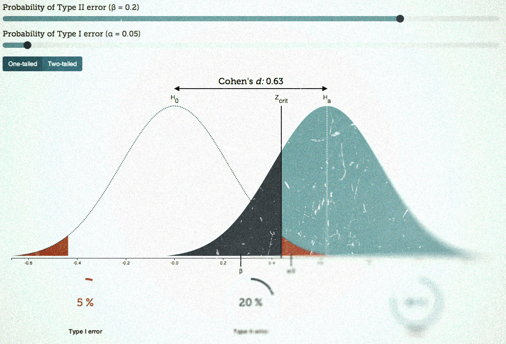

Here is a new visualization created in the same manner as my [Cohen’s d vizualisation](http://rpsychologist.com/d3/cohend). This new visualization is an interactive display of classical null hypothesis significance testing and statistical power.

The visualization should work on mobile phones and tablets, but it requires a modern browser that supports SVG. [Check it out here.](http://rpsychologist.com/d3/NHST)

