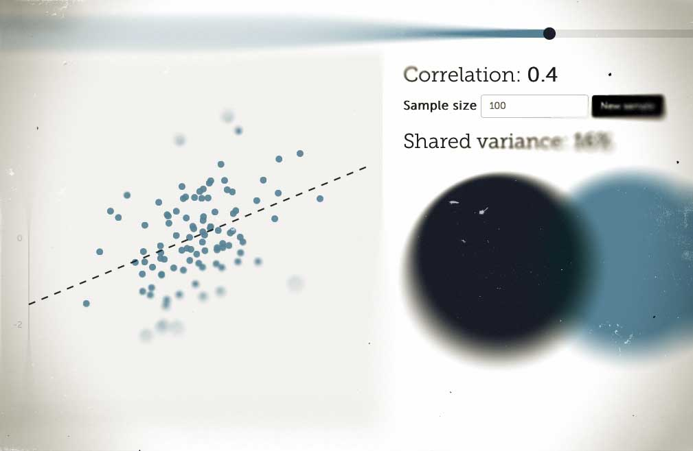

Here is a new visualization done in d3js. In this visualization I show a scatter plot of two variables with a given correlation. The variables are samples from the standard normal distribution, which are then transformed to have a given correlation by using Cholesky decomposition. By moving the slider you will see how the shape of the data changes as the association becomes stronger or weaker. [Check it out here.](http://rpsychologist.com/d3/correlation)

