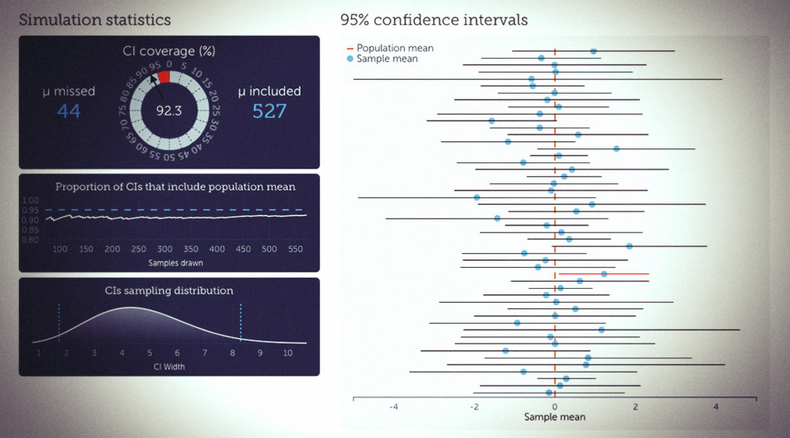

I just published a new interactive visualization in my series of basic statistical concepts and techniques. This time I have tried to explain confidence intervals for means. This visualization shows a simulation of repeated sampling from a normal distribution with mean zero and a standard deviation of two. I also show the sampling distribution of the width of CIs, which follow scaled chi-distribution. You can change the confidence level and sample size to see how the CIs change.

Check out it here: [rpsychologist.com/d3/CI/](http://rpsychologist.com/d3/CI)

