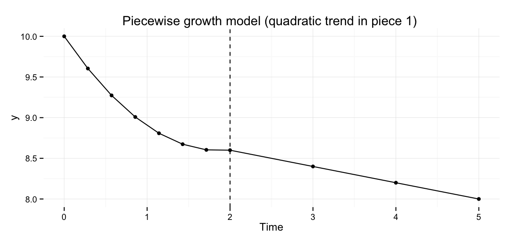

I often get asked how to fit different multilevel models (or individual growth models, hierarchical linear models or linear mixed-models, etc.) in R. In this guide I have compiled some of the more common and/or useful models (at least common in clinical psychology), and how to fit them using `nlme::lme()` and `lme4::lmer()`. I will cover the common two-level random intercept-slope model, and three-level models when subjects are clustered due to some higher level grouping (such as therapists), partially nested models were there are clustering in one group but not the other, and different level 1 residual covariances (such as AR(1)). The point of this post is to show how to fit these longitudinal models in R, not to cover the statistical theory behind them, or how to interpret them.  

# Data format
In all examples I assume this data structure. 

| subjects |  tx   | therapist | time  |   y   |
| :------: | :---: | :-------: | :---: | :---: |
|    1     |   0   |     1     |   0   |  10   |
|    1     |   0   |     1     |   1   |  12   |
|    1     |   0   |     1     |   2   |  14   |
|    2     |   0   |     1     |   0   |   4   |
|    2     |   0   |     1     |   1   |  14   |
|    2     |   0   |     1     |   2   |  13   |
|    3     |   0   |     2     |   0   |  12   |
|    3     |   0   |     2     |   1   |  15   |
|    3     |   0   |     2     |   2   |  16   |
|    4     |   0   |     2     |   0   |  17   |
|    4     |   0   |     2     |   1   |  13   |
|    4     |   0   |     2     |   2   |  12   |
|    5     |   0   |     3     |   0   |  15   |
|    5     |   0   |     3     |   1   |  13   |
|   ...    |  ...  |    ...    |  ...  |  ...  |

Where `subjects` is each subject's id, `tx` represent treatment allocation and is coded 0 or 1, `therapist` is the refers to either clustering due to therapists, or for instance a participant's group in group therapies. `Y` is the outcome variable. 

# Power analysis, and simulating these models
Most of the designs covered in this post are supported by my R package `powerlmm`, [(http://cran.r-project.org/package=powerlmm)](http://cran.r-project.org/package=powerlmm). It can be used to calculate power for these models, or to simulate them to investigate model misspecification. I will soon integrate the package into this post, in order to create example data sets. For now, see the package's vignettes for tutorials. 

# Longitudinal two-level model
We will begin with the two-level model, where we have repeated measures on individuals in different treatment groups. 


## Unconditional model
Model formulation
$$
\begin{aligned}
\text{Level 1}& \\
Y_{ij} &= \beta_{0j} + R_{ij}\\
\text{Level 2}& \\
\beta_{0j} &= \gamma_{00} + U_{0j} \\
\end{aligned}
$$
with, 
$$

U_{0j} \sim\mathcal{N}(0, ~\tau_{00}^2)
,

$$
and
$$

R_{ij} \sim\mathcal{N}(0, ~\sigma^2)

$$

To fit this model we run
```r
# lme4
lmer(y ~ 1 + (1 | subjects), data=data)

# nlme
lme(y ~ 1, random = ~ 1 | subjects, data=data)
```

## Unconditional growth model
Model formulation
$$
\begin{aligned}
\text{Level 1}& \\
Y_{ij} &= \beta_{0j} + \beta_{1j}t_{ij} + R_{ij}\\
\text{Level 2}& \\
\beta_{0j} &= \gamma_{00} + U_{0j} \\
\beta_{1j} &= \gamma_{10} + U_{1j} \\
\end{aligned}
$$
with, 
$$

\begin{pmatrix}
U_{0j} \\
 U_{1j}
\end{pmatrix}
\sim\mathcal{N}
\left(
\begin{matrix}
0 &\\
0
\end{matrix}
,
\begin{matrix}
 \tau_{00}^2 & \tau_{01}\\
 \tau_{01} & \tau_{10}^2
\end{matrix}
\right)
,

$$
and
$$

R_{ij} \sim\mathcal{N}(0, ~\sigma^2)

$$

To fit this model we run
```r
# lme4
lmer(y ~ time + (time | subjects), data=data)

# nlme
lme(y ~ time, random = ~ time | subjects, data=data)
```

 ## Conditional growth model
Model formulation
$$
\begin{aligned}
\text{Level 1}& \\
Y_{ij} &= \beta_{0j} + \beta_{1j}t_{ij} + R_{ij}\\
\text{Level 2}& \\
\beta_{0j} &= \gamma_{00} + \gamma_{01} TX_j + U_{0j} \\
\beta_{1j} &= \gamma_{10} + \gamma_{11} TX_j + U_{1j} \\
\end{aligned}
$$
with, 
$$

\begin{pmatrix}
U_{0j} \\
 U_{1j}
\end{pmatrix}
\sim\mathcal{N}
\left(
\begin{matrix}
0 &\\
0
\end{matrix}
,
\begin{matrix}
 \tau_{00}^2 & \tau_{01}\\
 \tau_{01} & \tau_{10}^2
\end{matrix}
\right)
,

$$
and
$$

R_{ij} \sim\mathcal{N}(0, ~\sigma^2)

$$

To fit this model we run
```r
# lme4
lmer(y ~ time * tx + (time | subjects), data=data)

# nlme
lme(y ~ time * tx, random = ~ time | subjects, data=data)
```

## Conditional growth model: dropping random slope
Model formulation
$$
\begin{aligned}
\text{Level 1}& \\
Y_{ij} &= \beta_{0j} + \beta_{1j}t_{ij} + R_{ij}\\
\text{Level 2}& \\
\beta_{0j} &= \gamma_{00} + \gamma_{01} TX_j + U_{0j} \\
\beta_{1j} &= \gamma_{10} + \gamma_{11} TX_j \\
\end{aligned}
$$
with, 
$$

U_{0j} \sim\mathcal{N}(0, ~\tau_{00}^2)

$$
and
$$

R_{ij} \sim\mathcal{N}(0, ~\sigma^2)

$$

To fit this model we run
```r
# lme4
lmer(y ~ time * tx + (1 | subjects), data=data)

# nlme
lme(y ~ time * tx, random = ~ 1 | subjects, data=data)
```

## Conditional growth model: dropping random intercept
Model formulation
$$
\begin{aligned}
\text{Level 1}& \\
Y_{ij} &= \beta_{0j} + \beta_{1j}t + R_{ij}\\
\text{Level 2}& \\
\beta_{0j} &= \gamma_{00} + \gamma_{01} TX_j \\
\beta_{1j} &= \gamma_{10} + \gamma_{11} TX_j + U_{1j}\\
\end{aligned}
$$
with, 
$$

U_{0j} \sim\mathcal{N}(0, ~\tau_{10}^2)

$$
and
$$

R_{ij} \sim\mathcal{N}(0, ~\sigma^2)

$$

To fit this model we run
```r
# lme4
lmer(y ~ time * tx + ( 0 + time | subjects), data=data)

# nlme
lme(y ~ time * tx, random = ~ 0 + time | subjects, data=data)
```

## Conditional growth model: dropping intercept-slope covariance
Model formulation
$$
\begin{aligned}
\text{Level 1}& \\
Y_{ij} &= \beta_{0j} + \beta_{1j}t + R_{ij}\\
\text{Level 2}& \\
\beta_{0j} &= \gamma_{00} + \gamma_{01} TX_j + U_{0j} \\
\beta_{1j} &= \gamma_{10} + \gamma_{11} TX_j + U_{1j} \\
\end{aligned}
$$
with, 
$$

\begin{pmatrix}
U_{0j} \\
 U_{1j}
\end{pmatrix}
\sim\mathcal{N}
\left(
\begin{matrix}
0 &\\
0
\end{matrix}
,
\begin{matrix}
 \tau_{00}^2 & 0\\
 0 & \tau_{10}^2
\end{matrix}
\right)
,

$$
and
$$

R_{ij} \sim\mathcal{N}(0, ~\sigma^2)

$$
To fit this model we run
```r
# lme4
lmer(y ~ time * tx + 
            (time || subjects) , data=data)

# same as above            
lmer(y ~ time * tx + 
            (1 | subjects) + 
            (0 + time | subjects) , 
          data=data)

# nlme
lme(y ~ time * tx, 
          random = list(subjects = pdDiag(~time)),
          data=data)
```

# Three-level models
Here I will cover some different three-level models. In my examples clustering at the highest level is due to therapists. But the examples generalize to other forms of clustering as well, such as group therapy or clustering due to health-care provider. 

## Conditional three-level growth model
We will jump straight to the conditional three-level growth model, with the following model formulation:
$$
\begin{aligned}
\text{Level 1}& \\
Y_{ijk} &= \beta_{0jk} + \beta_{1jk}t_{ijk} + R_{ijk}\\
\text{Level 2}& \\
\beta_{0jk} &= \gamma_{00k} + U_{0jk} \\
\beta_{1jk} &= \gamma_{10k} + U_{1jk} \\
\text{Level 3}& \\
\gamma_{00k} &= \delta_{000} + \delta_{001} TX_k + V_{0k} \\
\gamma_{10k} &= \delta_{100} + \delta_{101} TX_k + V_{1k} \\
\end{aligned}
$$
with, 
$$

\begin{pmatrix}
U_{0j} \\
 U_{1j}
\end{pmatrix}
\sim\mathcal{N}
\left(
\begin{matrix}
0 &\\
0
\end{matrix}
,
\begin{matrix}
 \tau_{00}^2 & \tau_{01}\\
 \tau_{01} & \tau_{10}^2
\end{matrix}
\right)
,

$$
and,
$$

\begin{pmatrix}
V_{0k} \\
 V_{1k} \\
\end{pmatrix}
\sim\mathcal{N}
\left(
\begin{matrix}
0 &\\
0
\end{matrix}
,
\begin{matrix}
 \varphi_{00}^2 & \varphi_{01} \\
 \varphi_{01} & \varphi_{10}^2 
\end{matrix}
\right)
,

$$
and
$$

R_{ijk} \sim\mathcal{N}(0, ~\sigma^2)

$$

To fit this model we use `therapist/subjects`, which specifies nesting. This formula expands to a main effect of therapist and a interaction between therapist and subjects (which is the subject level effect). 
```r
# lme
lmer(y ~ time * tx + 
                (time | therapist/subjects), 
        data=df)
## expands to
lmer(y ~ time * tx + 
                (time | therapist:subjects) + 
                (time | therapist),
        data=df)

# nlme
lme(y ~ time * tx, 
         random = ~time | therapist/subjects, 
         data=df)

## expands to
lme(y ~ time * tx, 
         random = list(therapist = ~time, 
                        subjects = ~time), 
         data=df)
```


## Subject level randomization (therapist crossed effect)
In the previous example therapists only provided one type of treatment (nested design). Sometimes therapists will be a crossed effect, i.e. in a parallel group design they will deliver both treatments. If it's a randomized trial then in this design we have subject level randomization, whereas in the previous example randomization was at the therapist level. 


$$
\begin{aligned}
\text{Level 1}& \\
Y_{ijk} &= \beta_{0jk} + \beta_{1jk}t_{ijk} + R_{ijk}\\
\text{Level 2}& \\
\beta_{0jk} &= \gamma_{00k} + \gamma_{01k} TX_{jk} + U_{0jk} \\
\beta_{1jk} &= \gamma_{10k} + \gamma_{11k} TX_{jk} + U_{1jk} \\
\text{Level 3}& \\
\gamma_{00k} &= \delta_{000} + V_{0k} \\
\gamma_{10k} &= \delta_{100} + V_{1k} \\
\gamma_{01k} &= \delta_{010} + V_{2k} \\
\gamma_{11k} &= \delta_{110} + V_{3k} \\
\end{aligned}
$$
with, 
$$

\begin{pmatrix}
U_{0j} \\
 U_{1j}
\end{pmatrix}
\sim\mathcal{N}
\left(
\begin{matrix}
0 &\\
0
\end{matrix}
,
\begin{matrix}
 \tau_{00}^2 & \tau_{01}\\
 \tau_{01} & \tau_{10}^2
\end{matrix}
\right)
,

$$
and,
$$

\begin{pmatrix}
V_{0k} \\
 V_{1k} \\
 V_{2k} \\
 V_{3k}
\end{pmatrix}
\sim\mathcal{N}
\left(
\begin{matrix}
0 &\\
0 &\\
0 &\\
0
\end{matrix}
,
\begin{matrix}
 \varphi_{00}^2 & 0 & 0 & 0 \\
  0 & \varphi_{10}^2 & 0 & 0 \\
  0 & 0 & \varphi_{20}^2 & 0 \\
  0 & 0 & 0 & \varphi_{30}^2
\end{matrix}
\right)
,

$$

and
$$

R_{ijk} \sim\mathcal{N}(0, ~\sigma^2)

$$

In this model we estimate no covariances at level 3. However, at the therapist level we have random effects for *time*, *treatment* and *time * treatment*. I fit this saturated model because you can easily delete a random effect in the expanded `lmer` syntax below. 

```r
# lme4
lmer(y ~ time * tx + 
            (time | therapist:subjects) +
            (time * tx || therapist), 
            data=df)
## expands to
lmer(y ~ time*tx + 
             (time | subjects:therapist) + 
             (1 | therapist) + 
             (0 + tx | therapist) +
             (0 + time | therapist) +
             (0 + time:tx | therapist), data=df)

# nlme
lme(y ~ time * tx, 
           random = list(therapist = pdDiag(~time * tx), 
                         subjects = ~time),
           data=df)
```

### Different level 3 variance-covariance matrix
We might hypothesize that therapists that are allocated participants that report worse symptoms at treatment start have better outcomes (more room for improvement). To allow for separate covariances in each treatment group we update the variance-covariance matrix at level 3
$$
\begin{pmatrix}
V_{0k} \\
 V_{1k} \\
 V_{2k} \\
 V_{3k}
\end{pmatrix}
\sim\mathcal{N}
\left(
\begin{matrix}
0 &\\
0 &\\
0 &\\
0
\end{matrix}
,
\begin{matrix}
 \varphi_{00}^2 & \varphi_{01} & 0 & 0 \\
  \varphi_{01} & \varphi_{10}^2 & 0 & 0 \\
  0 & 0 & \varphi_{20}^2 & \varphi_{23} \\
  0 & 0 & \varphi_{23} & \varphi_{30}^2
\end{matrix}
\right)
$$

To fit this model we run

```r
# lme4
lmer(y ~ time * tx + (time | therapist:subjects) +
                 (time | therapist) +
                 (0 + tx + time:tx | therapist), 
              data=data)

# nlme
lme(y ~time * tx, 
           random = list(therapist = pdBlocked(list(~time, ~0 + tx + time:tx)),
                          subjects = ~time ),
                        data=data)
```

Of course, we could also estimate all six covariances at level 3. For instance, we could look at if therapists who are more successful with Treatment A are also more successful with Treatment B, i.e. $cov(V_{2k}, V_{3k}) = \varphi_{23}$, and so forth. The full unstructured level 3 variance-covariance matrix we will estimate is thus

$$
\begin{pmatrix}
V_{0k} \\
 V_{1k} \\
 V_{2k} \\
 V_{3k}
\end{pmatrix}
\sim\mathcal{N}
\left(
\begin{matrix}
0 &\\
0 &\\
0 &\\
0
\end{matrix}
,
\begin{matrix}
 \varphi_{00}^2 & \varphi_{01} & \varphi_{02} & \varphi_{03} \\
  \varphi_{01} & \varphi_{10}^2 & \varphi_{12} & \varphi_{13} \\
  \varphi_{02} & \varphi_{12} & \varphi_{20}^2 & \varphi_{23} \\
  \varphi_{03} & \varphi_{13} & \varphi_{23} & \varphi_{30}^2
\end{matrix}
\right)
$$

Which we fit by running
```r
# lme4
lmer(y ~ time * tx + 
            (time | therapist:subjects) +
            (time * tx | therapist), 
            data=df)
# nlme
lme(y ~ time * tx, 
           random = list(therapist = ~time * tx, 
                         subjects = ~time),
           data=df)

```

## Partially nested models
Partially nesting occurs when we have nesting in one group but not the other. For instance, we might compare a treatment group to a wait-list condition. Subjects in the wait-list will not be nested, but subjects in treatment group will be nested within therapists.


We can write this model like this
$$
\begin{aligned}
\text{Level 1}& \\
Y_{ijk} &= \beta_{0jk} + \beta_{1jk}t_{ijk} + R_{ijk}\\
\text{Level 2}& \\
\beta_{0jk} &= \gamma_{00} + \gamma_{01k} TX_{jk} + U_{0jk} \\
\beta_{1jk} &= \gamma_{10} + \gamma_{11k} TX_{jk} + U_{1jk} \\
\text{Level 3}& \\
\gamma_{01k} &= \delta_{010} + V_{0k} \\
\gamma_{11k} &= \delta_{110} + V_{1k} \\
\end{aligned}
$$
with, 
$$
\begin{pmatrix}
U_{0j} \\
 U_{1j}
\end{pmatrix}
\sim\mathcal{N}
\left(
\begin{matrix}
0 &\\
0
\end{matrix}
,
\begin{matrix}
 \tau_{00}^2 & 0\\
 0 & \tau_{10}^2
\end{matrix}
\right)
,
$$
and,
$$
\begin{pmatrix}
V_{0k} \\
 V_{1k} 
\end{pmatrix}
\sim\mathcal{N}
\left(
\begin{matrix}
0 &\\
0
\end{matrix}
,
\begin{matrix}
 \varphi_{00}^2 & 0 \\
 0 & \varphi_{10}^2 
\end{matrix}
\right)
,
$$

and
$$
R_{ijk} \sim\mathcal{N}(0, ~\sigma^2)
$$


```
# lme4
 lmer(y ~ time * tx + 
                   (1 | therapist:subjects) +  
                   (0 + time | therapist:subjects) +
                   (0 + time:tx | therapist) + 
                   (0 + tx | therapist),
           data=data)

# nlme
lme(y ~ time * tx, 
         random = list(therapist = pdDiag(~ 0 + time:tx + tx), 
                       subjects = pdDiag(~time)),
                    data=data)
```

# More on level 1 specification
## Heteroscedasticity at Level 1
Only `lme` allows modeling heteroscedastic residual variance at level 1. If we wanted to extend our two level model and allow for different level 1 residual variance in the treatment groups, we'd get

$$
\begin{aligned}
(R_{ij} \ | \ \text{TX} = 0) &\sim\mathcal{N}(0, ~\sigma_0^2) \\
(R_{ij} \ | \ \text{TX} = 1) &\sim\mathcal{N}(0, ~\sigma_1^2)
\end{aligned}
$$

If we wanted to extend our two-level model with this level 1 structure we'd run

```r
lme(y ~ time * tx, 
        random = ~ time | subjects, 
        weights = varIdent(form= ~ 1 | tx), data=data)
```

### More grouping
We could also add another grouping factor such as time, and fit a model with heteroscedastic level 1 residuals for each time point in each treatment group. For instance, for *i* = 0, 1, 2 we get
$$
(R_{ij} \ | \ \text{TX} = 0) 
\sim\mathcal{N}
\left(
\begin{matrix}
0 &\\
0 &\\
0
\end{matrix}
,
\begin{matrix}
    \sigma_{00}^2 & 0 & 0\\
    0 & \sigma_{01}^2 & 0 \\
    0 & 0 & \sigma_{02}^2
\end{matrix}
\right) 
$$

$$
(R_{ij} \ | \ \text{TX} = 1) 
\sim\mathcal{N}
\left(
\begin{matrix}
0 &\\
0 &\\
0
\end{matrix}
,
\begin{matrix}
    \sigma_{10}^2 & 0 & 0\\
    0 & \sigma_{11}^2 & 0 \\
    0 & 0 & \sigma_{12}^2
\end{matrix}
\right) \\
$$
which we'd fit by running
```r
lme(y ~ time * tx, 
        random = ~ time | subjects, 
        weights = varIdent(form= ~ 1 | tx * time), 
      data=data)
```

## First-order Autoregressive AR(1) residuals
For $T = 1, 2, 3, ..., N_1$ time points we get the level 1 variance-covariance matrix
$$
\Sigma =
\sigma^2
\begin{pmatrix}
1 & \rho & \rho^2 & \cdots & \rho^{T-1} \\
\rho & 1 & \rho & \cdots & \rho^{T-2} \\
\rho^2 & \rho & 1 & \cdots & \rho^{T-3} \\
\vdots  & \vdots  & \vdots & \ddots & \vdots \\
\rho^{T-1} & \rho^{T-2} & \rho^{T-3} & \cdots & 1
\end{pmatrix}
$$
we leads to 
$$
R_{ij} 
\sim\mathcal{N}
\left(
0
,
\Sigma
\right)
$$

To fit this level 1 residual structure we use the `correlation`  argument.

```r
lme(y ~ time * tx, 
        random = ~ time | subjects, 
        correlation = corAR1(),
        data=data)
```

## Heterogenous AR(1)
We can also extend the level 1 variance-covariance matrix from above, to allow for different residuals at each time point. 
$$
\Sigma = 
\begin{pmatrix}
\sigma_0^2 & \sigma_0 \sigma_1 \rho & \sigma_0 \sigma_2 \rho^2 & \cdots & \sigma_0 \sigma_i \rho^{T-1} \\
\sigma_1 \sigma_0 \rho & \sigma_1^2 & \sigma_1 \sigma_2 \rho & \cdots & \sigma_1 \sigma_i \rho^{T-2} \\
\sigma_2 \sigma_0 \rho^2 & \sigma_2 \sigma_1 \rho & \sigma_2^2 & \cdots & \sigma_2 \sigma_i \rho^{T-3} \\
\vdots  & \vdots  & \vdots & \ddots & \vdots \\
\sigma_T \sigma_0 \rho^{T-1} & \sigma_T \sigma_1 \rho^{T-2} & \sigma_T \sigma_2 \rho^{T-2} & \cdots & \sigma_T^2
\end{pmatrix}
$$

and we have that

$$
R_{ij} 
\sim\mathcal{N}
\left(
0
,
\Sigma
\right)
$$

To fit this level 1 model we simply use both the `correlation` and the `weights` argument.

```r
lme(y ~ time * tx, 
        random = ~ time | subjects, 
        weights = varIdent(form= ~ 1 | time), 
        correlation = corAR1(),
        data=data)
```

## More level 1 variance-covariances matrices
Se `?corClasses` for the different types of residual variance-covariances matrices `lme` can estimate.  
 
## Changing the functional form of time
All of the examples above assume linear change. Here I will cover some examples of how to model nonlinear change at level 1. The examples will be based on the two-level model, but you could easily be combined them with the three-level models outlined above.  

### Quadratic trend
$$
\begin{aligned}
\text{Level 1}& \\
Y_{ij} &= \beta_{0j} + \beta_{1j}t_{1ij} + \beta_{2j}t_{1ij}^2 + R_{ij}\\
\text{Level 2}& \\
\beta_{0j} &= \gamma_{00} + \gamma_{01} TX_j + U_{0j} \\
\beta_{1j} &= \gamma_{10} + \gamma_{11} TX_j + U_{1j} \\
\beta_{2j} &= \gamma_{20} + \gamma_{21} TX_j + U_{2j} \\
\end{aligned}
$$
with, 
$$

\begin{pmatrix}
U_{0j} \\
 U_{1j} \\
  U_{2j}
\end{pmatrix}
\sim\mathcal{N}
\left(
\begin{matrix}
0 &\\
0 &\\
0
\end{matrix}
,
\begin{matrix}
 \tau_{00}^2 & \tau_{01} & \tau_{02} \\
 \tau_{01} & \tau_{10}^2 & \tau_{12} \\
  \tau_{02} & \tau_{12} & \tau_{20}^2
\end{matrix}
\right)
,

$$
and
$$

R_{ij} \sim\mathcal{N}(0, ~\sigma^2)

$$

```r
# lme4
lmer(y ~ (time + I(time^2)) * tx + 
            (time + I(time^2) | subjects),
             data=data)  

# or use poly()
lmer(y ~ poly(time, 2, raw = TRUE) * tx + 
            (poly(time, 2, raw = TRUE) | subjects),
             data=data)  

# nlme
lme(y ~ (time + I(time^2)) * tx,
            random = ~time + I(time^2) | subjects,
             data=data)   
```

#### Orthogonal polynomials
If you'd like to fit orthogonal polynomials you can use the `poly()` function with `raw = FALSE` (which is the default). 

```r
# lme4
lmer(y ~ poly(time, 2) * tx + 
            (poly(time, 2) | subjects),
             data=data)  

# nlme
lme(y ~ poly(time, 2) * tx,
            random = ~poly(time, 2) | subjects,
             data=data)   
```


### Piecewise growth curve
Segmenting the time trend into different pieces has got more to do with simple dummy coding of regression variables, than any specifics of `lme` or `lmer`. However, I will cover some common scenarios anyway.

To fit a piecewise growth model we simply replace `time` with two dummy variables `time1` and `time2`, that represent the different time periods. A common scenario is that the first piece represents the acute treatment phase, and piece 2 represent the follow-up phase.  

#### Coding scheme 1: separate slopes

| Time   | 0   | 1   | 2   | 3   | 4   | 5   |
| ------ | --- | --- | --- | --- | --- | --- |
| Time 1 | 0   | 1   | 2   | 2   | 2   | 2   |
| Time 2 | 0   | 0   | 0   | 1   | 2   | 3   |

#### Coding scheme 2: incremental/decremental slope

| Time   | 0   | 1   | 2   | 3   | 4   | 5   |
| ------ | --- | --- | --- | --- | --- | --- |
| Time 1 | 0   | 1   | 2   | 3   | 4   | 5   |
| Time 2 | 0   | 0   | 0   | 1   | 2   | 3   | 

These two coding schemes only differ in the interpretation of the regression coefficients. In scheme 1 the two slope coefficients represent the actual slope in the respective time period. Whereas in scheme 2 the coefficient for time 2 represents the deviation from the slope in period 1, i.e. if the estimate is 0 then the rate of change is the same in both periods.  


We could specify this model like this

$$
\begin{aligned}
\text{Level 1}& \\
Y_{ij} &= \beta_{0j} + \beta_{1j}t_{1ij} + \beta_{2j}t_{2ij} + R_{ij}\\
\text{Level 2}& \\
\beta_{0j} &= \gamma_{00} + \gamma_{01} TX_j + U_{0j} \\
\beta_{1j} &= \gamma_{10} + \gamma_{11} TX_j + U_{1j} \\
\beta_{2j} &= \gamma_{20} + \gamma_{21} TX_j + U_{2j} \\
\end{aligned}
$$
with, 
$$
\begin{pmatrix}
U_{0j} \\
 U_{1j} \\
  U_{2j}
\end{pmatrix}
\sim\mathcal{N}
\left(
\begin{matrix}
0 &\\
0 &\\
0
\end{matrix}
,
\begin{matrix}
 \tau_{00}^2 & \tau_{01} & \tau_{02} \\
 \tau_{01} & \tau_{10}^2 & \tau_{12} \\
  \tau_{02} & \tau_{12} & \tau_{20}^2
\end{matrix}
\right)
,
$$
and
$$
R_{ij} \sim\mathcal{N}(0, ~\sigma^2)
$$

In this model I've fit the full level 2 variance-covariance matrix. If we wanted to fit this model we'd do it like this

```r
J <- 20 # J participants
data$time1 <- rep(0:5, J)
data$time2 <- rep(c(0,0,0,1,2,3), J)

# lme4
lmer(y ~ (time1 + time2) * tx + 
                   (time1 + time2 | subjects),
           data=data)
# nlme
lme(y ~ (time1 + time2) * tx, 
                random = ~time1 + time2 | subjects,
        data=data)
```
#### Drop the correlation between time piece 1 and 2
Sometimes you might want to fit a model with a correlation between the random intercept and time piece 1, but no correlation between time piece 2 and the other effects. This would change the level 2 variance-covariance from above to this

$$
\begin{pmatrix}
U_{0j} \\
 U_{1j} \\
  U_{2j}
\end{pmatrix}
\sim\mathcal{N}
\left(
\begin{matrix}
0 &\\
0 &\\
0
\end{matrix}
,
\begin{matrix}
 \tau_{00}^2 & \tau_{01} & 0 \\
 \tau_{01} & \tau_{10}^2 & 0\\
  0 & 0 & \tau_{20}^2
\end{matrix}
\right)
$$

Fitting this model is straight-forward in `lmer` and more complicated in `lme`. 

```r
# lme4
 lmer(y ~ (time1 + time2) * tx + 
            (time1 | subjects) + 
            (0 + time2 | subjects),
             df)

# nlme
lme(y ~ (time1 + time2) * tx, 
          random = list(subjects = pdBlocked(list(~time1, ~0 + time2))),
          data=df)
```

#### Adding a quadratic effect
We could extend the two-part piecewise growth model to allow for non-linear change during one or both of the pieces. As an example, I'll cover extending the model to allow for quadratic change during piece 1. 



We could write this model like this
$$
\begin{aligned}
\text{Level 1}& \\
Y_{ij} &= \beta_{0j} + \beta_{1j}t_1 + \beta_{2j}t_{1ij}^2 + \beta_{3j}t_{2ij} + R_{ij}\\
\text{Level 2}& \\
\beta_{0j} &= \gamma_{00} + \gamma_{01} TX_j + U_{0j} \\
\beta_{1j} &= \gamma_{10} + \gamma_{11} TX_j + U_{1j} \\
\beta_{2j} &= \gamma_{20} + \gamma_{21} TX_j + U_{2j} \\
\beta_{3j} &= \gamma_{30} + \gamma_{31} TX_j + U_{3j} \\
\end{aligned}
$$
with, 
$$
\begin{pmatrix}
U_{0j} \\
 U_{1j} \\
  U_{2j} \\
  U_{3j}
\end{pmatrix}
\sim\mathcal{N}
\left(
\begin{matrix}
0 &\\
0 &\\
0 &\\
0
\end{matrix}
,
\begin{matrix}
 \tau_{00}^2 & \tau_{01} & \tau_{02}  & \tau_{03} \\
 \tau_{01} & \tau_{10}^2 & \tau_{12} &  \tau_{13}\\
 \tau_{02} & \tau_{12} & \tau_{20}^2 & \tau_{23} \\
 \tau_{03} & \tau_{13} & \tau_{23} & \tau_{30}^2
\end{matrix}
\right)
,
$$
and
$$
R_{ij} \sim\mathcal{N}(0, ~\sigma^2)
$$

This model could be fit like this
```r
# lme4
lmer(y ~ (time1 + I(time1^2) + time2) * tx + 
            (time1 + I(time1^2) + time2 | subjects),
             df)

# nlme
lme(y ~ (time1 + I(time1^2) + time2) * tx, 
          random =  ~time1 + I(time1^2) + time2 | subjects,
          data=df)
```
 
If you wanted to fit a reduced random effects structure you could use the method outlined in *"Drop the correlation between time piece 1 and 2"*. 

# Hypothesis tests
`lmer` does not report *p*-values or degrees of freedoms, see `?pvalues` and [r-sig-mixed-models FAQ](http://glmm.wikidot.com/faq) for why not. However, there are other packages that will calculate *p*-values for you. I will cover some of them here. 

## Wald test
```r
summary(lme.mod)
```

## Likelihood ratio test
```r
fm1 <- lmer(y ~ 1 + (1 | subjects), data=data)
fm2 <- lmer(y ~ 1 + (time | subjects), data=data)
# also works with lme objects
anova(fm1, fm2) 
```

## Profile confidence intervals
```r
confint(lmer.mod)
```

## Parametric bootstrap
```r
confint(lmer.mod, method="boot", nsim=1000)
```

## Kenward-Roger degrees of freedom approximation
```r
library(lmerTest)
anova(lmer.mod, ddf = "Kenward-Roger")
```

## Shattertwaite degrees of freedom approximation
```r
library(lmerTest)
anova(lmer.mod)
#or
summary(lmer.mod)
```

# Book recommendations
Not all of these books are specific to R and longitudinal data analysis. However, I've found them all useful over the years when working with multilevel/linear mixed models. 


* Singer & Wilett (2003). <a href="http://www.amazon.com/gp/product/0195152964/ref=as_li_tl?ie=UTF8&camp=1789&creative=9325&creativeASIN=0195152964&linkCode=as2&tag=rpsyc-20&linkId=53JJ3JAUSFZ64VHP">Applied Longitudinal Data Analysis: Modeling Change and Event Occurrence</a>
* Pinheiro & Bates (2009). <a href="http://www.amazon.com/gp/product/1441903178/ref=as_li_tl?ie=UTF8&camp=1789&creative=9325&creativeASIN=1441903178&linkCode=as2&tag=rpsyc-20&linkId=2Z4KDF5IE73GMZP5">Mixed-Effects Models in S and S-PLUS (Statistics and Computing)</a>
* Hedeker & Gibsson (2006). <a href="http://www.amazon.com/gp/product/0471420271/ref=as_li_tl?ie=UTF8&camp=1789&creative=9325&creativeASIN=0471420271&linkCode=as2&tag=rpsyc-20&linkId=RPVTFDG4UHVXX5FY">Longitudinal Data Analysis</a>
* Fitzmaurice, Laird, & Ware (2011). <a href="http://www.amazon.com/gp/product/0470380276/ref=as_li_tl?ie=UTF8&camp=1789&creative=9325&creativeASIN=0470380276&linkCode=as2&tag=rpsyc-20&linkId=CSBEDQ3ABDZ3COSP">Applied Longitudinal Analysis</a>
* Diggle et al (2013). <a href="http://www.amazon.com/gp/product/0199676755/ref=as_li_tl?ie=UTF8&camp=1789&creative=9325&creativeASIN=0199676755&linkCode=as2&tag=rpsyc-20&linkId=WITAB5KBDIZPYOBE">Analysis of Longitudinal Data (Oxford Statistical Science Series)</a>
* Gelman & Hill (2006). <a href="http://www.amazon.com/gp/product/052168689X/ref=as_li_tl?ie=UTF8&camp=1789&creative=9325&creativeASIN=052168689X&linkCode=as2&tag=rpsyc-20&linkId=W3EUL34BHUQSWV45">Data Analysis Using Regression and Multilevel/Hierarchical Models</a>
* Raudenbush  & Bryk (2001). <a href="http://www.amazon.com/gp/product/076191904X/ref=as_li_tl?ie=UTF8&camp=1789&creative=9325&creativeASIN=076191904X&linkCode=as2&tag=rpsyc-20&linkId=R7H6FE6VV4LTDSBX">Hierarchical Linear Models: Applications and Data Analysis Methods</a>
* Snijders & Bosker (2011). <a href="http://www.amazon.com/gp/product/184920201X/ref=as_li_tl?ie=UTF8&camp=1789&creative=9325&creativeASIN=184920201X&linkCode=as2&tag=rpsyc-20&linkId=JST5JW5FZ2DTUZZD">Multilevel Analysis: An Introduction to Basic and Advanced Multilevel Modeling</a>
* Hox, J (2010). <a href="http://www.amazon.com/gp/product/1848728468/ref=as_li_tl?ie=UTF8&camp=1789&creative=9325&creativeASIN=1848728468&linkCode=as2&tag=rpsyc-20&linkId=PRHBSG3QY2LPID4V">Multilevel Analysis: Techniques and Applications, Second Edition</a>
* Goldstein, H (2010). <a href="http://www.amazon.com/gp/product/0470748656/ref=as_li_tl?ie=UTF8&camp=1789&creative=9325&creativeASIN=0470748656&linkCode=as2&tag=rpsyc-20&linkId=J3IUJFIMN7VNYH72">Multilevel Statistical Models</a>
* Mirman (2014). <a href="http://www.amazon.com/gp/product/1466584327/ref=as_li_tl?ie=UTF8&camp=1789&creative=9325&creativeASIN=1466584327&linkCode=as2&tag=rpsyc-20&linkId=UQ6VHSCCLULBTZVO">Growth Curve Analysis and Visualization Using R</a>
* Finch, Bolin, & Kelley (2014). <a href="http://www.amazon.com/gp/product/1466515856/ref=as_li_tl?ie=UTF8&camp=1789&creative=9325&creativeASIN=1466515856&linkCode=as2&tag=rpsyc-20&linkId=4Q3A3CMXA5DZCSMJ">Multilevel Modeling Using R</a>


# Suggestions, errors or typos
Please don't hesitate to <a href="http://rpsychologist.com/about">contact me</a> if you find some errors in this guide. 

