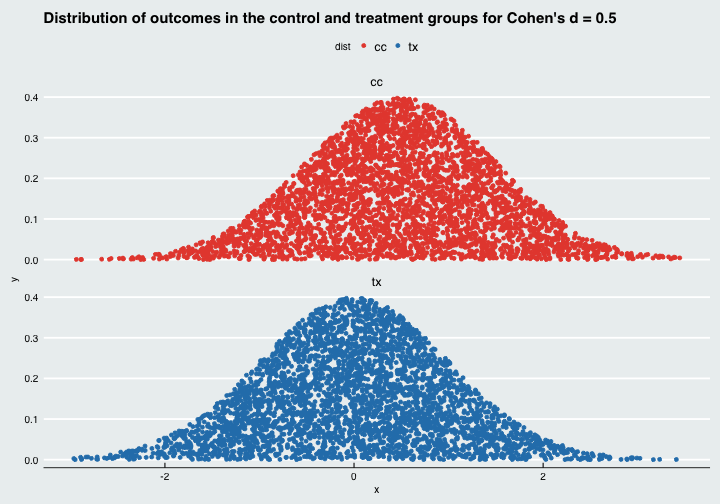
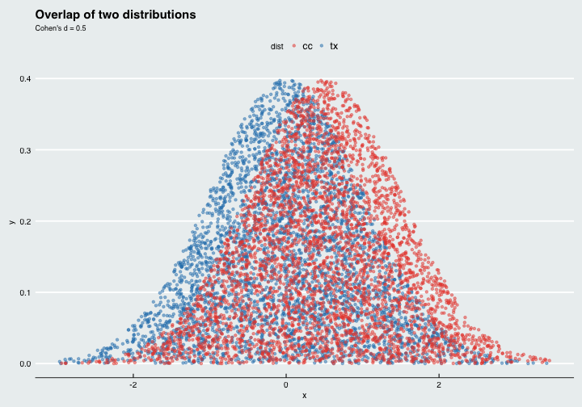
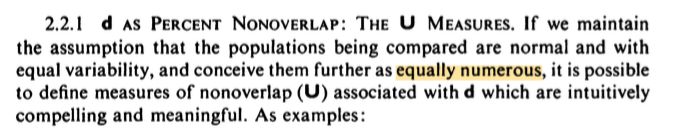

I've received many emails regarding the percent of overlap reported in my [Cohen's d visualization](http://rpsychologist.com/d3/cohend). Observant readers, have noted that I report a different number than Cohen (and other authors). For instance, if we open p. 22 in Cohen's *Statistical power analysis for the behavior sciences*, we see that Cohen writes that d = 0.5 means a 33 % non-overlap, i.e. a 67 % overlap. However, if you go to [http://rpsychologist.com/d3/cohend](http://rpsychologist.com/d3/cohend) and set d = 0.5, you get 80 % overlap. How come?


Let's calculate this ourselves using Monte Carlo integration. Doing it this way will make it easy to see what we're doing. What I'll do first is just sample uniform random data, and then save the points that fit under each normal curve. Let's assume we have a treatment group and a control group, then each point will represent one patient. Here's the code.


```r
library(dplyr)
library(ggplot2)
library(tidyr)
library(ggthemes)

# ggplot theme setup ------------------------------------------------------
bg <- "#ecf0f1"
theme_set(theme_economist() + theme(panel.background = element_rect(fill = bg),
                                    plot.background = element_rect(fill = bg),
                                    strip.background = element_rect(fill = bg),
                                    legend.background  = element_rect(fill = bg),
                                    legend.key = element_rect(fill = bg)))
scale_color_rpsy <- scale_color_manual(values = c("cc" = "#e74c3c", 
                                                  "tx" = "#2980b9", 
                                                  "tx_overlap" = "#1abc9c", 
                                                  "cc_overlap" = "#f39c12"))

# monte carlo integration --------------------------------------------------
set.seed(4443451)
overlap <- function(x) {
    pmin(dnorm(x, 0, 1), dnorm(x, 0.5, 1))
}

n <- 10000
d <- data.frame(x = runif(n, -3, 3.5),
                tx = runif(n, min = 0, max = 0.4),
                cc = runif(n, min = 0, max = 0.4)) # sample x,y from uniform dist

d <- d %>% 
        mutate(tx = ifelse(tx <= dnorm(x, 0, 1), tx, NA),
               cc = ifelse(cc <= dnorm(x, 0.5, 1), cc, NA))

d_long <- d %>%
    gather(dist, y, -x) %>% 
    mutate(overlap = ifelse(y <= overlap(x), paste(dist, "_overlap", sep = ""), dist),
           overlap = factor(overlap)) %>% 
    filter(!is.na(y))
```

And here's the distribution of points that we generated.

```r
d_long %>% 
    ggplot(aes(x, y, color = dist)) + 
    geom_point() +
    facet_wrap(~ dist, ncol = 1) +
    labs(title = "Distribution of outcomes in the control and treatment groups for Cohen's d = 0.5", 
         subtile = "Each point represents one patient",
         xlab = "Cohen's d") +
     scale_color_rpsy
```



Now if we overlay the two distributions we get

```r
d_long %>% 
    ggplot(aes(x, y, color = dist)) +
    geom_point(alpha = 0.5, size = 1.3) +
    labs(title = "Overlap of two distributions", subtitle = "Cohen's d = 0.5") +
     scale_color_rpsy
```



Also, let's color the individuals in the treatment and control groups that are in the region that overlap. We'll also label the regions and show percentages.

```r
labels <- d_long %>% 
    group_by(overlap) %>% 
    summarise(n = n()) %>% 
    mutate(prop = n/sum(n),
           prop = paste(round(prop, 1)*100, "%", sep = ""),
           x = c(1.5, 0.25, -1, 0.25),
           y = c(0.2, 0.25, 0.2, 0.2))

d_long %>% 
    ggplot(aes(x, y, color = overlap)) +
    geom_point(alpha = 0.5) +
    geom_label(data = labels, 
               aes(x=x, y = y, label = prop, color = overlap), 
               vjust = "center", show.legend = FALSE, size = 5) +
    labs(title = "Percentage of observations in each area", subtitle = "Frequency understanding of overlap") +
    scale_color_rpsy
```


What we've done to get percentages is simply to count the observation and divide them by the total amount. We see that we have 10 + 10 = 20 % non-overlapping observations. The overlapping region is more densely packed with observations, since both groups contribute an equal amount of observations that overlap. The proportion of the total amount of observations in the overlapping region is 40 + 40 = 80 %. 

Now, let's plot Cohen's interpretation of overlap, which is the proportion of shared area covered by both population. Since we're now thinking about areas, and not frequencies, we'll have to remove half of the observations from the overlapping region. Here's how it will look.


```r
labels <- d_long %>% 
    filter(overlap != "cc_overlap") %>% 
    group_by(overlap) %>% 
    summarise(n=n()) %>% 
    mutate(prop = n/sum(n),
           prop = paste(round(prop, 2) * 100, "%", sep = ""),
           x = c(1.5, -1, 0.25))

d_long %>% 
    filter(overlap != "cc_overlap") %>% 
    ggplot(aes(x, y, color = overlap)) +
    geom_point(alpha = 0.5, size = 1.3) +
    geom_label(data = labels, 
               aes(x=x, y = 0.2, label = prop, color = overlap), 
               vjust = "center", show.legend = FALSE, size = 5) +
    labs(title = "Proportion of shared area covered by both populations",
         subtitle = "Cohen's interpretation of overlap") +
    scale_color_rpsy
```


We see here that the shared area is 67 %, which is a different interpretation of overlap. Clearly, I believe this interpretation to be a bit strange (since I'm not using it on my site). To me it's more intuitive to think: if we have two populations, one that received an active treatment, and one that received a control, then 80 % tells us that 80 % of the total observations actually overlap. I believe that's more intuitive than reporting that the shared area is 67 %. What's interesting is that Cohen even used a frequency interpretation in his description (the distributions are "equally numerous").




# References
I'm not the only one to note this discrepancy, Grice & Barrett (2014) used the same reasoning in their article "A note on Cohen's overlapping proportions of normal distributions". 

