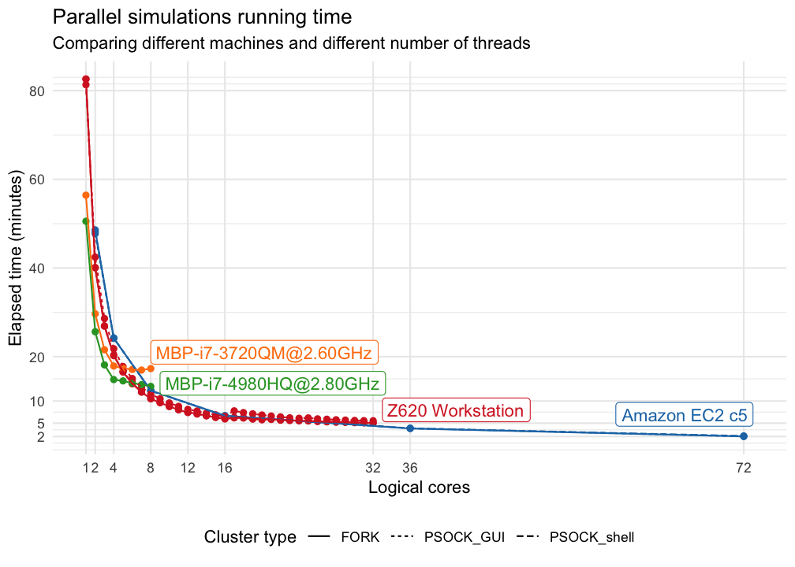

If you tend to do lots of large Monte Carlo simulations, you've probably already discovered the benefits of multi-core CPUs and parallel computation. A simulation that takes 4 weeks without parallelization, can easily be done in 1 week on a quad core laptop with parallelization. However, for even larger simulations reducing the computation time down from e.g. 8 months down to 2 months is where you either, start to think about reducing your simulation study, or getting more CPU power. I prefer the latter option (yeah, I know it's not always an option...), and often perform larger runs on Amazon EC2 instances, and more daily largeish runs on my workstation. Recently, I saw this post by Max Kuhn: [While you wait for that to finish, can I interest you in parallel processing?](http://appliedpredictivemodeling.com/blog/2018/1/17/parallel-processing) where he compared computers with 4 to 10 cores. Since I already had a bunch of benchmarks done on Amazon's EC2 c5.* instances (2 to 72 cores), for an article I'm writing, I figured it'd be interesting to compare those results to more everyday PhD student-level computers. So, in this post I compare two different MacBook Pros, a dual CPU workstation, and different EC2 instances. 


*The joy of running 72 R sessions in parallel.*

## The Machines
These are the machines I benchmarked. Logical cores indicate the maximum number of virtual cores, or threads. I didn't remember to write down how many sockets the Amazon machines had. 

Machine                  | CPU                       | GHz     |  Cores | Logical Cores
-------------            | -------------             | ------  | ------ | ----------
MacBook Pro 15" Mid 2012 | Intel Core i7-3720QM      | 2.6 GHz |    4   |  8
MacBook Pro 15" Mid 2015 | Intel Core i7-4980HQ      | 2.8 GHz |    4   |  8
HP Z620 Workstation      | Xeon E5-2670 (x 2)        | 2.6 GHz |    16  |  32
Amazon EC2 c5.large      | Xeon Platinum 8124M       | 3.0 GHz |    1   |  2
Amazon EC2 c5.xlarge     | Xeon Platinum 8124M       | 3.0 GHz |    2   |  4
Amazon EC2 c5.2xlarge    | Xeon Platinum 8124M       | 3.0 GHz |    4   |  8
Amazon EC2 c5.4xlarge    | Xeon Platinum 8124M       | 3.0 GHz |    8   |  16
Amazon EC2 c5.9xlarge    | Xeon Platinum 8124M       | 3.0 GHz |    18  |  36
Amazon EC2 c5.18xlarge   | Xeon Platinum 8124M       | 3.0 GHz |    36  |  72

## The Simulation
I used my package `powerlmm` [(link)](https://github.com/rpsychologist/powerlmm) to simulate longitudinally clustered data, with 6 clusters per treatment arm, 50 subjects per clusters, and 11 measures on each subject. So **600 * 11 observations in total**. This three-level model was fit with a random intercept and slope at the subject-level, and a random slope at the cluster level. To make the machines work even harder, I approximated *dfs* using Satterthwaite's approximation, using `lmerTest`. The number of simulations was **5000**.

The MacBooks were running macOS, and my HP workstation and Amazon's EC2 instances were running Ubuntu 16.04. R 3.4.3 was installed on all machines 

## Results
Unsurprisingly, running only 1 core was the slowest, which took between 50 to 80 minutes. The maximum performance of each machine was:

  * MBP (2012) **17 min**.
  * MPB (2015) **13 min**.
  * HP Z620 Workstation **5 min**.
  * Amazon EC2 c5.18xlarge **2 min**.

Moreover, running the simulations in a shell tended to be slightly faster than using a GUI (RStudio), and `fork` and `PSOCK` clusters were equally fast. However, the time it took to spawn the PSOCK workers is excluded from the benchmark. The figure bellow shows the elapsed time for all machines. 



Speedup was fairly linear for the number of physical cores per machine. The figure bellow shows relative speedup for each machine. 


## So, is cloud computing worth it?
Obviously, having remote access to a 72 core 3 GHz machine is an extremely convenient way to significantly decrease your simulation time. And RStudio Server makes remote R work painless. However, my ~5-year-old HP workstation still performs extremely well. So, if you have to pay for these things yourself, buying a refurbished workstation is a really good option, especially if you tend to do a lot of simulations. You can probably buy a refurbished Z620 for 600 EUR on Ebay, which is approximately what it costs to run the c5.9xlarge instance for 17 days (on-demand). 


# Code
Lastly, here's the code I used.
## Simulation functions

```r
# filename: funcs.R

#' @param cores no. cores to use
#' Rest of the arguments explained in run_benchmark()
benchmark_sim <- function(cores, object, type, label, nsim) {
   message("Benchmarking ", cores, " cores")
   cl <- parallel::makeCluster(cores, 
                               type = type)
   res <- simulate(p, 
                   cores = cores,
                   nsim = nsim, 
                   satterthwaite = TRUE, 
                   cl = cl)
   parallel::stopCluster(cl)
   pow <- summary(res)$summary$correct$FE$Power_satt[4]
   data.frame(power = pow, 
              time = res$time,
              cores = cores,
              label = paste(label, type, sep = "_"))
   
}

#' @param object simulation_parameters()-object
#' @param max_cores benchmark 1, ..., max_cores
#' @param type type of cluster to use
#' @param label a label for the experiment
#' @param nsim number of simulations
#' @param type FORK or PSOCK
run_benchmark <- function(object, max_cores, nsim, label, type = NULL) {
  if(is.null(type)) {
    # only use forking in non-interactive session
    if(interactive()) {
      type <- "PSOCK"
    } else {
      type <- "FORK"
    }
  }

  res <- lapply(1:max_cores, 
                benchmark_sim, 
                object = object,
                type = type,
                label = label,
                nsim = nsim)
  res <- do.call(rbind, res)

  # save
  fname <- paste0(unique(res$label), "_shell.rds")
  saveRDS(res, file = fname)
}
```

## Run benchmark

```r
source("funcs.R")
library(powerlmm)
library(methods)


# setup sim
p <- study_parameters(n1 = 11,
                      n2 = 50,
                      n3 = 6,
                      fixed_intercept = 37,
                      fixed_slope = -0.64,
                      sigma_subject_intercept = 2.8,
                      sigma_subject_slope = 0.4,
                      sigma_cluster_intercept = 0,
                      cor_subject = -0.5,
                      icc_slope = 0.05,
                      sigma_error = 2.6,
                      dropout = dropout_weibull(proportion = 0.3, 
                                                rate = 1/2),
                      cohend = -0.5)

# will save results to wd
run_benchmark(p, 
              max_cores = 8, 
              nsim = 5000,
              label = "c5.18xlarge",
              type = "FORK")
```
