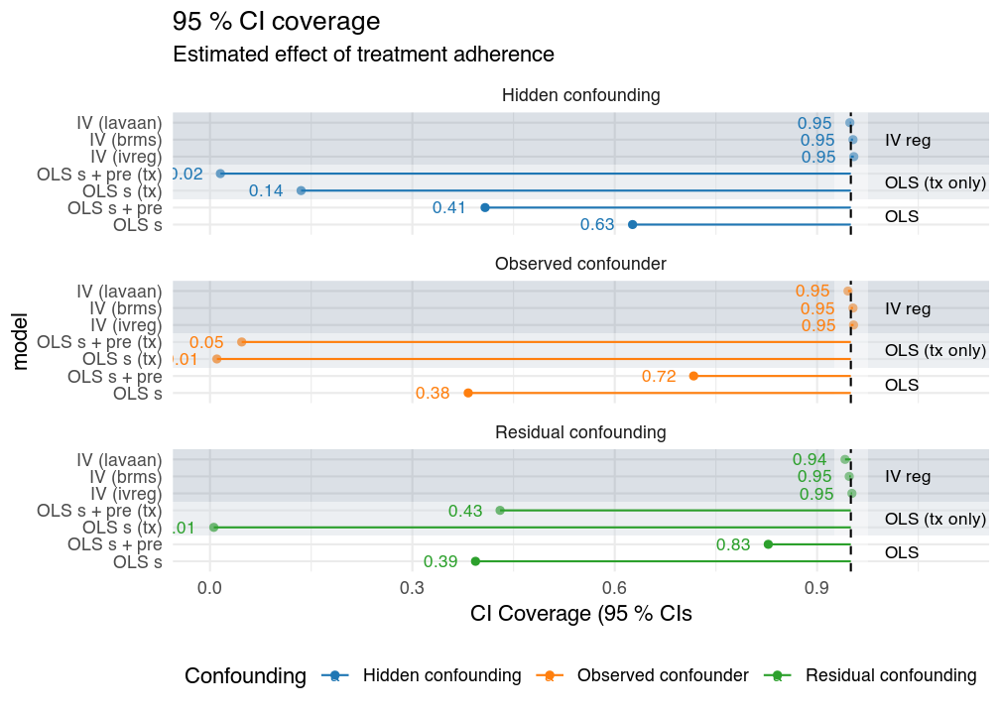
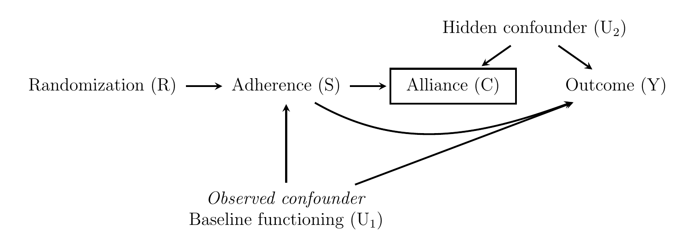
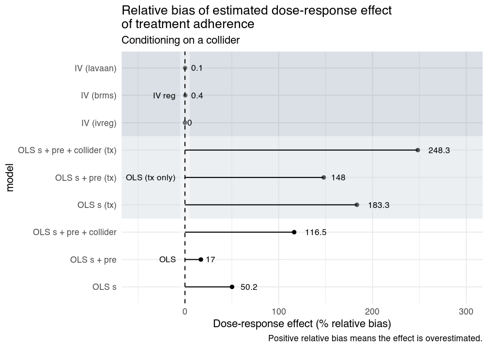

Something that never ceases to amaze (depress) me, is how extremely common it is to see causal claims in RCTs, that are not part of the randomization. For instance, the relationship between treatment adherence and outcome, or between alliance and outcome, are often analyzed but seldom experimentally manipulated. This is basically observational research disguised as experimental, but without DAGs, instrumental variables, propensity scores, or *any* other technique used in observational research. Hence, the effects will *almost surely* be biased in an unknown direction. This is a post I've been planning to write for a long time, but put off since the theory and methods are so well covered in, for instance, epidemiology. However, when `brms` added support for multivariate formulas, I figured I could show how some of the techniques can be implemented in R, and their Bayesian counterparts using `brms`. So, in this post I do three things:

1. Rant about how quickly clinical psychology researchers forget about **causal inference**, once they start analyzing non-randomized variables, such as the effect of **treatment adherence** (or "compliance") on treatment outcome in a randomized controlled trial. 
2. Show that common regression methods either, makes absolutely no sense, or result in badly biased estimates of the causal dose-response effect, when a third variable influences both adherence and outcome, i.e. when the dose-response relationship is confounded. While **instrumental variable** methods *may* allow for unbiased estimates in these scenarios. 
3. Show how **Bayesian intrumental variable** regression can be easily fit using `brms` new multivariate syntax. And also do a small simulation study to compare the results to `lavaan`, `AER::ivreg` and biased `lm()` models. 

# Motivating example
## The effect of treatment adherence (psychotherapy dose-response effects)
Let's assume we've performed an RCT and compared some psychotherapy condition to some control condition. Patients in these types of trials seldom complete all scheduled sessions, or adhere 100 % to the treatment. It's rather common for researchers to try to see if there is some relationship between adherence and treatment outcome. Which is a valid question, if there is no added effect of actually "receiving" more of the treatment, then that *should* be a problem for your theory, or at least some of the components of that theory. However, what usually happens is that researchers somehow forget that the variable "adherence to therapy" is not experimentally manipulated. Unless we have randomized patients to receive 1, 2, ..., 10 sessions, or to do 1, 2, ..., 10, exposure exercises (and somehow ensured adherence was 100% in all conditions)–then we are now longer in RCT country!


*Never stop to acknowledge you're doing non-randomized comparisons!*

## A simple model of confounded adherence effects
A really simple scenario with one know (or unknown) confounder is shown in the DAG below. 


Each arrow represent *causal* influence of one variable on another. `Y` is the observed outcome, `adherence` is often measured by some proxy, like the number of sessions completed–that we assume is a good indicator of treatment "dose", it could be any other proxy for treatment adherence. So, what the graph is saying, is that treatment allocation (randomization) influences the outcome (Y) via the amount of treatment received (adherence). Thus, unless something went horribly wrong, randomization should be strongly correlated with S, and only influence Y through the treatment received (S). By definition this makes randomization an *instrumental variable*. However, the problem is that the effect of S on Y is most likely confounded (U). For instance, baseline functioning might be related both to a better prognosis (better outcome) and treatment adherence. It is easy to come up with scenarios where the relationship could be either positive or negative. Higher baseline functioning could be related to a better prognosis, and to better treatment adherence, or, a patient could be too depressed to actually adhere to the treatment. It is also plausible that worse baseline functioning make you more motivated to adhere to your treatment. Whatever the relationship might be, it is clear that the causal effect of treatment adherence will be confounded.

We will deal with three types of scenarios where a variable $U$ confounds the estimate of treatment adherence:

* **Observed confounder**: $U$ is an observed variable that is adjusted for.
* **Residual confounding**: our known confounder $U$ is measured with error.
* **Hidden confounding**: $U$ is either unknown or unmeasured, and not adjusted for.

# The data generating model
First, let's remind ourselves what is commonly estimated in an RCT is the *average treatment effect* (ATE), or some related estimate, 

$$
\Delta = E[Y_i(C) - Y_i(Tx)].
$$

Where $Y_i(C)$ is the would-be outcome for patient *i* after participating in the control condition, and $Y_i(Tx)$ the would be outcome for patient *i* after participating in the treatment condition. Obviously, we can never observe both $Y_i(C)$ and $Y_i(Tx)$ for the same patient. But thanks to randomization when can infer the ATE. We also assume that the individual treatment effect $Y_i(C) - Y_i(Tx)$ is the same for all individuals, given the same level of adherence. 

The data generating model (DGM) is, thus, that adherence depends on $U_i$, the confounder variable,

$$ 
S_i = 7 - f(U_i) + e_{1i}.
$$

Where $f()$ is just a function that centers and scales the confounding variable, so that the mean adherence is 7, and $e_i$ is just random variation that influence the relationship between $U_i$ and $S_i$. Moreover, the *observed* measure of adherence could be a noisy measure of a patient's actual adherence, $S_i$, e.g. sessions completed,

$$ 
\text{Sessions}_i = S_i + e_{2i}.
$$

To generate the outcome, we first simulate $Y_i(C)$, and then calculate $Y_i(Tx)$,

$$
Y(Tx)_i = Y(C)_i - \beta_S S_i.
$$

So that $\beta_S$ is the causal effect of treatment adherence,

$$ 
E(\Delta_i | S_i) = \beta_s S_i.
$$

Lastly, the outcome is generated as,

$$
Y_i = Y_i(C) [1-R_i(Tx)] + Y_i(Tx) R_i(Tx).
$$ 

Where $R_i(Tx)$ is 1 for participants allocated to the treatment condition and 0 otherwise.

# Different ways to answer the same question
Now, that we have a DGM, let's generate some fake data and fit different models. We'll start with a standard OLS regression, the first model would make sense in the absence of any hidden or residual confounding (extremely unlikely). The second model ("naïve OLS") makes little sense, since it only analyze the treatment group, and as we'll see, further confounds prognosis with the causal effect of treatment adherence. Sadly, this way of analyzing psychotherapy trials is really common... Anyway, lets generate some fake data. I'll use a two-level random intercept-only model as a starting point, and assume that the confounder (baseline functioning), is measured without error.


```r
library(powerlmm)

# Skeleton to base data on
sp <- study_parameters(n1 = 11,
                      n2 = 100,
                      T_end = 10,
                      fixed_intercept = 10,
                      fixed_slope = -.5,
                      icc_pre_subject = 0.8,
                      sigma_error = 3,
                      cohend = 0)

## Some fake data, code at the end of post
dpp <- data_generator(update(sp, n2 = 5000), 
                      confounder = "intercept_subject", 
                      label = "example",
                      beta_s = 1, 
                      c_scale = 3,
                      hidden_confounder_sd = 0,
                      measure_error_sd = 0)()
```

## OLS
First, we fit the two standard OLS models where we are adjusting for pretest scores. 

```r
# lm
## Assume no confounding
OLS <- lm(y ~ session + pre, data = dpp)
summary(OLS)

## Naïve OLS (tx only)
naive <- dpp %>% 
    filter(treatment == 1) %>% 
    lm(y ~ session + pre, data = .)
summary(naive)
```

## Instrumental variables (IV)
Now, let's try to use treatment assignment as an *instrument* to better uncover the causal effect of adherence. Two-stage least-squares (2SLS) is a common method to estimate an IV model. The point of this post is not to explain IV regression, it's explained well in standard econometric textbooks (<a target="_blank" href="https://www.amazon.com/gp/product/0262232588/ref=as_li_tl?ie=UTF8&camp=1789&creative=9325&creativeASIN=0262232588&linkCode=as2&tag=rpsyc-20&linkId=8b0629e282068c90e6ecc6f093bcf1b4">Wooldridge, 2010</a>; <a target="_blank" href="https://www.amazon.com/gp/product/130527010X/ref=as_li_tl?ie=UTF8&camp=1789&creative=9325&creativeASIN=130527010X&linkCode=as2&tag=rpsyc-20&linkId=4941b5cb6ce034f04eed61345e7a656a">Wooldridge, 2015</a>). And in the context of psychotherapy research in the articles by [Maracy and Dunn (2011)](https://doi.org/10.1177/0962280208097243), or [Dunn and Bentall (2007)](http://doi.wiley.com/10.1002/sim.2891). The *very* short explanation, is that 2SLS is basically to regress `session` on the instruments, then regress `y` on the predicted sessions from Step 1. This can be done using `lm()` to get point estimates, but the standard errors will be highly suspicious. 


```r
# IV
## Two-step manual
step1 <- lm(session ~ treatment + pre:treatment, data = dpp)
dpp$session_hat <- predict(step1)
IV_ols <- lm(y ~ session_hat + pre, data = dpp)
summary(IV_ols)
```

However, 2SLS is easier done with `ivreg()` from the package `AER`. The same structural model is fit using this code.


```r
library(AER)
## ivreg (2SLS)
IV <- ivreg(y ~ session + pre | treatment + treatment:pre, data = dpp)
summary(IV)
```

The model can also be thought of as a special case of a structural equation model, and fit with e.g. `lavaan`. 


```r
library(lavaan)
l_model <- ' session ~ treatment + treatment:pre
             y ~ session + pre
             session ~~ y '
IV_lavaan <- sem(l_model, data = dpp)
summary(IV_lavaan)
```

Lastly, using the same approach, a Bayesian IV model can be fit using `brms` (>2.0.0).


```r
library(brms)
f1 <- bf(session ~ treatment + treatment:pre)
f2 <- bf(y ~ session + pre)
IV_brm <- brm(f1 + f2, data = dpp, cores = 4)

summary(IV_brm)
```

This allows extending the model a lot using `brms` highly flexible modelling syntax. Moreover, once you've exhausted `brms` capabilities you can get the `stancode()` and further customize the model yourself. 

# A small simulation study
Let's also do a small simulation study, to better show the impact of observed confounding, residual confounding, and hidden confounding. We'll use the OLS and IV models shown above. For each of the three scenarios, 5000 data sets were generated, with 50 patients per condition. The correlations between the variables are shown in the figure below, the actual values are arbitrary chosen, and the resulting bias, and its direction, is not meant to reflect real data, instead the values are meant to highlight the different types of confounding. 


In the figure, *s* is the latent adherence variable, *session* the observed adherence, *intercept_subject* is the baseline confounder, that is measured with or without error by *pre*, and *y* is the outcome.

## Relative bias
The relative bias of the estimated adherence effect is shown in the figure below.


In the figure, we see for the OLS models, that when there's:

* **Hidden confounding**: 
    - Adjusting for the baseline variable does not help, which is as expected, since it is not related to *adherence*.
* **Observed confounder**:
    - The estimates are biased when the confounder is omitted.
    - Adjusting for the confounder removes the bias. However, we do not recover the true causal effect, since *session* is a noisy proxy of adherence the effect is attenuated. 
* **Residual confounding**:
    - Controlling for the confounder reduces bias, but due to residual confounding estimates are still biased.

And the overall pattern is that:

* the naïve OLS is as bad idea, and is the most affected by bias in all scenarios. We use control groups for a reason, don't ignore the control group!
* IV estimates are unbiased.
  - However, large measurement errors in *session* would also attenuate the IV estimate.

We see the same results if look at the coverage probabilities of the confidence intervals. 

## Coverage probabilities of the CIs


## When less is more–collider bias
Let's throw in another example of how things can go wrong, this time by adjusting for a collider. We extend the first DAG, and add another covariate *therapeutic alliance*. A researcher might think that by controlling for X (alliance), the dose-response relationship will be more clearly revealed. Or they might just do a multivariable regression and think *"hey, both therapeutic alliance and adherence probably predict treatment outcome, let's throw both in and see what p-value we get"*. However, the problem is that alliance might neither be a predictor of outcome, nor a confounder of the adherence and outcome relationship, instead it could be a common effect of adherence and a hidden confounder (i.e., a collider). Obviously, this example is made up and *alliance* is just a placeholder–there's so much going on during a psychological treatment that it would be easy to come up with other colliders. In the DAG bellow, conditioning on alliance opens up a path between adherence and the hidden confounder, that bias the relationship between adherence and outcome *even* more.



If we also simulate this model, and assume that $U_1$ is measured with error, and use the same IV regressions, but add an OLS model that also includes the collider we get these results.



What we see is that:
<ul>
<li>The OLS models that control for the baseline confounder is still biased due to residual confounding, and the naïve OLS is badly biased.</li>
<li>By adjusting for the collider the bias increase, it would even have been better to not adjust for anything.</li>
<li>The IV models are unbiased, and as you see below, their CIs have nominal coverage probabilities as well.</li>
</ul>


# Summary
Lastly, to summarize this post:

* Don't do naïve regressions on treatment adherence dose-response effects. It makes no sense even in the absence of confounding. 
* Measurement error *will* bias your regression estimates even if you adjust for confounders.
* Confounders and colliders are everywhere, make your assumptions explicit. We don't need more zombie studies claiming XYZ is related to treatment outcome.
* IV regression does not *automagically* solve all problems. But if you think hard about your data it can be a very useful tool in treatment studies. 
* `brms` new multivariate syntax make it extremely easy to fit Bayesian IV models, that can be extended to much more complicated scenarios than what I covered in this article.

# References
* Dunn, G., & Bentall, R. (2007). Modelling treatment-effect heterogeneity in randomized controlled trials of complex interventions (psychological treatments). Statistics in Medicine, 26(26), 4719–4745. https://doi.org/10.1002/sim.2891
* Mohammad Maracy, & Graham Dunn. (2011). Estimating dose-response effects in psychological treatment trials: the role of instrumental variables. Statistical Methods in Medical Research, 20(3), 191–215. https://doi.org/10.1177/0962280208097243
* <a target="_blank" href="https://www.amazon.com/gp/product/0262232588/ref=as_li_tl?ie=UTF8&camp=1789&creative=9325&creativeASIN=0262232588&linkCode=as2&tag=rpsyc-20&linkId=8b0629e282068c90e6ecc6f093bcf1b4">Wooldridge, J. M. (2010). Econometric analysis of cross section and panel data. MIT press.</a>
* <a target="_blank" href="https://www.amazon.com/gp/product/130527010X/ref=as_li_tl?ie=UTF8&camp=1789&creative=9325&creativeASIN=130527010X&linkCode=as2&tag=rpsyc-20&linkId=4941b5cb6ce034f04eed61345e7a656a">Wooldridge, J. M. (2015). Introductory econometrics: A modern approach. Nelson Education.</a>

# Code

## Simulation functions

```r:collapsed=true
library(dplyr)
library(tidyr)
library(ggplot2)
library(parallel)
library(lavaan)
library(AER)
library(brms)

#' Extract results from lm and ivreg
#' @param x object
#' @param model character; name of model
get_res <- function(x, model) {
    est <-  coef(x)
    ind <- names(est) == "session"
    est <- est[ind]
    se <- sqrt(diag(vcov(x)))[ind]
    data.frame(model = model,
               para = names(est),
               est = est,
               se = se,
               lwr = est - 1.96 * se,
               upr = est + 1.96 * se)
}

#' brms: fit and extract results
#' @param dpp new pre-post data to fit
#' @param fit_brm brms-object to update
get_brm <- function(dpp, fit_brm) {
    fit <- suppressMessages(update(fit_brm, newdata = dpp, iter = 2000))
    est <- fixef(fit)
    est <- est[rownames(est) == "y_session", ]
    data.frame(model ="IV (brms)",
               para = "session",
               est = est[1], 
               se = est[2],
               lwr = est[3],
               upr = est[4])
    
}
#' lavaan: creates function that fit and extract results
#' @param model character; lavaan model syntax
#' @return function; accepts new data via "dpp"
make_lavaan_func <- function(model) {
    function(dpp) {
        fit_lavaan <- tryCatch({sem(model, data=dpp)}, 
                               error = function(e) {NA}, 
                               warning = function(w) {NA})
        if(isS4(fit_lavaan)) {
            se <- sqrt(diag(vcov(fit_lavaan)))
            ind <- names(se) == "y~session"
            est <- coef(fit_lavaan)
            est <- est[ind]
            se <- se[ind]
        } else if (is.na(fit_lavaan)) {
            se <- NA
            est <- NA
        }
        data.frame(model = "IV (lavaan)",
                   para = "session",
                   est = est,
                   se = se,
                   lwr = est - 1.96 * se,
                   upr = est + 1.96 * se)
    }
}

#' add confounding to pre-post data
#' @param x prepost data
#' @param confounder charater; name of column in x to use as confounder
#' @param n2 number of total subjects
#' @beta_s dose-response parameter
#' @c_scale scale confounding distribution
add_confounding <- function(x, confounder, n2, beta_s, c_scale) {
    x$confounder <- x[, confounder]
    x <- x %>% 
        mutate(s =  (7 - (confounder - mean(confounder))/sd(confounder) * c_scale) - hidden_confounder*0.5 + rnorm(n2, sd = 1),
               s = ifelse(s < 1, 1, s) * treatment,
               session = s + rnorm(n2, sd = 2),
               session = ifelse(session < 1, 1, session) * treatment,
               yt = yc - beta_s * s,
               y = yt * treatment + yc * (1-treatment),
               id = 1:n2)
    
    x
}
add_collider <- function(x, confounder, n2, beta_s, c_scale) {
    x$confounder <- x[, confounder]
    x <- x %>% 
        mutate(s =  (7 - (confounder - mean(confounder))/sd(confounder) * c_scale) + rnorm(n2, sd = 1),
               s = ifelse(s < 1, 1, s) * treatment,
               session = s + rnorm(n2, sd = 0),
               session = ifelse(session < 1, 1, session) * treatment,
               cred = (session + hidden_confounder) * treatment,
               yt = yc - beta_s * s,
               y = yt * treatment + yc * (1-treatment),
               id = 1:n2)
    
    x
}


#' Create data generator
#'
#' @param pp powerlmm::study_parameters-object
#' @param confounder character; passed to 'add_confounding'
#' @param beta_s passed to 'add_confounding'
#' @param c_scale passed to 'add_confounding'
#' 
#' @return function with no arguments that generate data.frame
data_generator <- function(pp, confounder, label, beta_s, c_scale, hidden_confounder_sd = 0, measure_error_sd = 0, collider = FALSE) {
    function() {
        d <- simulate_data(pp) # powerlmm::simulate_data
        
        dpp <- d %>% 
            filter(time %in% c(0, 10),
                   treatment == 0) %>% 
            mutate(time = factor(time, labels = c("pre", "post")),
                   treatment = rep(0:1, each = pp$n2)) %>% 
            select(-y_c) %>% 
            spread(time, y) %>% 
            mutate(hidden_confounder = rnorm(pp$n2, sd = hidden_confounder_sd),
                   yc = post + hidden_confounder)
        
        if(collider) {
            dpp <- add_collider(dpp, confounder = confounder, pp$n2, beta_s, c_scale)
        } else {
            dpp <- add_confounding(dpp, confounder = confounder, pp$n2, beta_s, c_scale)
                
        }
        dpp <- dpp %>%  
            mutate(pre = intercept_subject + rnorm(pp$n2, sd = measure_error_sd),
                   label = label)
        dpp
    }
}


#' Simulation function
#'
#' @param i i:th simulation
#' @param data_gen data_generator
#' @param fit_brm prefit brms-object

sim <- function(i, data_gen, fit_brm) {
    dpp <- data_gen()
    d_t <- dpp %>% 
        filter(treatment == 1)
    
    OLS <- lm(y ~ session, data = dpp)
    OLS_pre <- lm(y ~ pre + session, data = dpp)
    OLS_tx <- lm(y ~ session, data = d_t)
    OLS_pre_tx <- lm(y ~ pre + session, data = d_t)
    IV_ivreg <- ivreg(y ~ session + pre | treatment + treatment:pre, data = dpp)
    IV_brm <- get_brm(dpp, fit_brm)
    IV_lavaan <- get_lavaan(dpp)
    res <- mapply(get_res, 
                  list(OLS, OLS_pre, OLS_tx, OLS_pre_tx, IV_ivreg), 
                  model = c("OLS s", "OLS s + pre", "OLS s (tx)", "OLS s + pre (tx)", "IV (ivreg)"), 
                  SIMPLIFY = FALSE)
    res <- c(res, list(IV_brm), list(IV_lavaan))
    res <- do.call(rbind, res)
    res$sim <- i
    
    res
}
sim_collider <- function(i, data_gen, fit_brm) {
    dpp <- data_gen()
    d_t <- dpp %>% 
        filter(treatment == 1)
    
    OLS <- lm(y ~ session, data = dpp)
    OLS_pre <- lm(y ~ pre + session, data = dpp)
    OLS_pre_cred <- lm(y ~ pre + session + cred, data = dpp)
    OLS_tx <- lm(y ~ session, data = d_t)
    OLS_pre_tx <- lm(y ~ pre + session, data = d_t)
    OLS_pre_tx_cred <- lm(y ~ pre + session + cred, data = d_t)
    IV_ivreg <- ivreg(y ~ session + pre | treatment + treatment:pre, data = dpp)
    IV_brm <- get_brm(dpp, fit_brm)
    IV_lavaan <- get_lavaan(dpp)
    res <- mapply(get_res, 
                  list(OLS, OLS_pre, OLS_pre_cred, OLS_tx, OLS_pre_tx, OLS_pre_tx_cred, IV_ivreg), 
                  model = c("OLS s", "OLS s + pre","OLS s + pre + collider",
                            "OLS s (tx)", "OLS s + pre (tx)", "OLS s + pre + collider (tx)",
                            "IV (ivreg)"), 
                  SIMPLIFY = FALSE)
    res <- c(res, list(IV_brm), list(IV_lavaan))
    res <- do.call(rbind, res)
    res$sim <- i
    
    res
}
#' Summarise simulation results
#'
#' @param x Sim results from sim()
#' @param type character; label to use for type of confounding
#' @param theta true value of session dose-response coef
summarise_sim <- function(x, type, theta = -1) {
    x <- x %>% group_by(model) %>%
        summarise(est_M = mean(est, na.rm = TRUE), 
                  est_SE = mean(se, na.rm = TRUE),
                  est_SD = sd(est, na.rm = TRUE),
                  cover = mean(lwr < theta & theta < upr, na.rm = TRUE)) %>% 
        mutate(est_RB = ((est_M - theta)/theta) * 100,
               se_RB = (est_SE - est_SD)/est_SD)
    
    x$type <- type
    
    x
}
```

## Setup and run the simulation.

```r:collapsed=true
source("functions.R")
library(methods)

# Sim setup
nsim <- 5000
cores <- 16

sp <- study_parameters(n1 = 11,
                       n2 = 100,
                       T_end = 10,
                       fixed_intercept = 10,
                       fixed_slope = -.5,
                       icc_pre_subject = 0.8,
                       sigma_error = 3,
                       cohend = 0)

# start clusters
cl <- makeCluster(cores)
clusterEvalQ(cl, {
    library(powerlmm)
    library(dplyr)
    library(tidyr)
    library(AER)
    library(brms)
    library(lavaan)
    library(methods)
})

# brms setup
# precompile model

if(!exists("fit_brm")) {
    dpp <- data_generator(p_pre, "intercept_subject", label = "setup", beta_s = 1, c_scale = 3)()
    f1 <- bf(session ~ treatment + treatment:pre)
    f2 <- bf(y ~ session + pre)
    fit_brm <- brm(f1 + f2, data = dpp, chains = 1, cores = 1, iter = 1)
    
}

# lavaan setup
l_model <- ' session ~ 1 + treatment + treatment:pre
             y ~ 1 + session + pre
             session ~~ y'
get_lavaan <- make_lavaan_func(l_model)

clusterExport(cl, c("sp",
                    "get_res",
                    "add_confounding", 
                    "add_collider",
                    "fit_brm", 
                    "get_brm", 
                    "get_lavaan",
                    "l_model"))

# run sim
ptm <- proc.time()

# Observed 
res1 <- parLapply(cl, 
                  1:nsim, 
                  sim,
                  data_gen = data_generator(sp, "intercept_subject", 
                                            label = "Observed confounder",
                                            beta_s = 1,
                                            c_scale = 3, 
                                            hidden_confounder_sd = 0, 
                                            measure_error_sd = 0),
                  fit_brm = fit_brm)
res1 <- do.call(rbind, res1)

# Residual confound
res2 <- parLapply(cl, 
                  1:nsim, 
                  sim, data_gen = data_generator(sp, 
                                                 "intercept_subject", 
                                                 label = "Residual confounding",
                                                 beta_s = 1, 
                                                 c_scale = 3, 
                                                 hidden_confounder_sd = 0, 
                                                 measure_error_sd = 6),
                  fit_brm = fit_brm)
res2 <- do.call(rbind, res2)

# Hidden confound
res3 <- parLapply(cl, 
                  1:nsim, 
                  sim, 
                  data_gen = data_generator(sp, "intercept_subject", 
                                            label = "Hidden confounding", 
                                            beta_s = 1, 
                                            c_scale = 0, 
                                            hidden_confounder_sd = 6, 
                                            measure_error_sd = 0), 
                  fit_brm = fit_brm)
res3 <- do.call(rbind, res3)


x <- mapply(summarise_sim, 
            list(res1, res2, res3), 
            type = list("Known confounder", "Residual confounder", "Residual + hidden confounder"), 
            SIMPLIFY = FALSE)
x <- do.call(rbind, x)


# Collider ----------------------------------------------------------------
res_c <- parLapply(cl, 
                  1:nsim, 
                  sim_collider,
                  data_gen = data_generator(sp, "intercept_subject", 
                                            label = "Collider",
                                            beta_s = 1,
                                            c_scale = 3, 
                                            hidden_confounder_sd = 5, 
                                            measure_error_sd = 4,
                                            collider = TRUE),
                  fit_brm = fit_brm)
res_c <- do.call(rbind, res_c)

stopCluster(cl)
(et <- proc.time() - ptm)
x_c <- summarise_sim(res_c, type = "collider", theta = -1)

saveRDS(list("res1" = res1,
          "res2" = res2, 
          "res3" = res3, 
          "res_c" = res_c,
          "x" = x, 
          "x_c" = x_c,
          "et" = et), 
     file = "sim_res.rds")
```
