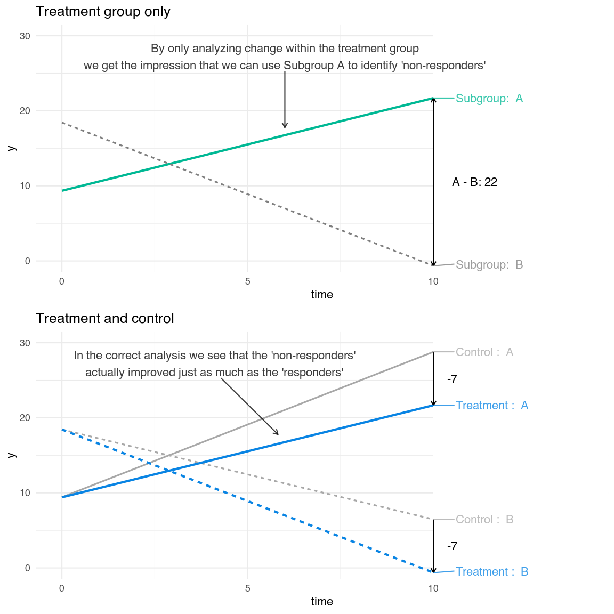

This will be a non-technical post illustrating the problems with identifying treatment responders or non-responders using inappropriate within-group analyses.  Specifically, I will show why it is pointless to try to identify a subgroup of non-responders using a naïve analysis of data from one treatment group only, even though we have weekly measures over time.

This type of unwarranted and misleading causal language is surprisingly common. You see this type of language even when the data comes from an RCT, often in secondary analyses of mediators, predictors, or in even trendier studies where the authors have a strong urge to mix *omics* (e.g., genomics) and artificial intelligence/machine learning for vague reasons. 

## Defining treatment response
When we talk about "treatment response" we usually mean the causal estimand, i.e., the counterfactual comparison of the effect of receiving the treatment versus not-receiving the treatment. Deep down we all know that a treatment outcome is a relative contrast, and not simply a patient's change from pre to posttest. We can (usually) only estimate the effect of the treatment on the group level, by randomizing patients to a treatment or a control group and estimating the average treatment effect by comparing the expected outcome in the two groups. The rate at which we tend to "forget" this basic knowledge seems directly related to our drive to publish in high impact journals.

## Simulating the problem


```r
# Packages used
library(tidyverse)
library(powerlmm) # dev version
library(ggrepel)
```

I will use `powerlmm` to simulate some longitudinal treatment data. In this setup, the control group has a ~40% reduction in symptoms at posttest, which in this case would give a Cohen's *d* of 0.5. And the actual treatment effect is *d* = 0.5, i.e., a 7 point difference at posttest between the treatment and control group. These would not be surprising numbers in some psychiatric trials.


```r
p <- study_parameters(design = study_design(),
                      n1 = 11,
                      n2 = 200,
                      fixed_intercept = 17,
                      fixed_slope = -7/10,
                      icc_pre_subject = 0.5,
                      var_ratio = 0.03,
                      cor_subject = -0.5,
                      effect_size = cohend(-0.5)
)
```


```r
plot(p, type = "trend", RE = FALSE) +
  theme_minimal() +
   scale_color_manual(values = c("Control" = "gray66", 
                                  "Treatment" = "#0984e3")) 
```


### Creating the subgroups
We want to add a subgroup of "non-responders", and we do this by simply assigning subjects to group A or B based on their latent random slopes. This is easily done using the `data_transform` argument. The non-responders have subject-specific slopes 1 SD above the mean. Obviously, this is a bit simplistic, but it gets the point across. 


```r
add_subgroup <- function(d) {
  
  # 1.73 is the slope SD
  d$subgroup <- ifelse(d$subject_slope < 1.73, "B", "A")
  d$subgroup <- factor(d$subgroup)
  
  d
}
```

If we plot one realization of the latent slopes from this data generating process, we get this figure.


```r:collapsed=true:title=plot
set.seed(1234)
p0 <- p %>% 
  update(n2 = 1000) %>% 
  simulate_data %>% 
  add_subgroup() %>% 
  mutate(mu = fixed_intercept + subject_intercept + (fixed_slope + subject_slope) * time) %>%    
  ggplot(aes(time, mu, group = subject)) + 
  geom_line(aes(color = subgroup, alpha = subgroup)) + 
  geom_text_repel(data = data.frame(mu = 25, time = 5),
                  aes(group = NULL),
                  direction = "y",
                  ylim = c(45,NA),
                  point.padding = 1,
                  
                  arrow = arrow(length = unit(0.02, "npc")),
                  label.size = NA, 
                  segment.color = "gray35",
                  label = "A subgroup with participants that\n tend to decline over time") +
  scale_color_manual(values = c("B" = "gray66", 
                                "A" = "#0984e3")) +
  scale_alpha_manual(values = c("B" = 0.25, 
                                "A" = 0.75)) +
  theme_minimal() +
  theme(legend.position = "bottom") +
  labs(title = "Treatment group")
```


### A naïve analysis: Using only the treatment group
Let's say we have access to data from a clinic that carefully monitor their patients' change during treatment (e.g., IAPT). The sample size is large, and we want to identify if there is a subgroup of patients that are "non-responders". There is no control group, but we have weekly measures during the treatment (there is also perfect adherence and no dropout...), we also have access to some cool baseline marker data that will impress reviewers and enable "personalized treatment selection for non-responding patients". So what we do is run an analysis to identify if there is an interaction between our proposed subgroup variable and change over time. Let's run such a simulation.


```r
add_subgroup_tx_only <- function(d) {
  d$subgroup <- ifelse(d$subject_slope < 1.73, "B", "A")
  d$subgroup <- factor(d$subgroup)
  
  d <- dplyr::filter(d, treatment == 1)
  d
}

f <- sim_formula("y ~ subgroup * time + (1 + time | subject)", 
                 data_transform = add_subgroup_tx_only, 
                 test = c("time"))

res <- simulate(p, 
                formula = f, 
                nsim = 5000, 
                cores = 16)
```


```r
summary(res)
```

```
## Model:  default 
## 
## Random effects 
## 
##          parameter  M_est theta est_rel_bias prop_zero is_NA
##  subject_intercept  89.00 100.0        -0.11         0     0
##      subject_slope   1.70   3.0        -0.44         0     0
##              error 100.00 100.0         0.00         0     0
##        cor_subject  -0.39  -0.5        -0.22         0     0
## 
## Fixed effects 
## 
##       parameter M_est theta M_se SD_est Power Power_bw Power_satt
##     (Intercept)   9.3  17.0 2.00   1.90  1.00        .        NaN
##       subgroupB   9.1     . 2.10   2.10  0.99        .        NaN
##            time   1.2  -0.7 0.29   0.22  1.00        1        NaN
##  subgroupB:time  -3.1     . 0.31   0.25  1.00        .        NaN
## ---
## Number of simulations: 5000  | alpha:  0.05
## Time points (n1):  11
## Subjects per cluster (n2 x n3):  200 (treatment)
##                                  200 (control)
## Total number of subjects:  400 
## ---
## At least one of the models applied a data transformation during simulation,
## summaries that depend on the true parameter values will no longer be correct,
## see 'help(summary.plcp_sim)'
```

We see that we tend to identify a powerful subgroup effect, participants in the A subgroup tend to change less and even deteriorate during the treatment. Surely, this is substantial proof that there is a differential treatment response and that these patients did not respond to the treatment? I'm sure you know the answer, but to be sure let us also run the simulation were we have access to some similar data from another source that actually randomized their patients to receive either the treatment or a placebo control. What we want now is to identify an interaction between the subgroup variable and the treatment-by-time interaction. So we update the simulation formula.


```r
f2 <- sim_formula("y ~ subgroup * time * treatment + (1 + time | subject)", 
                  data_transform = add_subgroup)

res2 <- simulate(p, 
                 formula = f2, 
                 nsim = 5000, 
                 cores = 16)
```


```r
summary(res2)
```

```
## Model:  default 
## 
## Random effects 
## 
##          parameter M_est theta est_rel_bias prop_zero is_NA
##  subject_intercept  89.0 100.0        -0.11         0     0
##      subject_slope   1.7   3.0        -0.44         0     0
##              error 100.0 100.0         0.00         0     0
##        cor_subject  -0.4  -0.5        -0.21         0     0
## 
## Fixed effects 
## 
##                 parameter M_est theta M_se SD_est Power Power_bw Power_satt
##               (Intercept)  9.40 17.00 2.00   1.90  1.00        .        NaN
##                 subgroupB  9.00     . 2.10   2.10  0.99        .        NaN
##                      time  1.90 -0.70 0.29   0.22  1.00        .        NaN
##                 treatment -0.01  0.00 2.80   2.70  0.04        .        NaN
##            subgroupB:time -3.10     . 0.31   0.26  1.00        .        NaN
##       subgroupB:treatment  0.02     . 3.00   3.00  0.04        .        NaN
##            time:treatment -0.71 -0.71 0.41   0.32  0.39     0.39        NaN
##  subgroupB:time:treatment  0.00     . 0.44   0.36  0.02        .        NaN
## ---
## Number of simulations: 5000  | alpha:  0.05
## Time points (n1):  11
## Subjects per cluster (n2 x n3):  200 (treatment)
##                                  200 (control)
## Total number of subjects:  400 
## ---
## At least one of the models applied a data transformation during simulation,
## summaries that depend on the true parameter values will no longer be correct,
## see 'help(summary.plcp_sim)'
```

Using the appropriate estimand of a subgroup effect we now get the "disappointing" result that there is absolutely no difference in treatment response for participants in subgroup A or B. The coefficient `subgroupB:time:treatment` is zero on average. To make it even more clear what is going on let us also plot the trends.

```r:collapsed=true:title=plot
# Calculate trends
tmp <- expand.grid(time = 0:10, 
                   subgroup = c("A", "B"))
X <- model.matrix(~subgroup * time, data = tmp)

b_hat <- summary(res)$summary$default$FE[, "M_est"]

tmp$y <- c(X %*% b_hat)

TE <- tmp %>% 
  filter(time == 10) %>% 
  spread(subgroup, y)


# Plot treatment group only
p0 <- ggplot(tmp, 
       aes(time, 
           y, 
           group = subgroup, linetype = subgroup, color = subgroup)) + 
  geom_line(aes(size = subgroup)) +
  annotate("rect", 
           xmin = 10, 
           xmax = Inf, 
           ymin = -Inf, 
           ymax = Inf, 
           fill = "white") +
  geom_segment(data = TE, 
               aes(xend = time, 
                   y = A, 
                   yend = B,
                   linetype = NULL,
                   color = NULL, 
                   group = NULL), 
               arrow = arrow(length = unit(0.02, "npc"), ends = "both")
  ) +
  geom_text_repel(data = filter(tmp, time == 10), 
                  alpha = 0.77,
                  aes(y = y, 
                      label = paste("Subgroup: ", subgroup), 
                      group = NULL),
                  direction = "x",
                  xlim = c(10.5, NA)
  ) +
  geom_text_repel(data = filter(tmp, time == 6, subgroup == "A"), 
                  alpha = 0.77,
                  aes(y = y, 
                      label = "By only analyzing change within the treatment group\nwe get the impression that we can use Subgroup A to identify 'non-responders'", 
                      group = NULL,
                      color = NULL),
                  direction = "y",
                  arrow = arrow(length = unit(0.02, "npc")),
                  point.padding = 1,
                  ylim = c(25, NA)
  ) +
  geom_text(data = TE,
            aes(group = NULL, 
                color = NULL, 
                linetype = NULL,
                y = (A+B)/2, 
                label = paste("A - B:", round(A - B, 0))), 
            point.padding = 1,
            direction = "x",
            nudge_x = 0.5,
            hjust = 0, 
            arrow = arrow(length = unit(0.02, "npc")),
            xlim = c(10.5,NA),
            label.size = NA, 
            segment.color = "gray35"
  ) +  
  theme_minimal() +
  theme(legend.position = "none") +
  scale_color_manual(values = c("B" = "gray50", 
                                "A" = "#00b894")) +
  scale_size_manual(values = c("B" = 0.75, "A" = 1)) +
  coord_cartesian(xlim = c(0, 14), ylim = c(0, 30)) +
  labs(title = "Treatment group only")


# Calculate trends for RCT
tmp <- expand.grid(time = 0:10, 
                   treatment = factor(0:1, labels = c("Control", "Treatment")), 
                   subgroup = c("A", "B"))
X <- model.matrix(~subgroup * time * treatment, data = tmp)

b_hat <- summary(res2)$summary$default$FE[, "M_est"]

tmp$y <- c(X %*% b_hat)

TE <- tmp %>% 
    filter(time == 10) %>% 
    spread(treatment, y)


# Plot RCT
p1 <- ggplot(tmp, 
       aes(time, 
           y, 
           group = interaction(subgroup, treatment), 
           color = treatment, linetype = subgroup)) + 
    geom_line(aes( size = treatment)) +
    annotate("rect", 
             xmin = 10, 
             xmax = Inf, 
             ymin = -Inf, 
             ymax = Inf, 
             fill = "white") +
    geom_segment(data = TE, 
                 aes(xend = time, 
                     y = Treatment, 
                     yend = Control,
                     group = subgroup, 
                     linetype = NULL,
                     color = NULL), 
                 arrow = arrow(length = unit(0.02, "npc"), ends = "first")
                 ) +
    geom_text_repel(data = filter(tmp, time == 6, subgroup == "A", treatment == "Treatment"), 
                  alpha = 0.77,
                  aes(y = y, 
                      label = "In the correct analysis we see that the 'non-responders'\nactually improved just as much as the 'responders'", 
                      group = NULL,
                      color = NULL),
                  direction = "y",
                  arrow = arrow(length = unit(0.02, "npc")),
                  point.padding = 1,
                  ylim = c(25, NA),
                  xlim = c(NA, 8)
  ) +
    geom_text_repel(data = filter(tmp, time == 10), 
                    alpha = 0.77,
                    aes(y = y, 
                        label = paste(treatment, ": ", subgroup), 
                        color = treatment, 
                        group = NULL),
                    direction = "x",
                    xlim = c(10.5, NA)
                    ) +
    geom_text(data = TE,
        aes(group = NULL, 
            color = NULL, 
            linetype = NULL,
            y = (Treatment+Control)/2, 
            label = round(Treatment - Control, 0)), 
        point.padding = 1,
        direction = "x",
        nudge_x = 0.5,
        arrow = arrow(length = unit(0.02, "npc")),
        xlim = c(10.5,NA),
        label.size = NA, 
        segment.color = "gray35"
    ) +  
    theme_minimal() +
    theme(legend.position = "none") +
    scale_color_manual(values = c("Control" = "gray66", 
                                  "Treatment" = "#0984e3")) +
    scale_size_manual(values = c("Control" = 0.75, "Treatment" = 1)) +
    coord_cartesian(xlim = c(0, 14), ylim = c(0, 30)) + 
  labs(title = "Treatment and control")
```




We see that the "non-responders" actually improved just as much as the "responders" when compared to the control group. The effect from the naïve within-group analysis clearly confounds treatment response with just "change". You might think that there is no reason why Subgroup A would start deteriorating just as they enter the study. It is easy to think of different explanations for this; one explanation might be that the marker we used to identify the subgroup is related to some personality trait that makes participants more likely to seek treatment when they feel "good enough to start treatment". It is not uncommon to hear such reasoning. During the study period these patients will tend to regress toward their typical symptom level, but the deterioration is somewhat slowed down thanks to the treatment. Patients in subgroup B on the other hand, seek treatment because they have felt worse than usual for a period. So our marker for "treatment response" do not identify responders and non-responders it simply identifies patients on different trajectories, i.e., it is a prognostic marker. 

The point of this post is not just semantics (treatment response versus change). The take-home message is important: by using the naïve analysis and the unwarranted causal language, we risk spreading the misinformation that patients belonging to subgroup A do no benefit from the treatment, when in fact they do. This risks creating an unnecessary stigma for a patient group that might already be seen as "difficult", and inspire suboptimal "personalized" treatments that could be less likely to work. 

