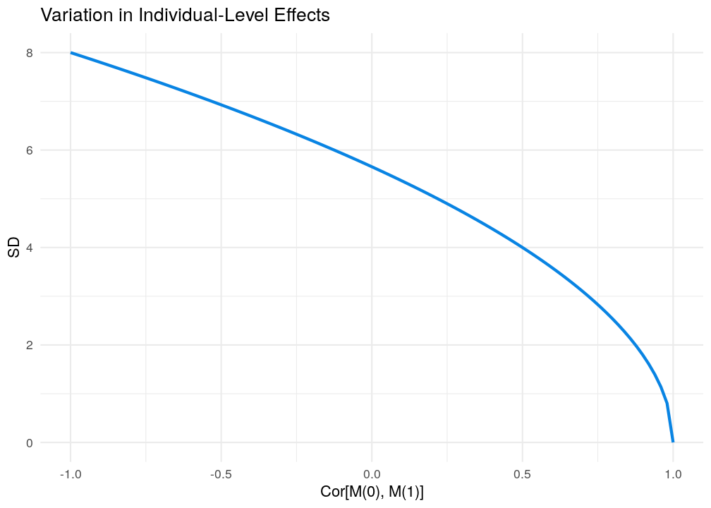
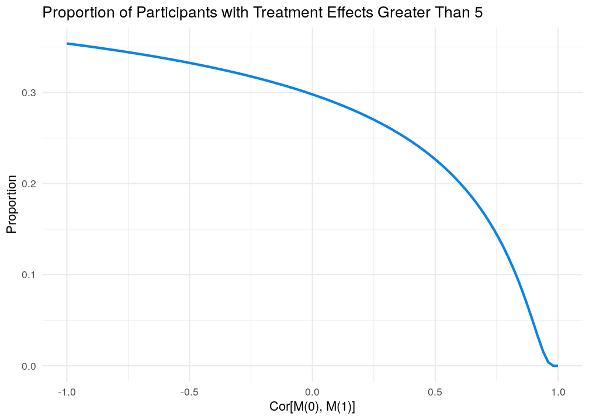

Recently there has been a couple of meta-analyses investigating heterogeneous treatment effects by analyzing the ratio of the outcome variances in the treatment and control group. The argument made in these articles is that if individuals differ in their response, then observed variances in the treatment and control group in RCTs should differ. For instance, Winkelbeiner et al. (2019) write:

> The SDs of the pretreatment and posttreatment outcome difference scores in the treatment and control groups consist of
the same variance components, including the within-patient variation. The treatment group, however, may also include the additional treatment-by-patient interaction, which could indicate the presence of individual response differences. Thus, in the case of a variable treatment effect, an increase of the variance in the treatment group, compared with the control group, should be observable.

Altough I agree with much of what's written in these articles, I'm still not completely sold on the core argument. If we filter the argument through my (perhaps missinformed) understanding of the ideas, we can write the following model for the individual-level treatment effect (ITE):


$$
\begin{aligned}
\text{ITE}_i &= \Delta_i =  Y_i(1) - Y_i(0),\\ 
Y_i(0) &= \beta_0 + e_i \\
Y_i(1) &= Y_i(0) + \Delta_i,
\end{aligned}
$$
where $Y_i(1)$ is the outcome after treatment and $Y_i(0)$ after placebo. For a single patient we can only observe one of these potential outcomes. We can see that the only difference between an individual's treatment-free outcome and their outcome after treatment is the causal effect of the treatment. We have two variance components: 1) the treatment effects ($\sigma_{\Delta}^2$), and 2) all other sources of variance ($\sigma_{e}^2$). Let's assume they are bivariate normal,

$$
\begin{pmatrix}
e_i \\
\Delta_i
\end{pmatrix}
\sim\mathcal{N}
\left(
\begin{matrix}
0 &\\
0
\end{matrix}
,
\begin{matrix}
 \sigma^2_{e} & \sigma_{e}\sigma_{\Delta}\rho \\
 \sigma_{e}\sigma_{\Delta}\rho  & \sigma^2_{\Delta}
\end{matrix}
\right).
$$
Hence, the treatment-free outcome $Y_i(0)$ is potentially correlated with the individual-level treatment effect.
Thus, in an RCT the observed variance in each arm would be:

$$
\begin{aligned}
\text{Var}(Y \mid \text{Tx = 0}) &= \sigma^2_e, \\
\text{Var}(Y \mid \text{Tx = 1}) &= \sigma^2_e + \sigma^2_{\Delta} + 2\sigma_e \sigma_{\Delta}\rho 
\end{aligned}
$$

It should be clear that all variance in the treatment effect is represented by $\sigma^2_{\Delta}$,

$$ 
\begin{aligned}
\text{Var}(\Delta_i) &= \text{Var}[Y_i(1)- Y_i(0)] \\
&=  \sigma^2_{\Delta}. 
\end{aligned}
$$

Now let's investigate under what conditions we can have equal variances *and* treatment effect heterogeneity, i.e., when is
$$
\begin{aligned}
\frac{
\text{Var}(Y \mid \text{Tx = 0})
}
{
\text{Var}(Y \mid \text{Tx = 1}) 
} = 1 \quad \text{and} \quad  \sigma^2_{\Delta} > 0.
\end{aligned}
$$

We can rewrite the expression above as,

$$
\begin{aligned}
\frac{
\sigma^2_e 
}
{
\sigma^2_e + \sigma^2_{\Delta} + 2\sigma_e \sigma_{\Delta}\rho 
} = 1 \quad \text{and} \quad  \sigma^2_{\Delta} > 0.
\end{aligned}
$$

We can see that this ratio will only equal 1 when the covariance exactly cancel the treatment effect variance, i.e., when

$$
\begin{aligned}
\sigma^2_{\Delta} + 2\sigma_e \sigma_{\Delta}\rho &= 0 \quad \text{and} \quad  \sigma^2_{\Delta} > 0 \\
-\frac{1}{2}\frac{\sigma_{\Delta}}{\sigma_e} &= \rho. 
\end{aligned}
$$

Under this model it seems quite unlikely that heterogeneous effects are present when the outcome variances are equal in magnitude, as they could only be present given a highly specific correlation and for all other values of $\rho$ the outcome variances will be heterogeneous. This result agrees with what Cortés et al. (2019) conclude in their supplement. **However, why must we assume that the treatment variance is an entirely separate variance component?** Let us see what happens if we change that assumption.

## What if the treatment changes one of the variance components?
Let's assume that there's a causal mechanism that causes some or all of the variance in symptoms. This variable, M, is now a source of variance in both the treatment and the control group. However, if the treatment impacts the outcome by fixing a dysfunction in this causal mechanism (i.e., the treatment effect is mediated) then this can be a source of treatment effect heterogeneity without having to introduce a new variance component in the treatment group. Let's write down this model, first we have an outcome,


$$
Y_i = Y_i[Tx_i, M(Tx_i)]
$$
where $Tx_i$ is an individuals assigned treatment, and $M_i(Tx_i)$ the value of the mediator realized depending on the assigment $Tx_i$. The potential outcomes after treatment or control is then,

$$
\begin{aligned}
Y_i(0) &= \beta_0 + \beta_M M_i(0) + e_i \\
Y_i(1) &= \beta_0 + \beta_M M_i(1) + \beta_{\Delta} + e_i.
\end{aligned}
$$
and we assume that the potential outcome values of the mediator is correlated,

$$
\begin{pmatrix}
M_i(0) \\
M_i(1) 
\end{pmatrix}
\sim\mathcal{N}
\left(
\begin{matrix}
M_0 &\\
M_1
\end{matrix}
,
\begin{matrix}
 \sigma^2_{M(0)} & \sigma_{M(0)}\sigma_{M(1)}\rho \\
 \sigma_{M(0)}\sigma_{M(1)}\rho  & \sigma^2_{M(1)}
\end{matrix}
\right)
$$

Now the outcome variances in each group can be written as,

$$
\begin{aligned}
\text{Var}(Y \mid \text{Tx = 0}) &= (\sigma_{M(0)}\beta_M)^2 + \sigma^2_e \\
\text{Var}(Y \mid \text{Tx = 1}) &= (\sigma_{M(1)}\beta_M)^2 + \sigma^2_e
\end{aligned}
$$
Hence variances are equal in the treatment and control group if the variance of the mediator is the same in each group (and that the effect of the mediator on the outcome is the same). Let's assume that's the case so that we have $\sigma_{M(0)} = \sigma_{M(1)} = \sigma_{M}$. Then the variance of the individual-level effects is,

$$
\begin{aligned}
\text{Var}(\Delta_i) &= \text{Var}[Y_i(1) - Y_i(0)] \\
 &=  \beta_M^2  \sigma_{M}^2 + \beta_M^2  \sigma_{M}^2 - 2\beta_M^2 \text{Cov}[M_i(0), M_i(1)] \\
         &= 2\beta_M^2  \sigma_M^2 - 2\beta_M^2 \sigma_{M}^2\rho.
\end{aligned}
$$

We can see that $\text{Var}(\Delta_i)$ can only be 0 if $\rho = 1$. Thus in this example, the results are reversed, and *homo*geneous effects are now only possible if individuals' potential outcomes on the mediator are perfectly (positively) correlated. The point here is not to claim that heterogeneous effects are likely and that "precision psychiatry" is the way forward. My point is simply that I'm not sure how much we can learn from looking at the ratio of outcome variances. 

## A Numerical Example
Here is a numerical example of equal outcome variances with varying degrees of heterogeneous individual-level treatment effects. Although a simulation is not needed here, I know some people prefer it over equations.


```r
library(dplyr)
library(ggplot2)
library(MASS)
theme_set(theme_minimal() + theme(legend.position = "bottom"))
scale_colour_discrete <- function(..., values) scale_color_manual(..., values = c("black", "#0984e3"))

#' Simulate potential outcomes with mediator
#'
#' @param n number of subjects
#' @param b_M0 Effect of mediator on outcome in control
#' @param b_M1 Effect of mediator on outcome in treatment
#' @param b_TX Direct effect of treatment
#' @param M0_M Mediator mean in control
#' @param M1_M Mediator mean in treatment
#' @param M0_SD Mediator SD in control
#' @param M1_SD Mediator SD in treatment
#' @param M01_cor Correlation between counterfactual mediator values
#' @param sigma "Error" variance
#' @param ... 
#'
#' @return a data.frame
#' @export

sim_data <- function(n,
                     b_M0,
                     b_M1,
                     b_TX,
                     M0_M = 1,
                     M1_M = 2.5,
                     M0_SD = 1,
                     M1_SD = 1,
                     M01_cor = 0,
                     sigma = 1,
                     ...) {
  
  Sigma <- matrix(c(M0_SD^2, M0_SD*M1_SD*M01_cor,
                    M0_SD*M1_SD*M01_cor, M1_SD^2), 
                  nrow=2)
  Mm <- mvrnorm(n=n, 
                mu=c(M0_M, M1_M),
                Sigma=Sigma,
                empirical=TRUE)
  
  tibble::tibble(
    # treatment assigment
    TX = rbinom(n, 1, 0.5),
    # Mediator in control
    M0 = Mm[,1], 
    # Mediator under treatment
    M1 = Mm[,2],
    # Y(0, M(0)), outcome in control when mediator at control levels
    Y0_M0 = 6 + b_M0 * M0,
    # Y(0, M(1)), outcomes in control when mediator at TX levels
    Y0_M1 = 6 + b_M1 * M1,
    # Y(1, M(0)), outcomes in TX when mediator at control levels
    Y1_M0 = Y0_M0 + b_TX,
    # Y(1, M(1)), outcomes in TX when mediator at TX levels 
    Y1_M1 = Y0_M1 + b_TX,
    # Obs. Mediator
    M = (TX==0) * M0 + (TX==1) * M1,
    # Obs. Outcome
    y = (TX==0) * Y0_M0 + (TX==1) * Y1_M1 + rnorm(n, sd = sigma)
  )
}
```


I base these values on Plöderl and Hengartner (2019). The SD in each group is 8, with an average treatment effect of -2 points on the Hamilton Depression Rating Scale (HDRS). I arbitrarily assume that 25% of the outcome variance is caused by The Causal Mechanism and that 50% of the total treatment effect is mediated.


```r
# Sim data
r <- 0.5
b_M <- 0.5
M0_SD <- sqrt(8^2 * 1/4)/b_M
M1_SD <- M0_SD
sigma <- sqrt(8^2 * 3/4)
set.seed(5050505)
d <- sim_data(
  n = 5e5,
  b_TX = -1,
  b_M0 = b_M,
  b_M1 = b_M,
  M0_M = 10,
  M1_M = 8,
  M0_SD = M0_SD,
  M1_SD = M1_SD,
  sigma = sigma,
  M01_cor = r,
  data_gen = sim_data
)

d %>% 
  group_by(TX) %>% 
  summarize(mean(y), 
            sd(y), 
            cor(Y0_M0, Y1_M1),
            cor(M0, M1),
            mean(Y1_M1 - Y0_M0),
            sd(Y1_M1 - Y0_M0)) %>% 
    kable(digits = 2)
```


| TX| mean(y)| sd(y)| cor(Y0_M0, Y1_M1)| cor(M0, M1)| mean(Y1_M1 - Y0_M0)| sd(Y1_M1 - Y0_M0)|
|--:|-------:|-----:|-----------------:|-----------:|-------------------:|-----------------:|
|  0|   10.99|  7.99|               0.5|         0.5|                  -2|              3.99|
|  1|    9.01|  8.00|               0.5|         0.5|                  -2|              4.01| 


Let us plot $SD(\Delta_i)$ as a function of the correlation of potential mediator outcomes.

```r
get_SD_ITE_df <- function(r, b_M, M0_SD, M1_SD) {
    sds <- sqrt(b_M ^ 2 * M0_SD ^ 2 + b_M ^ 2 * M1_SD ^ 2 - 2 * b_M ^ 2 * M0_SD ^
                    2 * r)
    data.frame(cor = r, 
               sd_ITE = sds)
}

tmp <-
    get_SD_ITE_df(
        r = seq(-1, 1, length.out = 100),
        b_M = b_M,
        M0_SD = M0_SD,
        M1_SD
    )

ggplot(tmp, aes(cor, sd_ITE)) +
    geom_line(color = "#0984e3", size = 1) +
        labs(y = "SD", 
         x = "Cor[M(0), M(1)]", 
         title = "Variation in Individual-Level Effects")
```




We can also plot the proportion of "responders" (improve by more than 5 points on HDRS) as a function of the correlation.

```r
get_responder_df <- function(r, cutoff, ATE, b_M, M0_SD, M1_SD) {
    sds <- sqrt(b_M ^ 2 * M0_SD ^ 2 + b_M ^ 2 * M1_SD ^ 2 - 2 * b_M ^ 2 * M0_SD ^
                    2 * r)
    data.frame(cor = r,
               prop_responder = pnorm(cutoff, ATE, sds))
}

tmp <- get_responder_df(
    r = seq(-1, 1, length.out = 100),
    cutoff = -5,
    ATE = -2,
    b_M = b_M,
    M0_SD = M0_SD,
    M1_SD
)

ggplot(tmp, aes(cor, prop_responder)) +
    geom_line(color = "#0984e3", 
              size = 1) +
    labs(y = "Proportion", 
         x = "Cor[M(0), M(1)]", 
         title = "Proportion of Participants with Treatment Effects Greater Than 5")
```



We can also take a sample of participants and plot their potential outcomes. 


```r
library(tidyr)
d_sub <- sample_n(d, 100)
tmp <- dplyr::select(d_sub, Y0_M0, Y1_M1, TX) %>% 
  gather(PO, val, -TX) %>% 
  mutate(obs = case_when(
    PO == "Y0_M0" & TX == "0"  ~ "Yes",
    PO == "Y0_M0" & TX == "1"  ~ "No",
    PO == "Y1_M1" & TX == "0"  ~ "No",
    PO == "Y1_M1" & TX == "1"  ~ "Yes",
  ),
  obs = factor(obs),
         TX = factor(TX))

tmp_tx <- filter(d_sub, TX == "1") %>% 
  mutate(TX = factor(TX))


ggplot(tmp, aes(PO, val)) +
  geom_point(aes(
    color = TX,
    group = TX,
    shape = obs
  ), position = position_dodge(width = 0.1)) +
  geom_segment(
    data = tmp_tx,
    aes(
        color = "1",
      y = Y1_M1,
      yend = Y0_M0,
        x = 2+0.025,
        xend = 1+0.025,
      alpha = NULL
    ),
    alpha = 0.25,
    position = position_dodge(width = 0.1)
  ) +
    labs(y = "Y", 
         x = "Potential Outcome", 
         shape = "Observed", 
         color = "Group",
         title = "Potential Outcomes")
```


## References
* Cortés, J., González, J. A., Medina, M. N., Vogler, M., Vilaró, M., Elmore, M., … Cobo, E. (2019). Does evidence support the high expectations placed in precision medicine? A bibliographic review. F1000Research, 7, 30. https://doi.org/10.12688/f1000research.13490.5
* Munkholm, K. (n.d.). Individual response to antidepressants for depression in adults – a simulation study and meta-analysis. 10.
* Plöderl, M., & Hengartner, M. P. (2019). What are the chances for personalised treatment with antidepressants? Detection of patient-by-treatment interaction with a variance ratio meta-analysis. BMJ Open, 9(12). https://doi.org/10.1136/bmjopen-2019-034816
* Winkelbeiner, S., Leucht, S., Kane, J. M., & Homan, P. (2019). Evaluation of Differences in Individual Treatment Response in Schizophrenia Spectrum Disorders: A Meta-analysis. JAMA Psychiatry, 76(10), 1063–1073. https://doi.org/10.1001/jamapsychiatry.2019.1530
