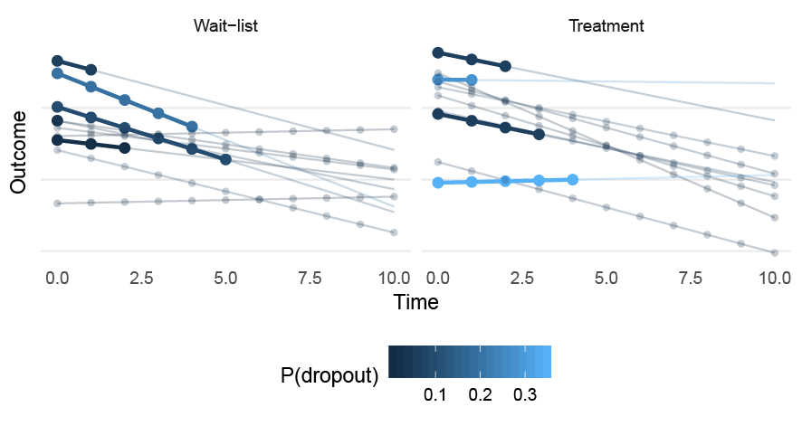

Linear mixed-effects models are often used for their ability to handle missing data using maximum likelihood estimation. In this post I will present a simple example of when the LMM fails, and illustrate two MNAR sensitivity analyses: the pattern-mixture method and the joint model (shared parameter model). This post is based on a small example from my [PhD thesis](https://openarchive.ki.se/xmlui/handle/10616/46909).

MCAR, MAR, and MNAR missing data
--------------------------------

D. B. Rubin (1976) presented three types of missing data mechanisms: missing completely at random (MCAR), missing at random (MAR), missing not at random (MNAR). LMMs provide unbiased estimates under MAR missingness. If we have the complete outcome variable $Y$ (which is made up of the observed data $Y_{obs}$ and the missing values $Y_{miss}$) and a missing data indicator $R$ (D. B. Rubin 1976; R. J. Little and Rubin 2014; Schafer and Graham 2002), then we can write the MCAR and MAR mechanisms as,

$$
\begin{aligned}
\text{MCAR}:\quad \text{P}(R \mid Y) &= \text{P}(R) \\
\text{MAR}:\quad \text{P}(R \mid Y) &= \text{P}(R \mid Y_{obs}).
\end{aligned}
$$

If the missingness depends on $Y_{miss}$, the missing values in $Y$, then the mechanism is MNAR. MCAR and MAR are called ignorable because the precise model describing the missing data process is not needed. In theory, valid inference under MNAR missingness requires specifying a joint distribution for both the data and the missingness mechanisms (R. J. A. Little 1995). There are no ways to test if the missing data are MAR or MNAR (Molenberghs et al. 2008; Rhoads 2012), and it is therefore recommended to perform sensitivity analyses using different MNAR mechanisms (Schafer and Graham 2002; R. J. A. Little 1995; Hedeker and Gibbons 1997).

### LMMs and missing data

LMMs are frequently used by researchers to try to deal with missing data problems. However, researchers frequently misunderstand the MAR assumption and often fail to build a model that would make the assumption more plausible. Sometimes you even see researchers using tests, e.g., Little's MCAR test, to prove that the missing data mechanisms is either MCAR or MAR and hence ignorable—which is clearly a misunderstanding and builds on faulty logic.

A common problem is that researchers do not include covariates that potentially predict dropout. Thus, it is assumed that missingness *only* depend on the previously observed values of the outcome. This is quite a strong assumption. A related misunderstanding, is that the LMM's missing data assumption is more liberal as it allows for participants' slopes to vary. It is sometimes assumed tat if a random slope is included in the model it can also be used to satisfy the MAR assumption. Clearly, it would be very practical if the inclusion of random slopes would allow missingness to depend on patients' latent change over time. Because it is probably true that some participants' dropout is related to their symptom's rate of change over time. Unfortunately, the **random effects are latent variables** and not observed variables—hence, such a **missingness mechanism would also be MNAR** (R. J. A. Little 1995). The figure below illustrates the MAR, outcome-based MNAR, and random coefficient-based MNAR mechanisms.


Let's generate some data
------------------------

To illustrate these concepts let's generate data from a two-level LMM with random intercept and slopes, and included a MNAR missing data mechanism where the likelihood of dropping out depended on the patient-specific random slopes. Moreover, let's assume that the missingness differs between the treatment and control group. This isn't *that* unlikely in unblinded studies (e.g., wait-list controls).




The equations for the dropout can be written as,

$$
\begin{aligned}
\text{logit}(\text{Pr}(R_{ij} = 1 | TX_{ij} = 1)) &= -\sigma_{u_{1}} + \text{logit}(0.15) + U_{1j} \\
\text{logit}(\text{Pr}(R_{ij} = 1 | TX_{ij} = 0)) &= -\sigma_{u_{1}} + \text{logit}(0.15) -U_{1j}.
\end{aligned}
$$

The R code is quite simple,

``` r:collapsed=true
add_MNAR_missing <- function(data) {
    # Slope dependent MNAR
    d <- data
    sd2 <- 1.414214
    u1 <- d$subject_slope
    tx <- d$treatment
    p_miss <- plogis(-sd2 + qlogis(0.15) + u1 * 1) * (tx == 1) + plogis(-sd2 + qlogis(0.15) + u1 * -1) * (tx == 0)
    d[, "p_miss"] <- p_miss
    d[d$time == 0, "p_miss"] <- 0
    d$miss <- rbinom(nrow(d), 1, d$p_miss)
    for (i in unique(d$subject)) {
        tmp <- d[d$subject == i, ]
        dropout <- which(tmp$miss == 1)[1]
        if (!is.na(dropout)) tmp[dropout:nrow(tmp), "y"] <- NA
        d[d$subject == i, "y"] <- tmp$y
        d$pre[d$subject == i] <- tmp$y[1]
    }
    d <- dplyr::group_by(d, subject)
    d <- dplyr::mutate(d,
        dropout = ifelse(any(miss == 1), 1, 0),
        dropout = factor(dropout),
        treatment = factor(treatment))

    d
}
```

Now let's draw a large sample from this model (1000 participants per group), and fit a typical longitudinal LMM using both the complete outcome variable and the incomplete (MNAR) outcome variable.

``` r
library(lme4)
library(powerlmm)
p <- study_parameters(n1 = 11,
    n2 = 1000,
    icc_pre_subject = 0.6,
    fixed_slope = -0.48,
    var_ratio = 0.02,
    cor_subject = -0.5,
    effect_size = cohend(-0.2))

set.seed(1111)
d <- simulate_data(p)
d <- add_MNAR_missing(d)

# MNAR
fit <- lmer(y ~ time * treatment + (time | subject), data = d)
# Complete Y
fit_c <- lmer(y_c ~ time * treatment + (time | subject), data = d)
```

Here are the results (click on "SHOW" to see the output).

``` r
# complete
summary(fit_c)
```

``` output:collapsed=true
## Linear mixed model fit by REML. t-tests use Satterthwaite's method ['lmerModLmerTest']
## Formula: y_c ~ time * treatment + (time | subject)
##    Data: d
## 
## REML criterion at convergence: 171594
## 
## Scaled residuals: 
##     Min      1Q  Median      3Q     Max 
## -3.8979 -0.6224  0.0008  0.6275  3.9917 
## 
## Random effects:
##  Groups   Name        Variance Std.Dev. Corr 
##  subject  (Intercept) 157.345  12.544        
##           time          2.122   1.457   -0.52
##  Residual             101.066  10.053        
## Number of obs: 22000, groups:  subject, 2000
## 
## Fixed effects:
##                   Estimate Std. Error         df t value Pr(>|t|)    
## (Intercept)     -2.314e-03  4.353e-01  1.998e+03  -0.005  0.99576    
## time            -5.452e-01  5.514e-02  1.998e+03  -9.887  < 2e-16 ***
## treatment1       2.778e-01  6.156e-01  1.998e+03   0.451  0.65182    
## time:treatment1 -2.494e-01  7.799e-02  1.998e+03  -3.198  0.00141 ** 
## ---
## Signif. codes:  0 '***' 0.001 '**' 0.01 '*' 0.05 '.' 0.1 ' ' 1
## 
## Correlation of Fixed Effects:
##             (Intr) time   trtmn1
## time        -0.585              
## treatment1  -0.707  0.414       
## tim:trtmnt1  0.414 -0.707 -0.585
## convergence code: 0
## Model failed to converge with max|grad| = 0.00234269 (tol = 0.002, component 1)
```

``` r
# MNAR
summary(fit)
```

``` output:collapsed=true
## Linear mixed model fit by REML. t-tests use Satterthwaite's method ['lmerModLmerTest']
## Formula: y ~ time * treatment + (time | subject)
##    Data: d
## 
## REML criterion at convergence: 129038.5
## 
## Scaled residuals: 
##     Min      1Q  Median      3Q     Max 
## -3.5720 -0.6249 -0.0031  0.6199  3.9551 
## 
## Random effects:
##  Groups   Name        Variance Std.Dev. Corr 
##  subject  (Intercept) 154.261  12.420        
##           time          1.482   1.217   -0.49
##  Residual             101.140  10.057        
## Number of obs: 16532, groups:  subject, 2000
## 
## Fixed effects:
##                   Estimate Std. Error         df t value Pr(>|t|)    
## (Intercept)       -0.55443    0.44122 1976.32082  -1.257   0.2091    
## time              -0.03171    0.05811 1531.01167  -0.546   0.5853    
## treatment1         1.40602    0.62353 1970.69369   2.255   0.0242 *  
## time:treatment1   -1.13713    0.08118 1515.27682 -14.008   <2e-16 ***
## ---
## Signif. codes:  0 '***' 0.001 '**' 0.01 '*' 0.05 '.' 0.1 ' ' 1
## 
## Correlation of Fixed Effects:
##             (Intr) time   trtmn1
## time        -0.523              
## treatment1  -0.708  0.370       
## tim:trtmnt1  0.374 -0.716 -0.526
```

We can see that the slope difference is -0.25 for the complete data and *much* larger for the LMM with missing data (-1.14).

### A Pattern-mixture model

A simple extension of the classical LMM is a pattern-mixture model. This is a simple model where we allow the slope to differ within subgroups of different dropout patterns. The simplest pattern is to group the participants into two subgroups dropouts (1) or completers (0), and include this dummy variable in the model.

``` r
fit_PM <- lmer(
  y ~ time * treatment * dropout + (time | subject),
  data = d)
summary(fit_PM)
```

``` output:collapsed=true
## Linear mixed model fit by REML. t-tests use Satterthwaite's method ['lmerModLmerTest']
## Formula: y ~ time * treatment * dropout + (time | subject)
##    Data: d
## 
## REML criterion at convergence: 128820.2
## 
## Scaled residuals: 
##     Min      1Q  Median      3Q     Max 
## -3.6488 -0.6232 -0.0068  0.6228  3.9328 
## 
## Random effects:
##  Groups   Name        Variance Std.Dev. Corr 
##  subject  (Intercept) 142.370  11.932        
##           time          1.295   1.138   -0.44
##  Residual             100.785  10.039        
## Number of obs: 16532, groups:  subject, 2000
## 
## Fixed effects:
##                            Estimate Std. Error         df t value Pr(>|t|)    
## (Intercept)                -3.79165    0.55175 1837.45768  -6.872 8.64e-12 ***
## time                        0.28856    0.06212 1310.90362   4.645 3.74e-06 ***
## treatment1                  6.85170    0.76746 1837.45768   8.928  < 2e-16 ***
## dropout1                    8.85122    0.87948 2142.34536  10.064  < 2e-16 ***
## time:treatment1            -1.70194    0.08640 1310.90362 -19.698  < 2e-16 ***
## time:dropout1              -1.57192    0.16006 3814.63541  -9.821  < 2e-16 ***
## treatment1:dropout1       -15.65008    1.25502 2150.49737 -12.470  < 2e-16 ***
## time:treatment1:dropout1    2.92160    0.22569 3702.06458  12.945  < 2e-16 ***
## ---
## Signif. codes:  0 '***' 0.001 '**' 0.01 '*' 0.05 '.' 0.1 ' ' 1
## 
## Correlation of Fixed Effects:
##             (Intr) time   trtmn1 dropt1 tm:tr1 tm:dr1 trt1:1
## time        -0.535                                          
## treatment1  -0.719  0.385                                   
## dropout1    -0.627  0.336  0.451                            
## tim:trtmnt1  0.385 -0.719 -0.535 -0.241                     
## time:dropt1  0.208 -0.388 -0.149 -0.449  0.279              
## trtmnt1:dr1  0.440 -0.235 -0.612 -0.701  0.327  0.315       
## tm:trtmn1:1 -0.147  0.275  0.205  0.319 -0.383 -0.709 -0.450
## convergence code: 0
## Model failed to converge with max|grad| = 0.00724549 (tol = 0.002, component 1)
```

As you can see in the output, we now have a bunch of new coefficients. In order to get the marginal treatment effect we need to average over the dropout patterns. There are several ways to do this, we could just calculate a weighted average manually. For example, the outcome at posttest in the control group is

``` r
# weight by the overall proportion of dropouts
p <- mean(d$dropout == 0)
b <- fixef(fit_PM)
# Outcome in control group at posttest
(b[1] + b[2]*10) * p[1] + 
(b[1] + b[4] + (b[2] + b[6]) * 10) * (1 - p[1])
```

``` output
## (Intercept) 
##    -3.70131
```

To estimate the treatment effect we'd need to repeat this for the treatment group and take the difference. However, we'd also need to calculate the standard errors (e.g., using the delta method). An easier option is to just specify the linear contrast we are interest in.

``` r
L <- c(0, 0, 1, 0, 10, 0, (1 - p), (1 - p) * 10)
lmerTest::contest1D(fit_PM, L = L)
```

``` output
##    Estimate Std. Error       df   t value     Pr(>|t|)
## 1 -4.646391  0.8937291 2687.174 -5.198881 2.155559e-07
```

This tells us that the difference between the groups at posttest is estimated to be -4.65. This is considerably smaller than the estimate from the classical LMM, but still larger then for the complete data. We could accomplish to same thing using `emmeans` package.

``` r
emmeans::emmeans(fit_PM,
        pairwise ~ treatment | time,
        at = list(time = 10),
        CIs = FALSE,
        lmer.df = "asymptotic", # wald
        weights = "proportional",
        data = d)
```

``` output
## $emmeans
## time = 10:
##  treatment emmean    SE  df asymp.LCL asymp.UCL
##  0          -3.70 0.635 Inf     -4.95     -2.46
##  1          -8.35 0.629 Inf     -9.58     -7.11
## 
## Results are averaged over the levels of: dropout 
## Degrees-of-freedom method: asymptotic 
## Confidence level used: 0.95 
## 
## $contrasts
## time = 10:
##  contrast estimate    SE  df z.ratio p.value
##  0 - 1        4.65 0.894 Inf 5.199   <.0001 
## 
## Results are averaged over the levels of: dropout 
## Degrees-of-freedom method: asymptotic
```

Fitting a joint model
---------------------

The pattern-mixture model was an improvement, but it didn't completely recover the treatment effect under the random slope MNAR model. We can actually fit a model that allows dropout to be related to the participants' random slopes. To accomplish this we combine a survival model for the dropout process and an LMM for the longitudinal outcome.

``` r
library(JM)
# JM
d_c <- d
d_m <- d %>%
    filter(!is.na(y)) %>%
    arrange(subject)
#  LMM
fit_lme <- lme(
  y ~ treatment * time, data = d_m,
  random = ~ time | subject
  )
# dropouts
d_miss <- d_m %>%
    group_by(subject, treatment) %>%
    summarise(time = max(time),
        time = ifelse(time < 10, time + 1, time),
        dropout = ifelse(time < 10, 1, 0)) %>%
    arrange(subject)
# the Cox model
fit_surv <- coxph(
  Surv(time, dropout) ~ 1 + treatment,
   data = d_miss, 
   x = TRUE
   )
# slope derivatives
dForm <- list(
    fixed = ~treatment,
    random = ~1,
    indFixed = c(3, 4),
    indRandom = c(2)
)
# Fit the joint model
fit_JM <- jointModel(
  fit_lme, 
  fit_surv,
  timeVar = "time",
  parameterization = "slope",
  derivForm = dForm,
  interFact = list(slope = ~treatment,
  data = d_miss))
summary(fit_JM)
```

``` output:collapsed=true
## 
## Call:
## jointModel(lmeObject = fit_lme, survObject = fit_surv, timeVar = "time", 
##     parameterization = "slope", interFact = list(slope = ~treatment, 
##         data = d_miss), derivForm = dForm)
## 
## Data Descriptives:
## Longitudinal Process     Event Process
## Number of Observations: 16532    Number of Events: 771 (38.5%)
## Number of Groups: 2000
## 
## Joint Model Summary:
## Longitudinal Process: Linear mixed-effects model
## Event Process: Weibull relative risk model
## Parameterization: Time-dependent slope 
## 
##    log.Lik      AIC      BIC
##  -67468.67 134963.3 135036.1
## 
## Variance Components:
##               StdDev    Corr
## (Intercept)  12.3930  (Intr)
## time          1.4029 -0.4960
## Residual     10.0626        
## 
## Coefficients:
## Longitudinal Process
##                   Value Std.Err z-value p-value
## (Intercept)      0.0590  0.4187  0.1409  0.8879
## treatment1       0.2201  0.5949  0.3700  0.7114
## time            -0.5025  0.0638 -7.8730 <0.0001
## treatment1:time -0.2315  0.0932 -2.4832  0.0130
## 
## Event Process
##                       Value Std.Err  z-value p-value
## (Intercept)         -4.8791  0.3464 -14.0846 <0.0001
## treatment1           1.2856  0.1971   6.5214 <0.0001
## Assoct.s            -1.2121  0.1308  -9.2637 <0.0001
## Assoct.s:treatment1  2.5567  0.2398  10.6632 <0.0001
## log(shape)           0.3507  0.0618   5.6770 <0.0001
## 
## Scale: 1.4201 
## 
## Integration:
## method: (pseudo) adaptive Gauss-Hermite
## quadrature points: 3 
## 
## Optimization:
## Convergence: 0
```

We can see from the output that the estimate of the treatment effect is really close to the estimate from the complete data (-0.23 vs -0.25). There's only one small problem with the joint model and that is that we almost never know what the correct model is...

A small simulation
------------------

Now let's run a small simulation to show the consequences of this random-slope dependent MNAR scenario. We'll do a study with 11 time points, 150 participants per group, a variance ratio of 0.02, and pretest ICC = 0.6, with a correlation between intercept and slopes of -0.5. There will be a "small" effect in favor of the treatment of $d = -0.2$. The following models will be compared:

-   LMM (MAR): a classical LMM assuming that the dropout was MAR.
-   GEE: a generalized estimating equation model.
-   LMM (PM): an LMM using a pattern-mixture approach. Two patterns were used; either "dropout" or "completer", and the results were averaged over the two patterns.
-   JM: A joint model that correctly allowed the dropout to be related to the random slopes.
-   LMM with complete data: an LMM fit to the complete data without any missingness.

I will not post all code here; [the complete code for this post can be found on GitHub](https://github.com/rpsychologist/rpsychologist-com/blob/master/content/blog/2020-07-08-lmm-slope-missingness). Here's a snippet showing the code that was used to fit the models.

``` r:collapsed=true
post_test <- function(fit, d = NULL) {
    # pattern mixture
    res <- emmeans::emmeans(fit,
        pairwise ~ treatment | time,
        at = list(time = 10),
        CIs = FALSE,
        lmer.df = "satterthwaite",
        weights = "proportional",
        data = d)
    out <- as.data.frame(res$contrasts)
    out_PM <- data.frame(parameter = "PM_avg_posttest",
        estimate = out$estimate,
        se = out$SE,
        pval = out$p.value,
        df = out$df,
        df_bw = NA)
    # GEE
    fit <- geepack::geeglm(y ~ time * treatment, id = subject, data = d)
    x <- summary(fit)
    out_GEE <- data.frame(parameter = paste0("GEE_", rownames(x$coefficients)),
        estimate = x$coefficients[, 1],
        se = x$coefficients[, 2],
        pval = x$coefficients[, 4],
        df = NA,
        df_bw = NA)
    # JM
    d_c <- d
    d_m <- d %>%
        filter(!is.na(y)) %>%
        arrange(subject)
    #  LMM
    fit_lme <- tryCatch(lme(y ~ treatment * time, data = d_m,
        random = ~ time | subject),
    error = function(e) NA)
    # dropouts
    d_miss <- d_m %>%
        group_by(subject, treatment) %>%
        summarise(time = max(time),
            time = ifelse(time < 10, time + 1, time),
            dropout = ifelse(time < 10, 1, 0)) %>%
        arrange(subject)
    # the Cox model
    fit_surv <- tryCatch(coxph(Surv(time, dropout) ~ treatment, data = d_miss, x = TRUE),
        error = function(e) NA)
    # the joint model
    # slope derivates
    dForm <- list(
        fixed = ~treatment,
        random = ~1,
        indFixed = c(3, 4),
        indRandom = c(2)
    )
    if (inherits(fit_lme, "lme") & inherits(fit_surv, "coxph")) {
        fit_JM <- tryCatch({
            fit <- jointModel(fit_lme, fit_surv,
                timeVar = "time",
                parameterization = "slope",
                derivForm = dForm,
                interFact = list(slope = ~treatment,
                    data = d_miss))
            summary(fit)
        }, error = function(e) NA)
    } else fit_JM <- NA
    if (inherits(fit_JM, "summary.jointModel")) {
        x <- fit_JM$`CoefTable-Long`
        out_JM <- data.frame(parameter = paste0("JM_", rownames(x)),
            estimate = x[, 1],
            se = x[, 2],
            pval = x[, 4],
            df = NA,
            df_bw = NA)
    } else {
        out_JM <- data.frame(
            parameter = paste0("JM_",
                c("(Intercept)",
                    "treatment1",
                    "time",
                    "treatment1:time")),
            estimate = NA,
            se = NA,
            pval = NA,
            df = NA,
            df_bw = NA)
    }

    rbind(out_PM,
        out_GEE,
        out_JM)
}
```

### Results

The table and figure below shows how much the treatment effects differ. We can see that LMMs are badly biased under this missing data scenario; the treatment effect is much larger than it should be (Cohen's *d*: -0.7 vs. -0.2). The pattern-mixture approach improves the situation, and the joint model recovers the true effect. Since the sample size is large, the bias under the MAR assumption leads to the LMM's CIs having extremely bad coverage. Moreover, under the assumption of no treatment effect the MAR LMM's type I errors are very high (83%), whereas the pattern-mixture and joint model are closer to the nominal levels.

| Model    |  M(Est.)|  Rel. bias|      d|  Power|  CI coverage|  Type I error|
|:---------|--------:|----------:|------:|------:|------------:|-------------:|
| MAR      |   -11.84|     274.38|  -0.74|   1.00|         0.02|          0.83|
| PM       |    -5.39|      70.47|  -0.34|   0.64|         0.84|          0.10|
| GEE      |   -11.19|     253.98|  -0.70|   1.00|         0.06|          0.71|
| JM       |    -3.18|       0.59|  -0.20|   0.28|         0.93|          0.07|
| Complete |    -3.21|       1.44|  -0.20|   0.38|         0.95|          0.05|

**Note:** MAR = missing at random; LMM = linear mixed-effects model; GEE = generalized estimating equation; JM = joint model; PM = pattern mixture; Est. = mean of the estimated effects; Rel. bias = relative bias of Est.; d = mean of the Cohen’s d estimates.


Summary
-------

This example is purposely quite extreme. However, even if the MNAR mechanism would be weaker, the LMM will yield biased estimates of the treatment effect. The assumption that dropout might be related to patients' unobserved slopes is not unreasonable. However, fitting a joint model is often not feasible as we do not know the true missingness mechanism. I included it just to illustrate what is required to avoid bias under a plausible MNAR mechanism. In reality, the patients' likelihood of dropping out is likely an inseparable mix of various degrees of MCAR, MAR, and MNAR mechanisms. The only sure way of avoiding bias would be to try to acquire data from all participants—and when that fails, perform sensitivity analyses using reasonable assumptions of the missingness mechanisms.

References
----------

Hedeker, Donald, and Robert D Gibbons. 1997. “Application of Random-Effects Pattern-Mixture Models for Missing Data in Longitudinal Studies.” *Psychological Methods* 2 (1): 64–78. doi:[10.1037/1082-989X.2.1.64](https://doi.org/10.1037/1082-989X.2.1.64).

Little, Roderick J. A. 1995. “Modeling the Drop-Out Mechanism in Repeated-Measures Studies.” *Journal of the American Statistical Association* 90 (431): 1112–21. doi:[10.1080/01621459.1995.10476615](https://doi.org/10.1080/01621459.1995.10476615).

Little, Roderick JA, and Donald B Rubin. 2014. *Statistical Analysis with Missing Data*. Vol. 333. John Wiley & Sons.

Molenberghs, Geert, Caroline Beunckens, Cristina Sotto, and Michael G. Kenward. 2008. “Every Missingness Not at Random Model Has a Missingness at Random Counterpart with Equal Fit.” *Journal of the Royal Statistical Society: Series B (Statistical Methodology)* 70 (2): 371–88. doi:[10.1111/j.1467-9868.2007.00640.x](https://doi.org/10.1111/j.1467-9868.2007.00640.x).

Rhoads, Christopher H. 2012. “Problems with Tests of the Missingness Mechanism in Quantitative Policy Studies.” *Statistics, Politics, and Policy* 3 (1). doi:[10.1515/2151-7509.1012](https://doi.org/10.1515/2151-7509.1012).

Rubin, Donald B. 1976. “Inference and Missing Data.” *Biometrika* 63 (3): 581–92. doi:[10.1093/biomet/63.3.581](https://doi.org/10.1093/biomet/63.3.581).

Schafer, Joseph L., and John W. Graham. 2002. “Missing Data: Our View of the State of the Art.” *Psychological Methods* 7 (2): 147–77. doi:[10.1037//1082-989X.7.2.147](https://doi.org/10.1037//1082-989X.7.2.147).
