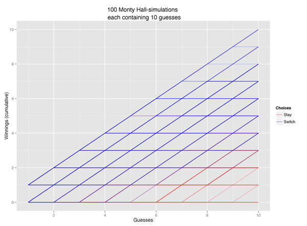
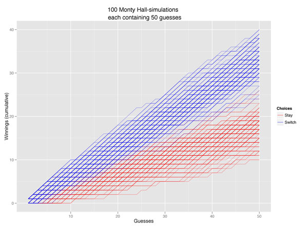
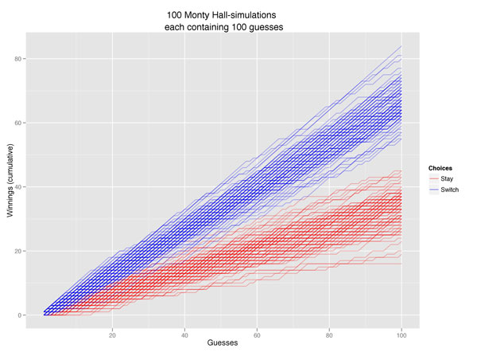
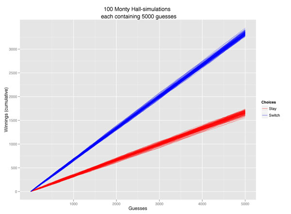
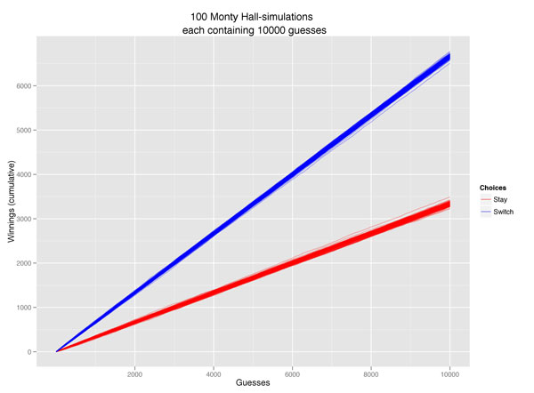

#### The Monty Hall Problem

There've been many simulations of the [Monty Hall-problem][] done in R.
But since I'm trying to learn R, I wanted to try to simulate the paradox
over many different trails and plot them all using `ggplot2`. The
problem was originally posed as follows (from wikipedia):  
> "Suppose you're on a game show, and you're given the choice of
> three doors: Behind one door is a car; behind the others, goats. You
> pick a door, say No. 1 [but the door is not opened], and the host, who
> knows what's behind the doors, opens another door, say No. 3, which has
> a goat. He then says to you, 'Do you want to pick door No. 2?'. Is it to
> your advantage to switch your choice?"

#### Writing the R code

Most of you already now what strategy is best. But to try it out I wrote
the following code:

```r
# load libraries
library(ggplot2)
library(reshape2)
 
N <- 10000 # Number of guesses per trail
T <- 100 # trails
 
# Function to create a list with N-number
# winning doors who are randomly chosen from 1,2,3
winning.door.func <- function() {
 winning.door <- sample(1:3, N, replace=TRUE)
}
 
# Create a matrix with the winning.door.func()
# replicated T-number of times.
winning.door.matrix <- replicate(T, winning.door.func())
switch.door.matrix <- 2 + (winning.door.matrix != 2)
```

To keep it simple, we **always** chose door number 1 as our
first choice. The simulation would run the same, regardless
of which door we choose. Since we always start with door 1, we can
calculate which door we must switch to by
`2 + (winning.door.matrix != 2)`. We can never choose to switch to
either door 2 or 3 in the same game. Because if door 2 is the winner,
door 3 will be opened by the host and if door 3 is the winner, door 2
will be opened by the host. Therefore, if we switch to 2 and 2 is the
winner the condition in this calculation will be `FALSE`, hence `2` will
be added to `switch.door.matrix`. And, likewise, if door 2 is not the
winner, the condition will be `TRUE` and `3` will be added to
`switch.door.matrix`. If the winning door is 1 the host will open either
door 2 or 3. And we will add `2` to our matrix, because the condition is
not met. Since we record switches in this way, we can calculate winnings
by `switch.door.matrix == winning.door.matrix`.
  
```r  
## Option 1: STAY with first choice.
#create a matrix with number of winnings for each guess and trail.
stay.winnings <- switch.door.matrix
# change value to 1 on each winnings.
stay.winnings[winning.door.matrix == 1] <- 1
# change value to 0 on each loss.
stay.winnings[winning.door.matrix != 1] <- 0
# make each trail cumulative for nicer plots.
for (i in 1:T) {
 stay.winnings[,i] <- cumsum(stay.winnings[,i])
}
 
## Option 2: Always switch
switch.winnings <- switch.door.matrix
# change value to 1 if we switch to the winning door.
switch.winnings[winning.door.matrix == switch.door.matrix] <- 1
# change value to 0 if we switch to a losing door.
switch.winnings[winning.door.matrix != switch.door.matrix] <- 0
# make each trail cumulative for nicer plots.
for (i in 1:T) {
 switch.winnings[,i] <- cumsum(switch.winnings[,i])
}
 
# Create a data.frames from the switch.door.matrix
switch.data <- as.data.frame(switch.winnings)
# Add a column named "category" cointaining row index.
switch.data$category <- row.names(switch.data)
# "Melt" the data.frame from wide to long-format.
# The reason for doing this is so we can plot
# each trail in the same plot, using trail as "group".
switch.data.molten <- melt(switch.data)
 
# Melt stay data.
stay.data <- as.data.frame(stay.winnings)
stay.data$category <- row.names(stay.winnings)
stay.data.molten <- melt(stay.data)
 
# Plot using ggplot2.
# start with stay.data
ggplot(stay.data.molten, aes(1:N,value, group=variable, color="Stay")) +
 ylab("Winnings (cumulative)") + # y-label
 xlab("Guesses") + # x-label
 # draw stay.data as a lines
 geom_line(alpha = I(3/10)) +
 # add another layer to draw switch.data as a lines.
 geom_line(data=switch.data.molten, aes(,value, group=variable, 
                                    color="Switch"),
 alpha = I(3/10)) +
 # create a manual legend
 scale_color_manual("Choices", values = c("Switch" = "blue","Stay" = "red")) +
 # Title over the plot
 opts(title = paste(T, "Monty Hall-simulations \n each containing", N, 
                    "guesses"))
 
#Calculate mean probablities
mean(colMeans(switch.data[N,1:T]))/N
mean(colMeans(stay.data[N,1:T]))/N
ggsave(filename=paste("monty_hall_",T,"x",N,".jpg"), dpi=300)
```

Results
=======

I ran the codes using different values for trails (T) and guesses (N). I
started with 100 trails x 10 guesses and ended with 100 trails x 10 000,
and it clearly demonstrates that we need quite a lot of guesses before
the lines converge towards the expected value. The 100 x 10 000
simulation gave a mean probability of winning if you chose not to change
door = 0.333701 and 0.666299 if you always switched door. But already at
the 100 x 100 plot we can see that it's always better to switch door.

  
  
  
  
  
  

#### Resources used

For this R session I used the following books:  
Matloff, N. (2011). *The Art of R Programming*. San Francisco: No
Starch Pess.  
Wickham, H. (2009). *ggplot2: elegant graphics for data analysis*. New
York: Springer.

  [Monty Hall-problem]: http://en.wikipedia.org/wiki/Monty_hall_problem

