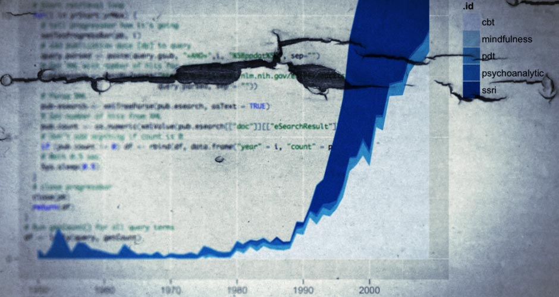
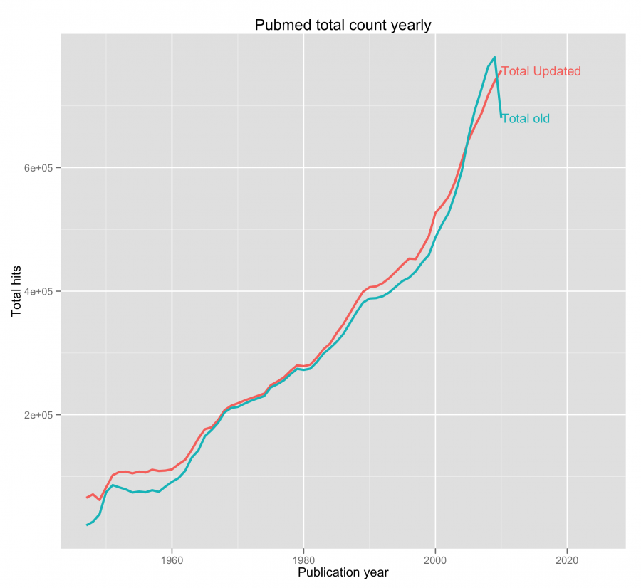
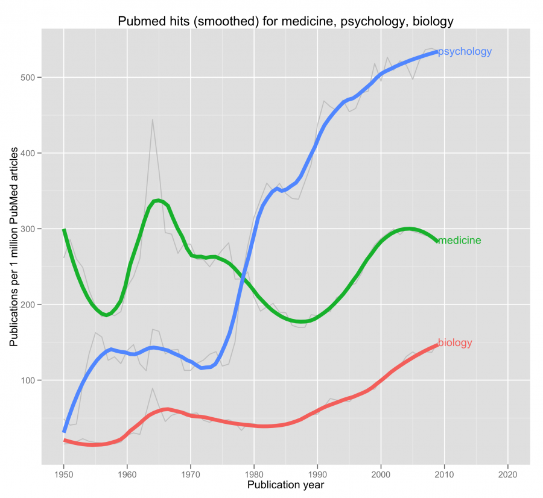

Background
----------

I believe there’s some information to be gained from looking at
publication trends over time. But it’s really troublesome to do it by
hand; fortunately it’s not so troublesome to do it in R statistical
software. Though, data like these should be interpreted with extreme
caution.

How the script works
--------------------

I tried to use the `RISmed`-package to query PubMed, but found it to be
really unreliable. Instead my script is querying [PubMed’s
E-Utilities][] using `RCurl` and `XML`. The E-utilities work like this:

```xhtml
http://eutils.ncbi.nlm.nih.gov/entrez/eutils/esearch.fcgi?db=pubmed&rettype=count&term=search+term
```

We can see after the URL that I’m telling E-Utilities that I want to
search PubMed’s database, and retrieve it as ‘count’. This will give a
minimal XML-output containing only the number of hits for my search
term, which is exactly what I want.

```xml
<eSearchResult>
<Count>140641</Count>
</eSearchResult>
```

That’s really the basic gist of what my script is doing. If you look at
the code (at the bottom of this post), you can see that I construct the
query in the beginning of the script using `paste()` and `gsub()`. Then
the main part of the script is the `for`-loop. What it’s doing is it’s
looping through all the years from the specified year range, retrieving
the number of hits, and then pasting it together in one data frame. To
get counts for a specific year `i`, I add `AND i[PPDAT]` (Print Dates
Only Tag) at the end of each query.

Since I have all the necessary code in `getCount()`, I can run the same
script for any number of queries using `ldply(query.index, getCount)`.
By doing that I end up with a data frame, which contains data for all
the queries arranged in long format. The end of the script will
calculate relative counts by dividing the matches each year by the
[total amount of publications that year][]. I’ve also added a function
that will type out the total number of hits for each query, called
`PubTotalHits()`.

## Why use Print Dates Only Tag [PPDAT] and not Publication Date [DP]?

The problem with using DP is in how PubMed handles articles. If an
article is published electronically in the end of say 2011 but printed
in 2012, that article will be counted both in 2011 and 2012 if I search
those 2 years individually (which my script is doing).

By using PPDAT I will miss some articles that doesn’t have a published
print date. If you’d rather get some duplicates in your data, but not
miss any citations, you can easily change PPDAT to DP, the script will
run the same either way.

## A quick example [PDAT] vs [DP]:

To illustrate the differences I did a quick search using a Cognitive
Behavioral Therapy-query. When searching with PubMed’s website I
specified the year range as 1940:2012[DP]/[PPDAT], and used the same
interval in R.

```rout
    PPDAT:  Pubmed 5372
            R      5372

    DP:     Pubmed 5501
            R      5661
```

The correct amount of hits is 5501 which is retrieved using [PubMed’s
website][] with the [DP]-tag. It’s also the same amount as what would be
reported when not specifying any time interval. Consequently, if you use
my script with the [PPDAT]-tag you would, in this scenario, be about
-2.5% off from the correct amount, and about +3% off from the correct
amount if you use [DP]. It’s possible that other queries will generate
different results. However, the error seems to be so small that it
doesn’t warrant any changes to the code. Duplicates could be avoided by
downloading PMIDS with every search, then checking for duplicates for
each adjacent year. Though, that change would require an unnecessary
amount of data transfer for an error that appear to be only 3%.

How to use my script
--------------------

It’s really simple to use this script. Assuming you have R installed,
all you need to do is download the files. Then point R to that directory
and then tell it to run “PubMedTrend.R”. Like this:

```r
setwd("/path/to/directory")

# Script source
source("PubMedTrend.R")
```

Once that is done you specify your query like this:

```r
query <- c("name of query" = "actually query", "ssri" = "selective serotonin reuptake inhibitor*[tiab]")
```

Now all you have to is to execute my `PubMedTrend()`-function for those
quires and save the results in a data frame:

```r
df <- PubMedTrend(query)
```

The content of df will be structured like this:

```rout
> head(df)
  .id year count total_count   relative
1 cbt 1970     1      212744 0.04700485
2 cbt 1976     2      249328 0.08021562
3 cbt 1977     1      255863 0.03908342
4 cbt 1978     1      265591 0.03765188
5 cbt 1979     1      274302 0.03645617
6 cbt 1980     9      272549 0.33021585 
```

### Additional arguments

The default year range is set to 1950–2009, but can easily be changed,
like this:

```r
df <- PubMedTrend(query, 1990,2005)
```

### Some notes about using relative values

PubMed’s total counts (as posted in a [table at their website][]) hasn't
been updated since April 8 2011, but the *de facto* total values have
changed since then, because PubMed is always adding new citations (new
and old). This can be remedied easily by looping through 1950[PPDAT],
1951[PPDAT] … 2012[PPDAT] (or you can use [DP]). I did that for you and
made a graph of the two data sets, and as you can see there’s some
differences, but they're not that big. Nonetheless, I’ve included both
files with my script.



Some example runs
-----------------

```r
query <- c("medicine" = "medicine[tw]","psychology" = "psychology[tw]","biology" = "biology[tw]")
```



```r
query <- c("cbt"= "cognitive behav* psychotherap*[tiab] OR cognitive behav* therap*[tiab]", 
           "pdt" = "psychodynamic therap*[tiab] OR psychodynamic psychotherap*[tiab]",
           "psychoanalytic" = "psychoanalytic therap*[tiab] OR psychoanalytic psychoterap*[tiab]", 
           "ssri" = "selective serotonin reuptake inhibitor*[tiab]",
            "mindfulness" = "mindfulness[tiab]")
```


When searching a progress bar will show the progress, and the search
will look like this once completed.

```rout
> df <- PubMedTrend(query)
Searching for:  cognitive behav* psychotherap*[tiab] OR cognitive behav* therap*[tiab] 
  |=======================================================================================================================| 100%
Searching for:  psychodynamic therap*[tiab] OR psychodynamic psychotherap*[tiab] 
  |=======================================================================================================================| 100%
Searching for:  psychoanalytic therap*[tiab] OR psychoanalytic psychoterap*[tiab] 
  |=======================================================================================================================| 100%
Searching for:  psychotherapy[tiab] 
  |=======================================================================================================================| 100%
Searching for:  selective serotonin reuptake inhibitor*[tiab] 
  |=======================================================================================================================| 100%
Searching for:  mindfulness[tiab] 
  |=======================================================================================================================| 100%

All done!
```

Using the function to get total hits, will give this output

```rout
> PubTotalHits()
     search_name                                                                  query total_hits
1            cbt cognitive behav* psychotherap*[tiab] OR cognitive behav* therap*[tiab]       5514
2            pdt       psychodynamic therap*[tiab] OR psychodynamic psychotherap*[tiab]        554
3 psychoanalytic      psychoanalytic therap*[tiab] OR psychoanalytic psychoterap*[tiab]        294
4  psychotherapy                                                    psychotherapy[tiab]      20843
5           ssri                          selective serotonin reuptake inhibitor*[tiab]       5653
6    mindfulness                                                      mindfulness[tiab]        529
```

A few words on usage guidelines
-------------------------------

In PubMed’s [E-utilities usage guidelines][] it’s specified that:

> In order not to overload the E-utility servers, NCBI recommends that
> users post no more than three URL requests per second and limit large
> jobs to either weekends or between 9:00 PM and 5:00 AM Eastern time
> during weekdays. Failure to comply with this policy may result in an
> IP address being blocked from accessing NCBI

To comply with this my script will wait 0.5 sec after each iteration
resulting in (theoretically) 2 URL GETs per second. This means that
searching for 100 yearly counts will take a minimum if 50 seconds for
each query. You can change the wait time if you feel that 0.5 sec is too
low or too high.

And here’s the R code to look at PubMed trends
----------------------------------------------

*Update (2013 August 2)*: I am currently updating this script and moving
it to a GitHub repo, so it will be easier to maintain. You can find the
repo [here][].

And some example ggplot2 codes
------------------------------

```r
# Note:
# ——
# These plots wont work if you only have 1 query.
 
### AREA PLOT ###
ggplot(df, aes(year, relative, group=.id, fill=.id)) +
geom_area() +
opts(title=paste("Area Plot of PubMed Publications per Year\nfor", paste(names(query), collapse = ", "))) +
xlab("year") +
ylab("Publications per 1 million PubMed articles") +
scale_fill_brewer()
 
### LINE PLOTS ###
 
# RAW
ggplot(df, aes(year, relative, group=.id, color=.id)) +
geom_line(show_guide=F) +
xlab("Publication year") +
ylab("Publications per 1 million PubMed articles") +
opts(title = paste("Pubmed hits for", paste(names(query), collapse = ", ")))
 
# SMOOTHED
p <- ggplot(df, aes(year, relative, group=.id, color=.id)) +
geom_line(alpha = I(7/10), color="grey", show_guide=F) +
stat_smooth(size=2, span=0.3, se=F, show_guide=F) +
xlab("Publication year") +
ylab("Publications per 1 million PubMed articles") +
opts(title = paste("Pubmed hits (smoothed) for", paste(names(query), collapse = ", "))) +
xlim(1950,2020)
#direct.label(p, "last.bumpup")
```

  [PubMed’s E-Utilities]: http://eutils.ncbi.nlm.nih.gov/entrez/query/static/esearch_help.html
    "PubMed E-utilities"
  [total amount of publications that year]: http://www.nlm.nih.gov/bsd/medline_cit_counts_yr_pub.html
    "Medline citation counts by year of publication"
  [PubMed’s website]: http://www.ncbi.nlm.nih.gov/pubmed
    "PubMed's website"
  [table at their website]: http://www.nlm.nih.gov/bsd/medline_cit_counts_yr_pub.html
    "PubMed Citation Counts by Year of Publication"
  [E-utilities usage guidelines]: http://www.ncbi.nlm.nih.gov/books/NBK25497/
    "PubMed’s E-utilities usage guidelines "
  [here]: https://github.com/rpsychologist/PubMed "PubMedTrend repo"
