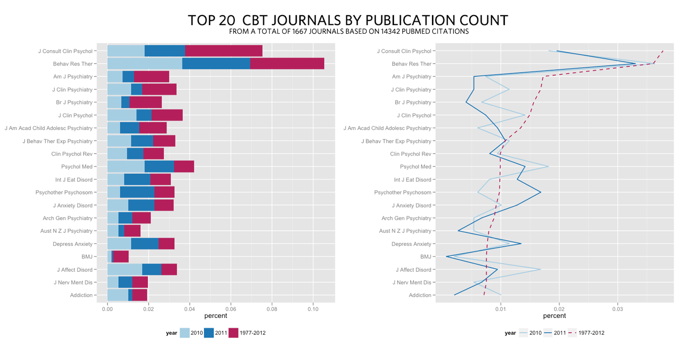

# Introduction

My first PubMed script [(An R Script to Automatically download PubMed
Citation Counts By Year of Publication)][] extracted yearly counts for
any number of search strings, by using *PubMed’s E-utilities*.
Specifically, it’s using the `esearch`-function, which will report the
number of hits for your search and/or the articles PMIDs. This method is
very reliable and fast if you’re only interested in the number of hits
for a given query. However, PubMed’s E-utilities have a lot more
features than that, some of which I will use in this article to download
complete article records in XML.

# How it works

What’s cool about `esearch` is that you can tell it to save a history of
the articles found by your query, and then use another function called
`efetch` to download that history. This is done by adding
`&usehistory=y` to your search, which will generate this XML (in
addition to some other XML-tags): 

```xml 
<WebEnv>
NCID_1_90555773_130.14.18.48_5553_1335519406_1226217114
</WebEnv>
```

Once we have extracted the WebEnv string, we just tell PubMed’s efetch
to send us the articles saved in WebEnv. There's one complication,
though. PubMed “only” allows us to fetch 10 000 articles in one go,
therefore my code includes a loop that will batch download the data, and
paste it together in order to create valid XML-code. The XML cutting and
pasting is done with `gsub`, since the unparsed XML-data is just a long
string. It’s not the most beautiful solution, but it seems to work.

Now that all XML-data is saved in one object, we just need to parse it
an extract whatever PubMed field(s) we’re interested in. I’ve included a
function that will parse the XML-code and extract journal counts,
although you could use the same method to extract any field.

# One example run: Top 20 CBT journals in 2010, 2011 and all time


These two graphs were created by using the following 3 queries (notice
that I use single-quotes inside my query). This script does not have the
functionality to download different queries automatically for you, so I
ran my three searches individually. The R code for `searchPubmed()` and
`extractJournal()` are at the end of this article.  

```r
# Get data for 2011
query <- c("cbt" = "’cognitive behavior therapy’ OR ‘cognitive behavioral therapy’ OR ‘cognitive therapy’ AND 2011[DP]")
pub.efetch <- searchPubmed(query)
cbt_2011 <- extractJournal()

# Get data for 2010
query <- c("cbt" = "’cognitive behavior therapy’ OR ‘cognitive behavioral therapy’ OR ‘cognitive therapy’ AND 2010[DP]")
pub.efetch <- searchPubmed(query)
cbt_2010 <- extractJournal()

# Get data total data for all years
query <- c("cbt" = "’cognitive behavior therapy’ OR ‘cognitive behavioral therapy’ OR ‘cognitive therapy’")
pub.efetch <- searchPubmed(query)
cbt_any <- extractJournal()
```

# Reshaping the data and creating the plots

I needed to reshape my data a bit, and combine it into one object,
before I used `ggplot2` to make the graphs. I did it like this:  

```r
# Add year-column
cbt_2010$year <- "2010"
cbt_2011$year <- "2011"
cbt_any$year <- "All"

# Reorder by $freq
cbt_any <- cbt_any[order(cbt_any$freq, decreasing=TRUE),]
# keep top 20
cbt_any <- cbt_any[1:20,]
# Reorder factor levels, this will also drop levels not used
cbt_any$x <- factor(cbt_any$x, levels=cbt_any$x)

# Only keep values that’s in Top 20 all time
cbt_2010 <- cbt_2010[cbt_2010$x %in% cbt_any$x,]
cbt_2011 <- cbt_2011[cbt_2011$x %in% cbt_any$x,]

# Combine data into one data frame
cbt_total <- rbind(cbt_2010,cbt_2011,cbt_any)

# Copy levels from cbt_any, but with levels in reverse order
# since I want the hightest value at the top
cbt_total$x <- factor(cbt_total$x, levels=rev(cbt_any$x))
```

# Ggplot2 code

Now that I have all my top 20 data in one object in the long format, the
`ggplot2` code is pretty simple. 

```r
## Names for plot legend ##
my_labels <- c("2010", "2011", "1977-2012")

# Box plot
ggplot(cbt_total, aes(x, percent, group=year, fill=year)) + geom_bar(stat="identity") +
  coord_flip() +
  scale_fill_manual(values=c("All" = "#b41f5b", "2010" = "#A6CEE3", "2011" = "#1F78B4"), labels=my_labels) +
  xlab(NULL) +
  opts(legend.position = "bottom")

# Line plot
ggplot(cbt_total, aes(x, percent, group=year, color=year, linetype=year)) + geom_line(size=0.7) +
  coord_flip() +
  scale_color_manual(values=c("All" = "#b41f5b", "2010" = "#A6CEE3", "2011" = "#1F78B4"), labels=my_labels) +
  scale_linetype_manual(values=c("All" = "dashed", "2010" = "solid", "2011" = "solid"), labels=my_labels) +
  xlab(NULL) +
  opts(legend.position = "bottom")
```

# Reliability of the method

To check the reliability of my method I compared the number of extracted
journals to the total number of hits. These are the numbers:

*2010:* 1487 / 1488 = 0.999328  
*2011:* 1488 / 1493 = 0.996651  
*All years:* 14345 / 14354 = 0.999373

Since the error is so low, I didn’t bother to check why some journals
were left out. My guess is, that they were missing in the original data
as well.

# The R code for searchPubmed() and extractJournal()

<del>Update 2013-02-23: The script broke when the date in
doctype-declaration was changed from 2012 to 2013. I've updated the
code, and it should be working now.</del>

**Update 2013-08-17**: Moved the script to github and fixed the broken batch
procedure. It should be more stable now.

[Click here to get the source code](https://github.com/rpsychologist/PubMed/tree/master/PubMedXML)

  [(An R Script to Automatically download PubMed Citation Counts By Year of Publication)]: http://rpsychologist.com/an-r-script-to-automatically-look-at-pubmed-citation-counts-by-year-of-publication/
    "An R Script to Automatically download PubMed Citation Counts By Year of Publication"

