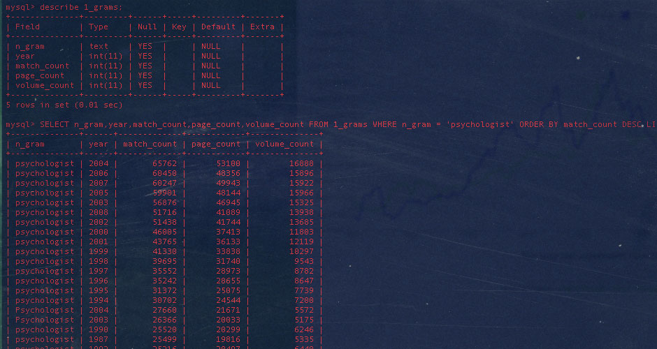
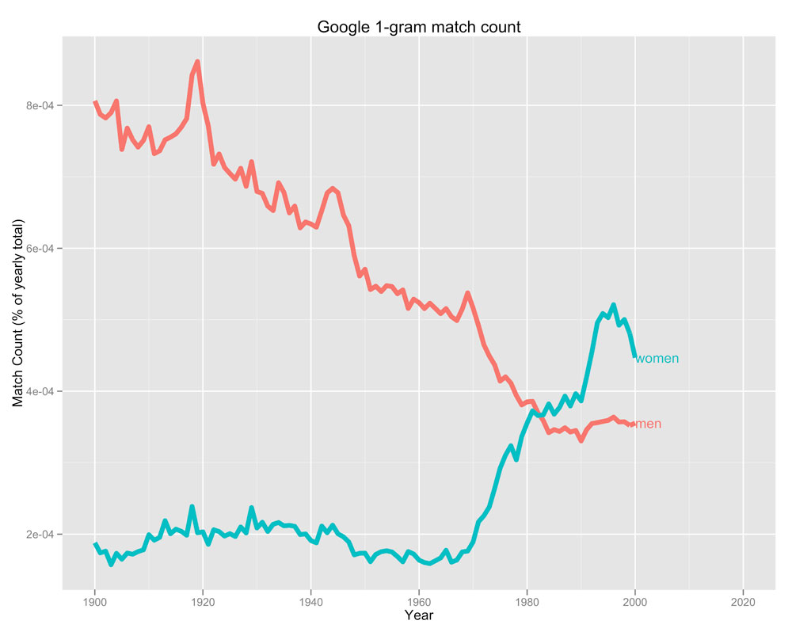
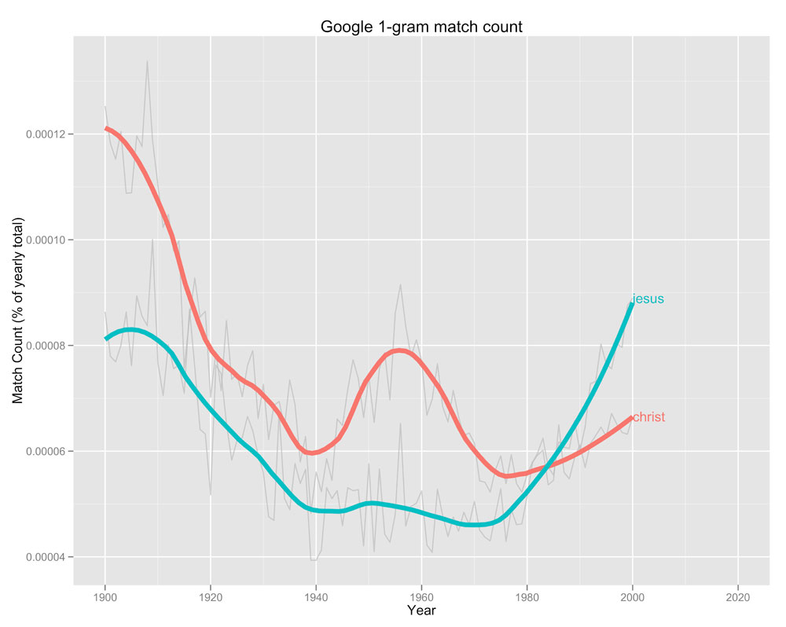
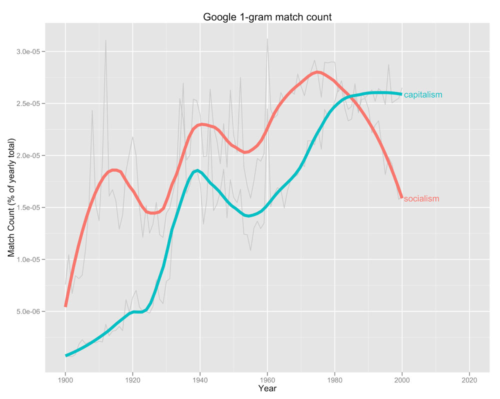
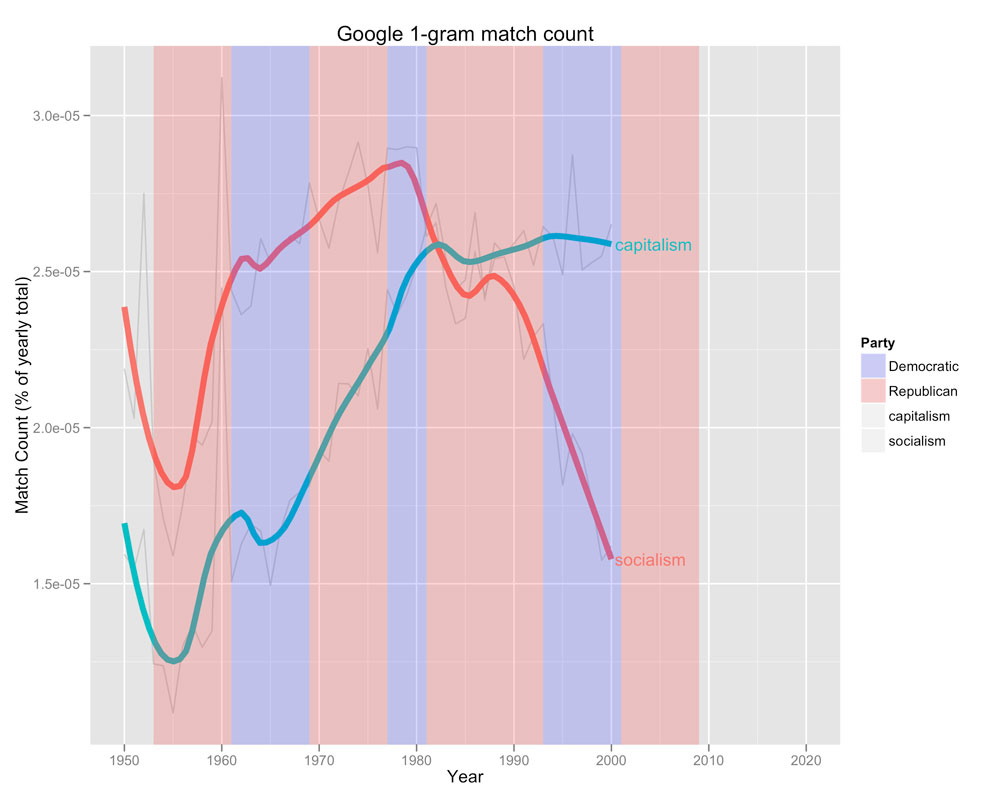

### Introduction

*Google Ngram* is a corpus of *n*-grams compiled from data from *Google Books*. Here I’m going to show how to analyze individual word counts from Google 1-grams in R using MySQL. I’ve also written an R script to automatically extract and plot multiple word counts. To read more about the datasets go to: <http://books.google.com/ngrams/datasets>. Of course, one could just use [Google Ngram Viewer][] but what’s the fun in that? And it won’t really give the output that I’m looking for. Since it’s case sensitive queries like “psychotherapy” and “Psychotherapy” will give different results. Using R one can combine match counts regardless of case lettering and display the results in a more intuitive way using `ggplot2`. If you’re not interested in the technical aspects of this post, you could just jump to the end of it to view an example of different applications of the *n*-gram database.

### Setting up MySQL

##### Get MySQL

First you need to install and setup MySQL on your system. I’m on Mac OS and it was really straightforward to get MySQL up and running. [Here’s the documentation on how to do it on Mac OS.][]
##### Download the raw data

Go to <http://books.google.com/ngrams/datasets> and get the data files for Google 1-gram [highlight]files 0-9[/highlight]. After you’ve downloaded the files unzip them.
##### Import Google 1-gram into a MySQL database

Since I figured it would take a couple of hours to build the database I first combined all 10 files into one `csv-file` using `cat` in Terminal:

```
cat *.csv > outputfile
```

Since I’m not really well versed in working with MySQL I used a free GUI ([Sequel Pro][]) to create and import the data. I setup my DB like this:

```sql
CREATE TABLE `1_grams` (
`n_gram` text,
`year` int(11) DEFAULT NULL,
`match_count` int(11) DEFAULT NULL,
`page_count` int(11) DEFAULT NULL,
`volume_count` int(11) DEFAULT NULL
) ENGINE=InnoDB DEFAULT CHARSET=latin1;
```

And imported newly created CSV-file into this structure. I figured it took about 8 hours to build it on my 2,4 GHz Core 2 Duo iMac from 2009, but I didn’t time it. The resulting database contained 470 million rows and landed at 24 GB using InnoDB indexing.

##### Querying MySQL from R

I’m using the `RMySQL`-package to get data from MySQL into R. I wrote a function that accepts search terms and fetches the matching results from my Google 1-gram database. I've masked my user and password, so you've got to change 'user="*****", password="*****"` to your own user name and password.

##### Optimization

MySQL is well optimized to handle `OR` statements, and it's a lot faster to send all terms in the same query then to send new queries for each term. Consequently I needed a function that would write out my MySQL query combining the different search terms used. Like this: 

```r
createQuery <- function(query) {
 # Function used later to create 'OR' segments in query
  createOR <- function(index) {
    x <- paste("OR n_gram = '", query[index] ,"'", sep = "")
    return(x)
  }
  # Create MySQL query depending on number of items in query. 
  if (length(query) == 1) {
    result <- paste("SELECT n_gram, year, match_count FROM 1_grams WHERE n_gram  = '", query, "'", sep = "")
  } else
  {
    index <- 2:length(query)
    x <- laply(index, createOR)
    result <- paste("SELECT n_gram, year, match_count FROM 1_grams WHERE n_gram  = '", 
                    query[1],"' ", paste(x, collapse = " "), sep="")
  }
  return(result)
}
``` 

Which I then put into the function that connects to MySQL. Using `system.time()` [highlight]I clocked the run time to about 15 minutes[/highlight] independent of how many search terms I used. I would say that's pretty decent considering it's \~470 million rows of data, that I'm hosting on an external FireWire 800 drive.

```r
getMySQL <- function (query) {
    connection <- dbConnect(MySQL(), user="*****", password="*****", dbname="n_grams", host="localhost")
    results <- dbSendQuery(connection, paste(createQuery(query)))
    data <- fetch(results, n=-1)
    dbDisconnect(connection)
    return(data)
  }
  data <- getMySQL(query)
```

##### Cleaning up the data

The MySQL query created a data frame with “n\_gram”, “year” and “match\_count”. However, since the raw data is case sensitive there are a lot of duplicates with just different lower- and uppercase configurations. Therefore I created a function to combine all 1-grams regardless of letter casing. Google's *n*-gram database is not perfect, so sometimes you fetch OCR-errors with your query. I had to add some code to get rid of those erroneous words otherwise `tolower()` would return an error and the script would stop.

```r
  # Remove junk words due to OCR-error
  data$n_gram <- iconv(data$n_gram, "UTF-8", 'ASCII')
  # conditional statement to not do anything if there are no missing values.
  if (length(which(is.na(data))) > 0) {
    cat("Removed", length(which(is.na(data))), "values of missing data (probably OCR-error)\n")
    data <- data[-which(is.na(data)),]
  } else cat("Found no missing data\n")
   
  # Convert all n-grams to lowercase
  data$n_gram <- tolower(data$n_gram)
# Outer function to combine ngrams
CreateDf <- function (query) {
  # Create a year.index with duplicates removed. 
  year.index <- data.frame("year" = sort(unique(data$year[data$n_gram == query])))
   
  # Function to sum 'match_count' from the same years
  MeltYear <- function(query, year) {
    # sum rows from the same year and put into a data.frame
    df2 <- data.frame("n_gram" = query, "year" = year, 
                      "match_count" = sum(data$match_count[data$n_gram == query & data$year == year]))
    return(df2)
  }
  # I only want to pass one argument with ldply(), so I create a wrapper for MeltYear()
  ApplyIndex <- function (year) {  
    x <- MeltYear(query, year)
    return(x)
  }
  # Apply function ApplyIndex() for each element in year.index$year and
  # combine results into a data.frame.    
  df <- ldply(year.index$year, ApplyIndex)
  return(df)
} 
```

##### Creating the final data frame

To create the final data frame I run `CreateDf()` for each query term and combine them into one data frame with `ldply()`. Lastly I import [data containing total counts][] for each year, which allows me to calculate relative values for each *n*-gram. 

```r
df <- ldply(query, CreateDf)
 # Add data about relative proportions
  load(file="google_n-gram_total_table")
  match <- match(df$year, total$year)
  df$total_count <- total$total_count[match]
  df$relative <- df$match_count / df$total_count
  return(df)
```

## Results

### Without smoothing

This is what the raw data look like.  


### With smoothing

Here I added a smoothing function and ran some more queries.
#### Women vs Men

#### Sweden vs Norway vs Denmark vs Finland

#### Psychodynamic vs Psychoanalysis vs Psychoanalytic vs Psychotherapy

#### Jesus vs Christ

#### Gay vs Lesbian vs Homosexual vs Heterosexual

#### Socialism vs Capitalism


### But isn't this exactly like using Google Ngram Viewer except a lot sexier?

Well, yes, this is exactly like using Google Ngram Viewer except with sexier graphics. However, you could do much more with this data than with Google Ngram Viewer. One could, for instance, aggregate the data with another data set. For example I could combine “socialism” and “capitalism” with data about which US political party were in power at that time. If you have more computer power than I do you could work with 2-9-grams and generate much cooler data. 



## Ggplot2 R code used here

### Smoothed plots

I actually had to write a function to get `direct.labels()` to display annotations after the smoothed curve instead of after the line of the raw data. 

```r
# Set year range
yrMin <- 1900
yrMax <- 2000
 
# Use loess() to get x-values for annotation
funcDlMove <- function (n_gram) {
  model <- loess(relative ~ year, df[df$n_gram==n_gram & df$year >= yrMin & df$year <= yrMax,], span=0.3)
  Y <- model$fitted[length(model$fitted)]
  Y <- dl.move(n_gram, y=Y,x=yrMax, hjust=-0.05)
  return(Y)
}
# Index of n-words for lapply()
index <- unique(df$n_gram)
# Custom 'method' for direct.labels()
mymethod <- c(
  "last.bumpup", 
  lapply(index, funcDlMove)
  )
 
# Plot
PLOT <- ggplot(df[df$year >= yrMin & df$year <= yrMax,], aes(year, relative, group=n_gram, fill=n_gram, color=n_gram)) +
    xlim(c(yrMin ,yrMax + 20)) + 
    geom_line(alpha = I(7/10), color="grey", show_guide=F) +
    stat_smooth(size=2, span=0.3, se=F, show_guide=F) +
    ylab("Match Count (% of yearly total)") +
    xlab("Year") +
    opts(title = "Google 1-gram match count") 
direct.label(PLOT, mymethod) 
```

### Aggregated plot

I added party data using an example in the book *ggplot2: elegant graphics for data analysis.* Which I just added to the previous syntax already saved in `PLOT`

```r
data(presidential)
presidential$start <- as.integer(format(presidential$start, "%Y"))
presidential$end <- as.integer(format(presidential$end, "%Y"))
 
yrng <- range(df$relative)
xrng <- c(yrMin,yrMax)
 
P <- PLOT + geom_rect(aes(NULL, NULL, xmin = start, xmax = end, 
                     fill = party, group=1, color= NULL), ymin = yrng[1], ymax = yrng[2], 
                 data = presidential, alpha = I(2/10), show_guide=T) + scale_fill_manual("Party", values = 
                   c("Democratic" = "blue", "Republican" = "red"))
direct.label(P, mymethod)
```


  [Google Ngram Viewer]: http://books.google.com/ngrams
    "Google Ngram viewer"
  [Here’s the documentation on how to do it on Mac OS.]: http://dev.mysql.com/doc/refman/5.6/en/macosx-installation-pkg.html
    "Installing MySQL on Mac OS X"
  [Sequel Pro]: http://www.sequelpro.com/ "Sequel Pro website"
  [data containing total counts]: http://commondatastorage.googleapis.com/books/ngrams/books/googlebooks-eng-all-totalcounts-20090715.txt
    "Total counts for Google 1-gram (english)"
