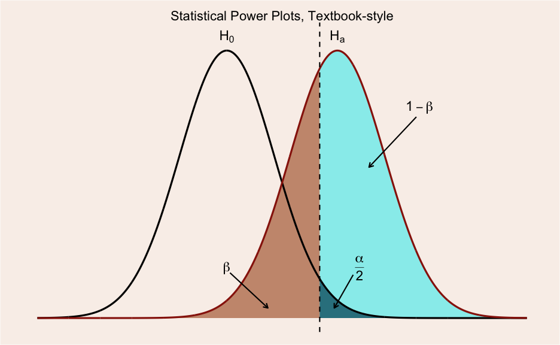
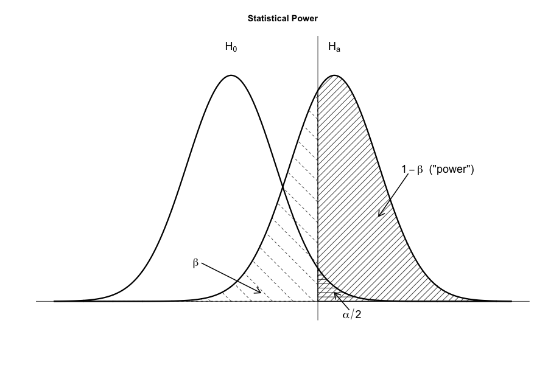

A common way of illustrating the idea behind statistical power in null
hypothesis significance testing, is by plotting the sampling
distributions of the null hypothesis ($ H_0 $) and the
alternative hypothesis ($ H_A $). Typically, these illustrations
highlight the regions that correspond to making a type II error ($ 
\beta $), type I error ($ \alpha $) and correctly rejecting the
null hypothesis (i.e. the test's power; $ 1 - \beta$).

In this post I will show how to create such "power plots" using R.
Typically, I prefer to use `ggplot` for plotting, but tasks such as this
is one of the few times were I think R's base graphics have some
merit—especially for creating black and white plots, since `ggplot` does
not support using patterns. Thus, I will present code both for `ggplot`
and base graphics.

Creating these plots is pretty straight forwards. You only need to be
vaguely familiar with the mechanics of plotting polygons. For instance,
say we want to plot a triangle with the following coordinates.

```  
#                 
         (2,3)
          /\
         /  \
        /    \
       /      \
  (1,2) ------ (3,2)
```

Then we just specify x and y as vectors, like this:  

```r
# ggplot polygon example
ggplot(data.frame(x=c(1,2,3),y=c(2,3,2)), aes(x,y)) + geom_polygon()
```

 

So, let us begin by creating the data for the two distributions and
three polygons that we will need.  

```r
library(ggplot2)
library(grid) # need for arrow()
m1 <- 0  # mu H0
sd1 <- 1.5 # sigma H0
m2 <- 3.5 # mu HA
sd2 <- 1.5 # sigma HA
 
z_crit <- qnorm(1-(0.05/2), m1, sd1)
 
# set length of tails
min1 <- m1-sd1*4
max1 <- m1+sd1*4
min2 <- m2-sd2*4
max2 <- m2+sd2*4          
# create x sequence
x <- seq(min(min1,min2), max(max1, max2), .01)
# generate normal dist #1
y1 <- dnorm(x, m1, sd1)
# put in data frame
df1 <- data.frame("x" = x, "y" = y1)
# generate normal dist #2
y2 <- dnorm(x, m2, sd2)
# put in data frame
df2 <- data.frame("x" = x, "y" = y2)
 
# Alpha polygon
y.poly <- pmin(y1,y2)
poly1 <- data.frame(x=x, y=y.poly)
poly1 <- poly1[poly1$x >= z_crit, ] 
poly1<-rbind(poly1, c(z_crit, 0))  # add lower-left corner
 
# Beta polygon
poly2 <- df2
poly2 <- poly2[poly2$x <= z_crit,] 
poly2<-rbind(poly2, c(z_crit, 0))  # add lower-left corner
 
# power polygon; 1-beta
poly3 <- df2
poly3 <- poly3[poly3$x >= z_crit,] 
poly3 <-rbind(poly3, c(z_crit, 0))  # add lower-left corner
 
# combine polygons. 
poly1$id <- 3 # alpha, give it the highest number to make it the top layer
poly2$id <- 2 # beta
poly3$id <- 1 # power; 1 - beta
poly <- rbind(poly1, poly2, poly3)
poly$id <- factor(poly$id,  labels=c("power","beta","alpha"))
```

Now that we have all the data that we need, let us create the first
plot using `ggplot`. The annotation is set manually, so it will be a bit
tedious to change these plots.

```r
# plot with ggplot2
ggplot(poly, aes(x,y, fill=id, group=id)) +
  geom_polygon(show_guide=F, alpha=I(8/10)) +
  # add line for treatment group
  geom_line(data=df1, aes(x,y, color="H0", group=NULL, fill=NULL), size=1.5, show_guide=F) + 
  # add line for treatment group. These lines could be combined into one dataframe.
  geom_line(data=df2, aes(color="HA", group=NULL, fill=NULL),size=1.5, show_guide=F) +
  # add vlines for z_crit
  geom_vline(xintercept = z_crit, size=1, linetype="dashed") +
  # change colors 
  scale_color_manual("Group", 
                     values= c("HA" = "#981e0b","H0" = "black")) +
  scale_fill_manual("test", values= c("alpha" = "#0d6374","beta" = "#be805e","power"="#7cecee")) +
  # beta arrow
  annotate("segment", x=0.1, y=0.045, xend=1.3, yend=0.01, arrow = arrow(length = unit(0.3, "cm")), size=1) +
  annotate("text", label="beta", x=0, y=0.05, parse=T, size=8) +
  # alpha arrow
  annotate("segment", x=4, y=0.043, xend=3.4, yend=0.01, arrow = arrow(length = unit(0.3, "cm")), size=1) +
  annotate("text", label="frac(alpha,2)", x=4.2, y=0.05, parse=T, size=8) +
  # power arrow
  annotate("segment", x=6, y=0.2, xend=4.5, yend=0.15, arrow = arrow(length = unit(0.3, "cm")), size=1) +
  annotate("text", label="1-beta", x=6.1, y=0.21, parse=T, size=8) +
  # H_0 title
  annotate("text", label="H[0]", x=m1, y=0.28, parse=T, size=8) +
  # H_a title
  annotate("text", label="H[a]", x=m2, y=0.28, parse=T, size=8) +
  ggtitle("Statistical Power Plots, Textbook-style") +
  # remove some elements
  theme(panel.grid.minor = element_blank(),
             panel.grid.major = element_blank(),
             panel.background = element_blank(),
             plot.background = element_rect(fill="#f9f0ea"),
             panel.border = element_blank(),
             axis.line = element_blank(),
             axis.text.x = element_blank(),
             axis.text.y = element_blank(),
             axis.ticks = element_blank(),
             axis.title.x = element_blank(),
             axis.title.y = element_blank(),
             plot.title = element_text(size=22))
 
ggsave("stat_power_ggplot.png", height=8, width=13, dpi=72)
```


Now, if we want a more "classical looking" black and white-plot, we need to use base graphics. 

```r
# example with base graphics
png("stat_power_base.png", width=900, height=600, units="px") # save as png
# reset
plot.new()
# set window size
plot.window(xlim=range(x), ylim=c(-0.01,0.3))
# add polygons
polygon(poly3,  density=10) # 1-beta
polygon(poly2, density=3, angle=-45, lty="dashed") # beta
polygon(poly1, density=10, angle=0) # alpha
# add h_a dist
lines(df2,lwd=3)
# add h_0 dist
lines(df1,lwd=3)
### annotations
# h_0 title
text(m1, 0.3, expression(H[0]), cex=1.5)
# h_a title
text(m2, 0.3, expression(H[a]), cex=1.5)
# beta annotation
arrows(x0=-1, y0=0.045, x1=1, y1=0.01,lwd=2,length=0.15)
text(-1.2, 0.045, expression(beta), cex=1.5)
# beta annotation
arrows(x0=4, y0=-0.01, x1=3.5, y1=0.01, lwd=2, length=0.15)
text(x=4.1, y=-0.015, expression(alpha/2), cex=1.5)
# 1-beta 
arrows(x0=6, y0=0.15, x1=5, y1=0.1, lwd=2,length=0.15)
text(x=7, y=0.155, expression(paste(1-beta, "  (\"power\")")), cex=1.5)
# show z_crit; start of rejection region
abline(v=z_crit)
# add bottom line
abline(h=0)
title("Statistical Power")
dev.off()
```




