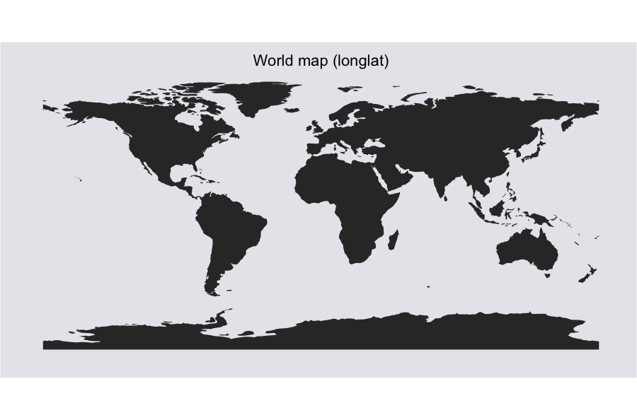
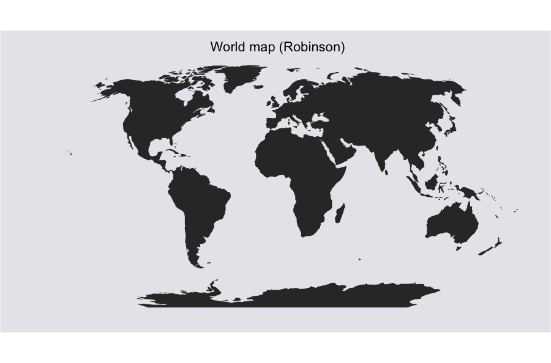
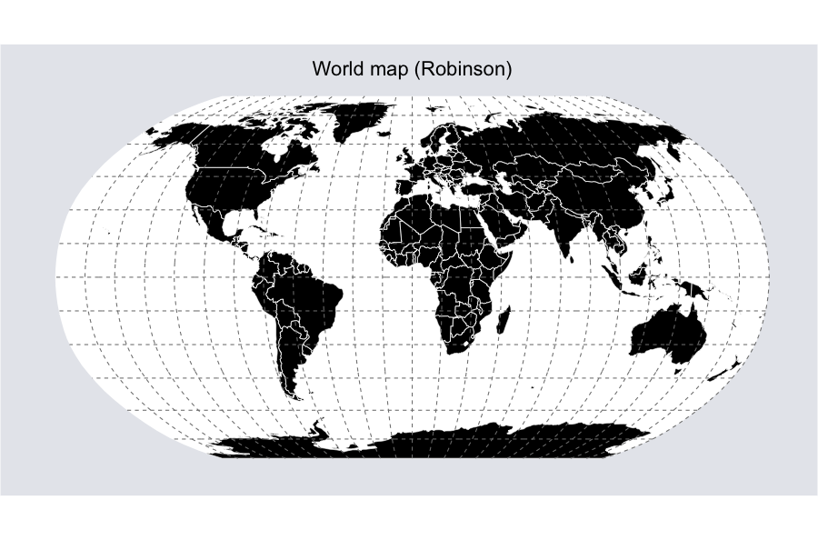

In this post I will show some different examples of how to work with map
projections and how to plot the maps using `ggplot`. Many maps that are
shown using their default projection are in the longlat-format, which is
far from optimal. For plotting world maps I prefer to use either
Robinson or Winkel Tripel projection—but many more are available—and I
will show how to use both these projections.

Before we get started you need to download a couple of shapefiles that
we will use. You can find them here:

-   <http://www.naturalearthdata.com/downloads/110m-physical-vectors/110m-land/>
-   <http://www.naturalearthdata.com/downloads/110m-cultural-vectors/110m-admin-0-countries/>
-   <http://www.naturalearthdata.com/downloads/110m-cultural-vectors/110m-populated-places/>
-   <http://www.naturalearthdata.com/downloads/110m-physical-vectors/110m-graticules/>

Put them directly inside your working directory. We will use functions
from the `rgdal`-package to read the shapefiles into R, so if you do not
have it, you need to install it before you continue.  
```r
library(rgdal)
library(ggplot2)
setwd("/Users/kris/maps_ggplot")
 
# read shapefile
wmap <- readOGR(dsn="ne_110m_land", layer="ne_110m_land")
# convert to dataframe
wmap_df <- fortify(wmap)
 
# create a blank ggplot theme
theme_opts <- list(theme(panel.grid.minor = element_blank(),
                        panel.grid.major = element_blank(),
                        panel.background = element_blank(),
                        plot.background = element_rect(fill="#e6e8ed"),
                        panel.border = element_blank(),
                        axis.line = element_blank(),
                        axis.text.x = element_blank(),
                        axis.text.y = element_blank(),
                        axis.ticks = element_blank(),
                        axis.title.x = element_blank(),
                        axis.title.y = element_blank(),
                        plot.title = element_text(size=22)))
 
# plot map
ggplot(wmap_df, aes(long,lat, group=group)) + 
  geom_polygon() + 
  labs(title="World map (longlat)") + 
  coord_equal() + 
  theme_opts
 
ggsave("maps/map1.png",  width=12.5, height=8.25, dpi=72) 
```

This will create a longlat-projected world map.
 

```r
# reproject from longlat to robinson
wmap_robin <- spTransform(wmap, CRS("+proj=robin"))
wmap_df_robin <- fortify(wmap_robin)
ggplot(wmap_df_robin, aes(long,lat, group=group)) + 
  geom_polygon() + 
  labs(title="World map (robinson)") + 
  coord_equal() +
  theme_opts
 
ggsave("maps/map2.png", width=12.5, height=8.25, dpi=72) 
```
Here the world map is shown using the Robinson
projection.


```r
# show hole
ggplot(wmap_df_robin, aes(long,lat, group=group, fill=hole)) +
  geom_polygon() + 
  labs(title="World map (robin)") +
  coord_equal() + 
  theme_opts
ggsave("maps/map3.png", width=12.5, height=8.25, dpi=72) 
```

However, the Caspian sea is missing. This is because of how
ggplot handles polygon holes. Ggplot will plot polygon holes as a
separate polygon, thus we need to make it pseudo-transparent by changing
its fill color.

![World map in ggplot2 polygon hole example][./img/map3.png]

```r
# change colors
ggplot(wmap_df_robin, aes(long,lat, group=group, fill=hole)) + 
  geom_polygon() + 
  labs(title="World map (Robinson)") + 
  coord_equal() + 
  theme_opts +
  scale_fill_manual(values=c("#262626", "#e6e8ed"), guide="none") # change colors & remove legend
 
ggsave("maps/map4.png", width=12.5, height=8.25, dpi=72) 
```
Now the Caspian sea is visible.


```r
# add graticule and bounding box (longlat)
grat <- readOGR("ne_110m_graticules_all", layer="ne_110m_graticules_15") 
grat_df <- fortify(grat)
 
bbox <- readOGR("ne_110m_graticules_all", layer="ne_110m_wgs84_bounding_box") 
bbox_df<- fortify(bbox)
 
ggplot(bbox_df, aes(long,lat, group=group)) + 
  geom_polygon(fill="white") +
  geom_polygon(data=wmap_df, aes(long,lat, group=group, fill=hole)) + 
  geom_path(data=grat_df, aes(long, lat, group=group, fill=NULL), linetype="dashed", color="grey50") +
  labs(title="World map + graticule (longlat)") + 
  coord_equal() + 
  theme_opts +
  scale_fill_manual(values=c("black", "white"), guide="none") # change colors & remove legend
 
ggsave("maps/map5.png", width=12.5, height=8.25, dpi=72) 
```

If we want we can also add a graticule and a bounding box. The
bounding box is useful if we want to make the sea blue—especially when
using some form of curved projection. Here I have added a graticule and
bounding box to the longlat-map.


```r
# graticule (Robin)
grat_robin <- spTransform(grat, CRS("+proj=robin"))  # reproject graticule
grat_df_robin <- fortify(grat_robin)
bbox_robin <- spTransform(bbox, CRS("+proj=robin"))  # reproject bounding box
bbox_robin_df <- fortify(bbox_robin)
 
ggplot(bbox_robin_df, aes(long,lat, group=group)) + 
  geom_polygon(fill="white") +
  geom_polygon(data=wmap_df_robin, aes(long,lat, group=group, fill=hole)) + 
  geom_path(data=grat_df_robin, aes(long, lat, group=group, fill=NULL), linetype="dashed", color="grey50") +
  labs(title="World map (Robinson)") + 
  coord_equal() + 
  theme_opts +
  scale_fill_manual(values=c("black", "white"), guide="none") # change colors & remove legend
 
ggsave("maps/map6.png", width=12.5, height=8.25, dpi=72) 
```

Robinson projection with added graticule and bounding
box.


```r
# add country borders
countries <- readOGR("ne_110m_admin_0_countries", layer="ne_110m_admin_0_countries") 
countries_robin <- spTransform(countries, CRS("+init=ESRI:54030"))
countries_robin_df <- fortify(countries_robin)
 
ggplot(bbox_robin_df, aes(long,lat, group=group)) + 
  geom_polygon(fill="white") +
  geom_polygon(data=countries_robin_df, aes(long,lat, group=group, fill=hole)) + 
  geom_path(data=countries_robin_df, aes(long,lat, group=group, fill=hole), color="white", size=0.3) +
  geom_path(data=grat_df_robin, aes(long, lat, group=group, fill=NULL), linetype="dashed", color="grey50") +
  labs(title="World map (Robinson)") + 
  coord_equal() + 
  theme_opts +
  scale_fill_manual(values=c("black", "white"), guide="none") # change colors & remove legend
 
ggsave("maps/map7.png", width=12.5, height=8.25, dpi=72)
```

Here I have added country borders to the previous map
plot.


```r
# bubble plot
places <- readOGR("ne_110m_populated_places", layer="ne_110m_populated_places") 
places_df <- as(places, "data.frame")
places_robin_df <- project(cbind(places_df$LONGITUDE, places_df$LATITUDE), proj="+init=ESRI:54030") 
places_robin_df <- as.data.frame(places_robin_df)
names(places_robin_df) <- c("LONGITUDE", "LATITUDE")
places_robin_df$POP2000 <- places_df$POP2000 
 
ggplot(bbox_robin_df, aes(long,lat, group=group)) + 
  geom_polygon(fill="white") +
  geom_polygon(data=countries_robin_df, aes(long,lat, group=group, fill=hole)) + 
  geom_point(data=places_robin_df, aes(LONGITUDE, LATITUDE, group=NULL, fill=NULL, size=POP2000), color="#32caf6", alpha=I(8/10)) +
  geom_path(data=countries_robin_df, aes(long,lat, group=group, fill=hole), color="white", size=0.3) +
  geom_path(data=grat_df_robin, aes(long, lat, group=group, fill=NULL), linetype="dashed", color="grey50") +
  labs(title="World map (Robinson)") + 
  coord_equal() + 
  theme_opts +
  scale_fill_manual(values=c("black", "white"), guide="none")+
  scale_size_continuous(range=c(1,20), guide="none")# change colors & remove legend
ggsave("maps/map8.png", width=12.5, height=8.25, dpi=72) 
```
Bubble plots are a popular way of displaying information on
maps. Here I used project() to reproject the bubbles' coordinates into
the Robinson projection.


```r
# Winkel tripel projection
countries_wintri <- spTransform(countries, CRS("+proj=wintri"))
bbox_wintri <- spTransform(bbox, CRS("+proj=wintri"))
wmap_wintri <- spTransform(wmap, CRS("+proj=wintri"))
grat_wintri <- spTransform(grat, CRS("+proj=wintri"))
 
p<-ggplot(bbox_wintri, aes(long,lat, group=group)) + 
  geom_polygon(fill="white") +
  geom_polygon(data=countries_wintri, aes(long,lat, group=group, fill=hole)) + 
  geom_path(data=countries_wintri, aes(long,lat, group=group, fill=hole), color="white", size=0.3) +
  geom_path(data=grat_wintri, aes(long, lat, group=group, fill=NULL), linetype="dashed", color="grey50") +
  labs(title="World map (Winkel Tripel)") + 
  coord_equal(ratio=1) + 
  theme_opts +
  scale_fill_manual(values=c("black", "white"), guide="none") # change colors & remove legend
 
ggsave(plot=p, "maps/map9.png", width=12.5, height=8.25, dpi=72)
```

Lastly, here is an example of the Winkel tripel projection. This
projection became popular after 1998 when the National Geographic
Society choose to use it for their world maps—using it to replace the
Robinson projection, which they previously used.  

