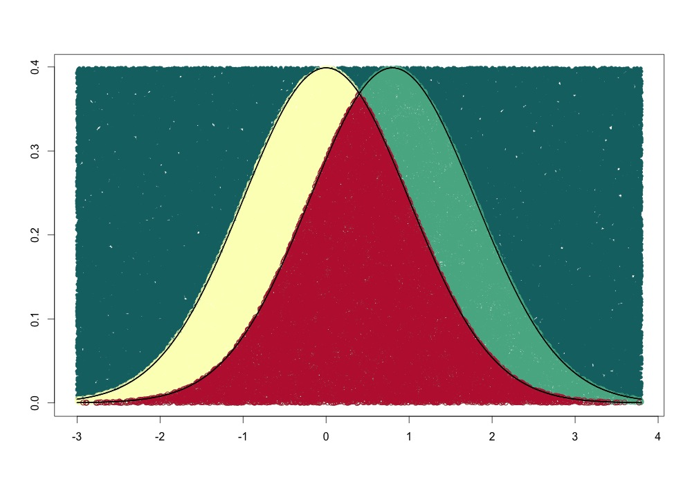

I read this post over at the blog Cartesian Faith about [Probability and Monte Carlo methods](http://cartesianfaith.com/2013/12/15/probability-and-monte-carlo-methods/). The post describe how to numerically intregate using Monte Carlo methods. I thought the results looked cool so I used the method to calculate the overlap of two normal distributions that are separated by a Cohen’s d of 0.8. You should head over to the original post if you want a more detailed explanation of the method. And I should add that this is not the most efficient way to calculate the overlap of two gaussian distributions, but it is a fun and pretty intuitive way, plus you can make a cool plot of the result. However, I also show how to get the overlap using the cumulative distribution function and using R’s built-in integration function.


## Overlapping proportions of two normal distributions

```r
# Numerical integration using monte carlo methods
set.seed(456456)
n <- 100000
mu1 <- 0
sd1 <- 1
mu2 <- 0.8 # i.e. cohen's d = 0.8
sd2 <- 1
 
xs <- seq(min(mu1 - 3*sd1, mu2 - 3*sd2), max(mu1 + 3*sd1, mu2 + 3*sd2), length.out=n)
f1 <- dnorm(xs, mean=mu1, sd=sd1) # dist1
f2 <- dnorm(xs, mean=mu2, sd=sd2) # dist2
 
ps <- matrix(c(runif(n, min(xs), max(xs)), runif(n, min=0, max=max(f1,f2)) ), ncol=2) # sample x,y from uniform dist
 
z1<- ps[,2] <= dnorm(ps[,1], mu1, sd1) # dist1
z2<- ps[,2] <= dnorm(ps[,1], mu2, sd2) # dist 2
z12 <- z1 | z2 # both dists
z3 <- ps[,2] <= pmin(dnorm(ps[,1], mu1, sd1), dnorm(ps[,1], mu2, sd2)) # overlap
 
# plot
plot(ps[!z12, 1], ps[!z12, 2], col='#137072', pch=20, ylim=c(0, max(f1,f2)), xlim=range(xs), xlab="", ylab="")
points(ps[z1,1], ps[z1,2], col="#FBFFC0")
points(ps[z2,1], ps[z2,2], col="#56B292")
points(ps[z3, 1], ps[z3,2], col="#BF223D")
lines(xs, f1, lwd=2)
lines(xs, f2, lty="dotted",lwd=2)
```

So two gaussian distributions that are separated by a standardized mean difference (Cohen’s d) of 0.8 look like this



To calculate the overlap we just divide the number of points in the overlap region with the total numbers of points in one of the distributions. To get more stable results I calculate the mean overlap using both distributions. What we’re calculating is sometimes called the overlapping *coefficient (OVL)*.

```r
# proportion of overall overlap
(sum(z3)/sum(z1) + sum(z3)/sum(z2))/2
```

```
[1] 0.691094
```

## The faster but less cool way
If we just want to convert from Cohen’s d to OVL, we can use the cumulative distribution function `pnorm()`.

```r
# using cdf, only works when sigma_1 = sigma_2
d <- (mu1-mu2)/sd1
2 * pnorm(-abs(d)/2)
```

```
[1] 0.6891565
```

This result is very close to our monte carlo estimate. Another easy way is to use R’s built-in `integrate()` function, which will work with unequal variances as well.

```r
int_f <- function(x, mu1, mu2, sd1, sd2) {
  f1 <- dnorm(x, mean=mu1, sd=sd1)
  f2 <- dnorm(x, mean=mu2, sd=sd2)
  pmin(f1, f2)
}
integrate(int_f, -Inf, Inf, mu1=0, mu2=0.8, sd1=1, sd2=1)
```

```
0.6891566 with absolute error < 1.6e-05
```


