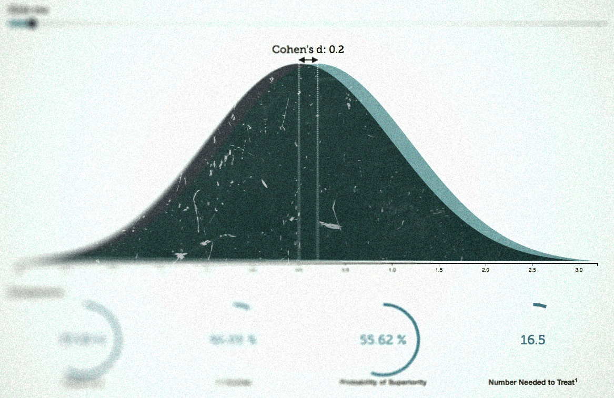

I have created a new visualization in D3. The purpose is to aid in the interpretation of Cohen’s d. The visualization presents Cohen’s d in the following ways: Visually, Cohen’s U3, Probability of superiority, Percentage of overlap and Number needed to treat.

The visualization should work on mobile phones and tablets, but it requires a modern browser that supports SVG. Check it out [here](http://rpsychologist.com/d3/cohend)

