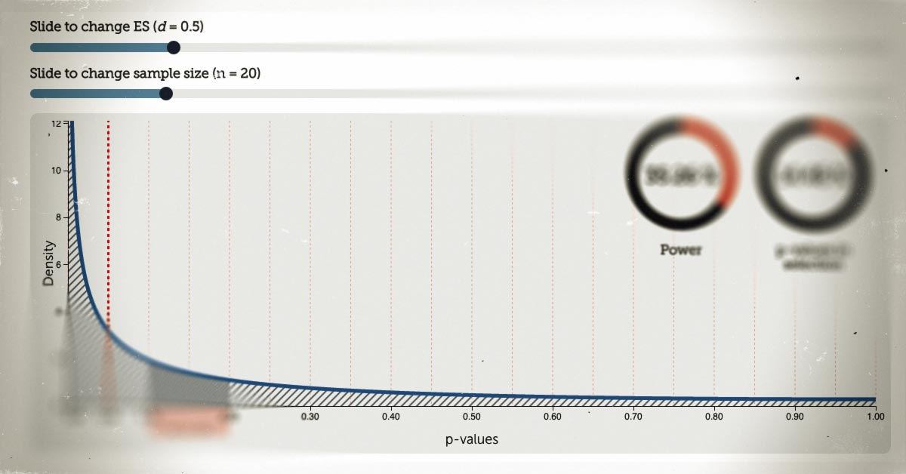

I just published a new interactive visualization in my series of basic statistical concepts and techniques. This time I am trying to show how p-values are distributed. Check it out here: [rpsychologist.com/d3/pdist/](http://rpsychologist.com/d3/pdist)

