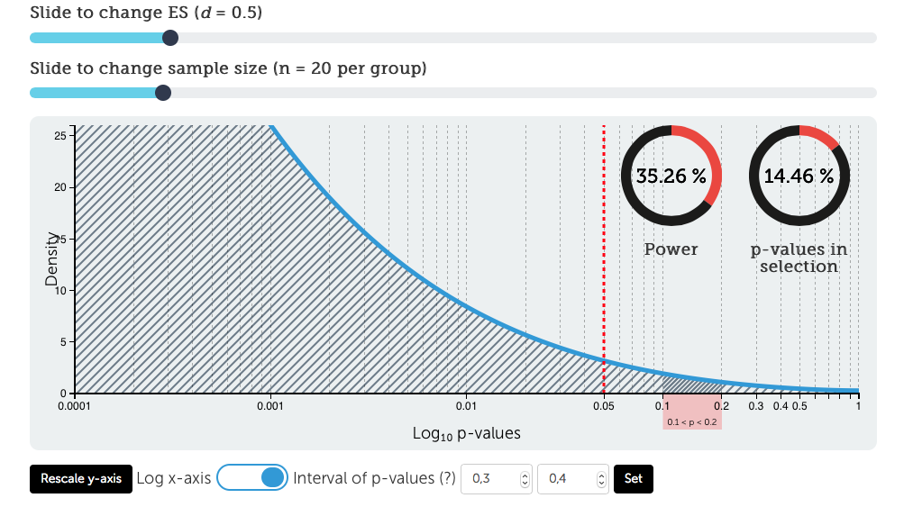

My [p-curve tool](http://rpsychologist.com/d3/pdist) now lets you show the x-axis on a log₁₀ scale, which makes it a lot easier to look at really small p-values. Thanks to Ged Ridgway for suggestion this! 

