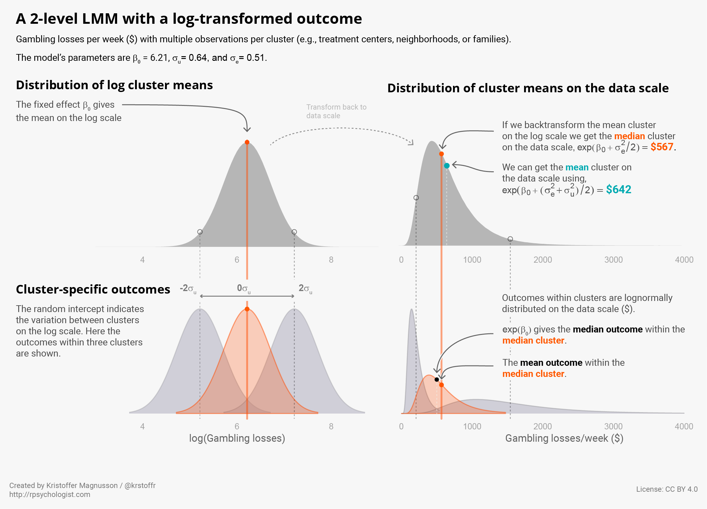
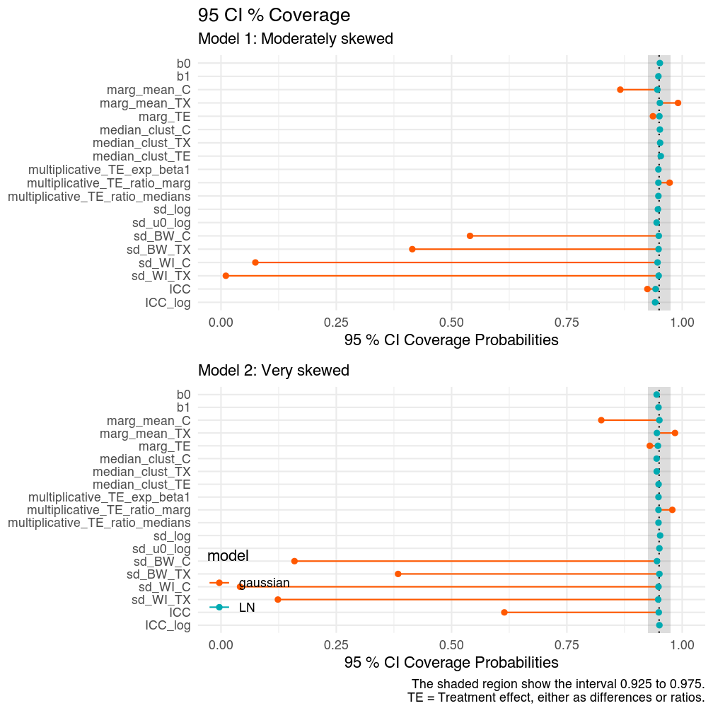
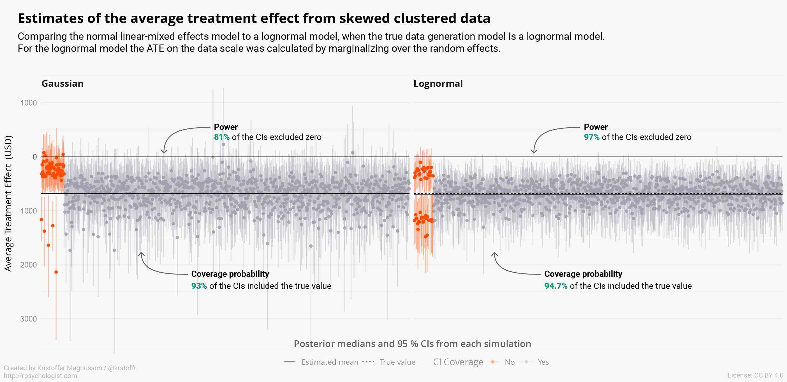

When a **multilevel** model includes either a non-linear transformation (such as the log-transformation) of the response variable, or of the expectations via a GLM link-function, then the interpretation of the results will be different compared to a standard Gaussian multilevel model; specifically, the estimates will be on a transformed scale and not in the original units, and the effects will no longer refer to the average effect in the population, instead they are conditional/cluster-specific. In this post, I will deal with linear mixed-effects models (LMM) that use a log-transformed outcome variable. This will be the first part of a three-part tutorial on some of the finer details of (G)LMMs, and how Bayes can make your (frequentist) life easier. In each post I will focus on:

- **log-transformation** of the dependent variable in a **multilevel** model
- Calculating both **multiplicative effects** (% change) and differences on the **untransformed scale**.
- **Subject-specific**/cluster-specific versus **population-average effects** (conditional versus marginal effects).
- **Intraclass correlations** on the transformed/link/latent scale or on the response/data/original scale.

In part 2 I will cover a GLMM with a binary outcome, and part 3 will focus on semicontinuous (hurdle/two-part) models when the outcome is a skewed continuous variable that include zeros.

The aim of this post is also to show:

- How simulation-based approaches like MCMC make it much easier to make inferences about transformed parameters.
- How the estimates from a multilevel model can be transformed to answer the same questions as population-average models or fixed effects models. 

## Data-generating model: a lognormal LMM

As an example, we will use a simple hierarchical design with clusters nested within either a treatment or a control condition. This is a classic 2-level multilevel model.

$$ 
\text{log}(y_{ij} \mid u_i, TX_i) \sim \mathcal{N}(\beta_0 + \beta_1 TX_{i} + u_i, \sigma_e^2) 
$$

$$ 
u_i \sim \mathcal{N}(0, \sigma^2_u) 
$$

In this model, the natural logarithm of $y$ is normally distributed conditional on the cluster-specific effect $u_i$ and the treatment variable $TX$. Let's assume $y$ is the average money (in USD) lost gambling per week (since I do research on gambling disorder). Gambling expenditure is sometimes quite well described by a lognormal distribution, or a (generalized) Gamma distribution. Importantly, the methods in this post can quite easily be tweaked to work with other response distributions. Each treatment arm has $n_2$ clusters, and each cluster has $n_1$ observations. In this example clusters refer to e.g. schools, centers, groups, and the first level are subjects. However, it would be easy to use the contents of this post for a longitudinal model where clusters refer to subjects, and the subjects have repeated observations.

## Simulate data
Let's create a simple function that generates data from this model

```r
#' Generate lognormal data with a random intercept
#'
#' @param n1 patients per cluster
#' @param n2 clusters per treatment
#' @param B0 log intercept
#' @param B1 log treatment effect
#' @param sd_log log sd
#' @param u0 SD of log intercepts (random intercept)
#'
#' @return a data.frame
gen_data <- function(n1, n2, B0, B1, sd_log, u0) {
  
  cluster <- rep(1:(2 * n2), each = n1)
  TX <- rep(c(0, 1), each = n1 * n2)
  u0 <- rnorm(2 * n2, sd = u0)[cluster]
  
  mulog <- (B0 + B1 * TX + u0)
  y <- rlnorm(2 * n1 * n2, meanlog = mulog, sdlog = sd_log)
  
  d <- data.frame(cluster,
                  TX,
                  y)
  d
}
```

The model parameters are

```r
set.seed(4445)
pars <- list("n1" = 30, # observations per cluster
             "n2" = 10, # clusters per treatment
             "B0" = log(500),
             "B1" = log(0.5),
             "sd_log" = 0.5,
             "u0" = 0.5)

d <- do.call(gen_data,
             pars)
```

## Fit the model
We can fit this model using `brms` (or rstanarm, lme4, etc).


```r
fit <- brm(y ~ 1 + TX + (1 | cluster), 
           family = lognormal(), 
           data = d,
           cores = 4, 
           seed = 4445)
fit
```


```
##  Family: lognormal 
##   Links: mu = identity; sigma = identity 
## Formula: y ~ 1 + TX + (1 | cluster) 
##    Data: d (Number of observations: 600) 
## Samples: 4 chains, each with iter = 2000; warmup = 1000; thin = 1;
##          total post-warmup samples = 4000
## 
## Group-Level Effects: 
## ~cluster (Number of levels: 20) 
##               Estimate Est.Error l-95% CI u-95% CI Eff.Sample Rhat
## sd(Intercept)     0.64      0.12     0.45     0.91        640 1.01
## 
## Population-Level Effects: 
##           Estimate Est.Error l-95% CI u-95% CI Eff.Sample Rhat
## Intercept     6.21      0.21     5.80     6.61        583 1.00
## TX           -0.70      0.30    -1.25    -0.09        548 1.00
## 
## Family Specific Parameters: 
##       Estimate Est.Error l-95% CI u-95% CI Eff.Sample Rhat
## sigma     0.51      0.01     0.48     0.54       1834 1.00
## 
## Samples were drawn using sampling(NUTS). For each parameter, Eff.Sample 
## is a crude measure of effective sample size, and Rhat is the potential 
## scale reduction factor on split chains (at convergence, Rhat = 1).
```

Using the notation of our 2-level model, we get these results

Parameter | Estimate
-------- | ---------
$\hat\beta_0$ | 6.21
$\hat\beta_1$ | -0.70
$\hat\sigma_u$ | 0.64
$\hat\sigma_e$ | 0.51

## Interpreting the parameters
All of the estimates are on the log scale, and they do not have an immediate interpretation on the natural scale. To further complicate things we should also remind ourselves that the effects from (G)LMM have cluster-specific interpretations ("subject-specific" in a longitudinal model when clusters = subjects). Researchers who work mostly with LMMs sometimes tend to forget this, since for LMMs the cluster-specific effects are equal to the population-average (marginal) effects. The non-linear transformation of either the data (like the log-transformation) or via the link function in (G)LMMs both means that back-transformation of the model's estimates from e.g. the log scale does not give the expected values on the natural scale (cf. Jensen's inequality). 

In the figure below I try to illustrate both the cluster-specific nature of the model, and the transformation between the log scale and the natural data scale, without being too technical. 



```r:collapsed=true
# To create the figure below this code was used to generate the distributions,
# the viz was then finalized in Illustrator.

library(ggplot2)
library(gridExtra)

# panel 1
p1 <- ggplot(data.frame(x = seq(B0 - u0 * 3, B0 + u0 * 3,
                                length.out = 500)),
             aes(x)) +
  stat_function(
    fun = dnorm,
    geom = "area",
    alpha = 0.5,
    args = list(mean = B0,
                sd = u0),
    aes(color = "Control", fill = "Control")
  ) +
  geom_vline(xintercept = B0 * c(-2, 0, 2) * u0, color = "blue") +
  annotate("point", y = dnorm(B0, B0, u0), x = B0) +
  annotate(
    "text",
    y = dnorm(B0, B0, u0),
    x = B0 + 0.2,
    label = expression(paste("mean: ", beta[0]))
  ) +
  labs(title = "Distribution of log cluster means",
       y = "Density") +
  theme(legend.position = "none") +
  scale_y_continuous(breaks = NULL) +
  xlim(c(3, 9))

# panel 2
p2 <- ggplot(data.frame(x = seq(0, 4e3,
                                length.out = 500)),
             aes(x)) +
  geom_density(data = data.frame(y = exp(B0 + rnorm(5e6, 0, u0) + sd_log^2 / 2)),
               aes(x = y),
               color = "blue",
               fill = "green") +
  geom_vline(xintercept = exp(B0 + c(-2, 0, 2) * u0 + sd_log^2 / 2)) +
  geom_vline(xintercept = exp(B0 + sd_log^2 / 2), color = "blue") +
  geom_vline(xintercept = exp(B0 + (sd_log^2 + u0^2) / 2),
             color = "blue",
             linetype = "dotted") +
  labs(title = "Distribution of cluster means",
       y = "Density") +
  xlim(c(0, 4e3)) +
  theme(legend.position = "none") +
  scale_y_continuous(breaks = NULL)


##
#' Get cluster-specific densities
#'
#' @param RE the cluster-specific effect (u_i)
#' @param B0 log intercept
#' @param sd_log log SD
#' @param u0 log random intercept
#'
#' @return data.frame y = dlnorm, ylog = dnorm

log_density <- function(RE = 0, B0, sd_log, u0) {
  mulog <- B0 + u0 * RE
  mu <- exp(mulog + sd_log^2 / 2)
  sd <- sqrt((exp(sd_log^2) - 1) * exp(2 * mulog + sd_log^2))
  
  xlog <-
    seq(mulog - 3 * sd_log, mulog + 3 * sd_log, length.out = 100)
  x <- seq(0, mu + 3 * sd, length.out = 100)
  ylog <- dnorm(xlog, mean = mulog, sd = sd_log)
  y <- dlnorm(x, meanlog = mulog, sdlog = sd_log)
  
  data.frame(x,
             y,
             xlog,
             ylog,
             sd_log,
             u0,
             RE = factor(paste0(RE, "SD"),
                         ordered = TRUE))
  
}


d_density <- lapply(
  c(-2, 0, 2),
  log_density,
  B0 = pars$B0,
  sd_log = pars$sd_log,
  u0 = pars$u0
)
d_density <- do.call(rbind,
                     d_density)


# panel 3
p3 <-
  ggplot(d_density, aes(
    xlog,
    ylog,
    group = RE,
    color = RE,
    fill = RE
  )) +
  geom_line() +
  geom_area(alpha = 1 / 3, position = "identity") +
  geom_vline(xintercept = c(B0 - 2 * u0, B0, B0 + 2 * u0)) +
  labs(
    x = "log(Gambling losses)",
    y = "Density",
    color = "Cluster mean (log)",
    fill = "Cluster mean (log)",
    title = "Log scale"
  ) +
  theme(legend.position = "bottom") +
  scale_y_continuous(breaks = NULL) +
  xlim(c(3, 9))

# panel 4
p4 <-
  ggplot(d_density, aes(
    x,
    y,
    group = RE,
    color = RE,
    fill = RE
  )) +
  geom_line() +
  geom_area(alpha = 1 / 3) +
  geom_vline(xintercept = exp(B0 + c(-2, 0, 2) * u0 + sd_log^2 / 2)) +
  annotate("point", x = exp(B0), y = dlnorm(exp(B0), B0, sd_log)) +
  labs(x = "Gambling losses",
       y = "Density",
       title = "Data scale") +
  theme(legend.position = "none") +
  scale_y_continuous(breaks = NULL)

# Save

theme <- theme_minimal() + theme(legend.position = "none", panel.grid = element_blank())

ggsave(filename = "lognormal_LMM_illu.pdf", 
       grid.arrange(p1 + theme, 
                    p2 + theme, 
                    p3 + theme, 
                    p4 + theme, ncol = 2), 
       width = 10, 
       height = 5,
       useDingbats=FALSE)
```

### How to calculate marginal effects on the data scale
So how do we derive the numbers presented in the figure above? Well, for the lognormal distribution with the log mean $\mu$ and the log SD $\sigma_e$ we have:

* mean: $\text{exp}(\mu + \frac{\sigma_e^2}{2})$
* median: $\text{exp}(\mu)$

If we want to get the marginal mean we need to average this back-transformation over the random effects distribution. Since, as noted earlier, simply back-transforming the log coefficient (the expected mean on the log scale) will not give the expected mean on the original scale (money lost). 

$$ 
\text{exp}(\beta_0 + \frac{\sigma^2_e}{2}) \ne \text{E} (Y_{ij} \mid TX = 0)
$$

The correct expectation is

$$ 
\text{E}(y_{ij} \mid TX = 0) = \int \text{exp}(x + \sigma^2_e/2)  f_{\mathcal{N}}(x, \beta_{0}, \sigma_{u}^2)dx
$$

This integral is easily solved using numerical integration. 

```r
mu <- integrate(
  f = function(x) {
    exp(x + sd_log ^ 2 / 2) * dnorm(x, B0, sd = u0)
  },
  lower = B0 - 10 * u0,
  upper = B0 + 10 * u0
)$value
mu
```

```
## [1] 642.0127
```

In this case, we can also derive an exact and simple solution using the moment-generating function of the lognormal distribution (see Proof 1: left as an exercise to the reader 🤓)


```r
exp(B0 + (u0^2 + sd_log^2)/2)
```

```
## [1] 642.0127
```

A third option is Monte Carlo integration. Were we simply simulate a large number of cluster outcomes on the log scale, back-transform to the natural scale, and then get the average. For multivariate integrals (e.g. models with correlated random effects) this is often the simplest solution that also works well in practice, although the package `cubature` offers a fast solution using adaptive numerical integration. 


```r
u_i <- rnorm(1e5, 0, u0)
y <- exp(B0 + u_i + sd_log^2/2)
mean(y)
```

```
## [1] 643.239
```

We see that all three methods give the same result (within Monte Carlo error).

### Can we interpret the cluster-specific values?
So, if the expected value for the outcome group is 642 USD, and $\text{exp}(\beta_0 + \frac{\sigma^2_e}{2})$ = 567 USD is there a meaningful interpretation of 567? As shown in the figure above, this is the expected value for the cluster at the center of the distribution of cluster means on the *log scale*. Since percentiles are invariant under a monotonic transformation (and the mean is equal to the median for the normal distribution), this cluster (with $u_i = 0$) is also at the median on the natural scale. 

```r
exp(B0 + sd_log^2/2)
```

```
## [1] 566.5742
```

So to summarize, the cluster-specific effects are,

$$ 
\text{E}(y_{ij} \mid u_i, TX_i) = \text{exp}(\beta_0 + \beta_1TX_i + u_i + \frac{\sigma^2_e}{2}),
$$

and the expected marginal mean in each treatment group is,

$$
 \text{E}(y_{ij} | TX_i) = \text{exp}(\beta_0 + \beta_1TX_i + \frac{\sigma^2_u + \sigma^2_e}{2})
$$

### Average treatment effects on the data scale
Using the results above, the cluster-specific average treatment effect on the original scale is,

$$ 
\text{E}(Y_{ij} \mid u_i, \text{TX} = 1) - \text{E}(Y_{ij} \mid u_i, \text{TX} = 0) = \\
\text{exp}(\beta_0 + \beta_1 + u_i + \frac{\sigma^2_e}{2}) - \text{exp}(\beta_0 + u_i + \frac{\sigma^2_e}{2})
$$

which is (for $u_i = 0$),

```r
exp(B0 + B1 + sd_log^2/2) - exp(B0 + sd_log^2/2)
```

```
## [1] -283.2871
```

And the marginal treatment effect on the original scale is,

$$ 
\text{E}(Y_{ij} \mid \text{TX} = 1) - \text{E}(Y_{ij} \mid  \text{TX} = 0) = \\
\text{exp}(\beta_0 +\beta_1 + \frac{\sigma^2_e + \sigma^2_u}{2}) - \text{exp}(\beta_0 + \frac{\sigma^2_e + \sigma^2_u}{2})
$$


```r
exp(B0 + B1 + (u0^2 +sd_log^2)/2) - exp(B0 + (u0^2 +sd_log^2)/2)
```

```
## [1] -321.0064
```


### Multiplicate effects (% change)
Most know that if we take the exponent of the log difference we get the % change. Generally, these multiplicative effects are also cluster-specific. However, for our simple model $\text{exp}(\beta_1)$ gives both the cluster-specific and population-average effect. We can see this if we look at the ratio of the expected conditional outcome in the treatment and control group,

$$
\begin{aligned}
\frac{\text{E}(Y_{ij} \mid u_i, \text{TX} = 1)}{\text{E}(Y_{ij} \mid u_i, \text{TX} = 0)} &= \frac{\text{exp}(\beta_0 + \beta_1 +u_i + \frac{\sigma^2_e}{2})}
{\text{exp}(\beta_0 + u_i + \frac{\sigma^2_e}{2})} \\\ &= \text{exp}(\beta_1)
\end{aligned}
$$

and similarly for the marginal outcomes
$$
\begin{aligned}
\frac{\text{E}(Y_{ij} \mid \text{TX} = 1)}{\text{E}(Y_{ij} \mid \text{TX} = 0)} &= \frac{\text{exp}(\beta_0 + \beta_1 + \frac{\sigma^2_u + \sigma^2_e}{2})}
{\text{exp}(\beta_0 + \frac{\sigma^2_u + \sigma^2_e}{2})} \\\ &= \text{exp}(\beta_1).
\end{aligned}
$$

The cluster-specific and population-average effect is the same. However, this is not true in general for nonlinear transformation or GLMM link functions (which we shall see in part 2 on binary outcomes).

### 95 % CIs for the backtransformed marginal effects
Getting back to our fitted model, let's see how we can transform the estimates into the posterior distribution of e.g. the marginal mean outcome in the control group. We do this by applying the back-transformation and marginalization using all the posterior samples of $\hat\beta_0$, $\hat\sigma_u$, and $\hat\sigma_e$. 


```r
marg_f <- function(B0, u0, sd_log) {
  data.frame("marginal" = exp(B0 + (u0^2 + sd_log^2)/2),
             "conditional" = exp(B0 + (sd_log^2)/2)
             )
}
ss <- posterior_samples(fit)

# mapply would also work
mu <- pmap_df(
    list(
      B0 = ss$b_Intercept,
      u0 = ss$sd_cluster__Intercept,
      sd_log = ss$sigma
    ),
    .f = marg_f
  )

map(mu, quantile, probs = c(0.025, 0.5, 0.975)) %>% 
    do.call(rbind, .) 
```

```
##                 2.5%      50%     97.5%
## marginal    454.4591 697.9116 1123.3794
## conditional 374.4601 570.5069  847.8781
```

As one would expect, estimates of the population effect are less precise compared to condition on a specific cluster effect.

### Summarizing the model
Let's summarize all the results from the model, both the conditional and marginal, absolute and multiplicative treatment effects. 

```r:collapsed=true
ss <- posterior_samples(fit, pars = c("b_", 
                                      "sd", 
                                      "sigma"))


res <- ss %>% 
  select(B0 = b_Intercept, B1 = b_TX, u0 = sd_cluster__Intercept, sigma) %>% 
  mutate(y_cond_cc = exp(B0 + sigma^2/2),
         y_cond_tx = exp(B0 + B1 + sigma^2/2),
         y_marg_cc = exp(B0 + (u0^2 + sigma^2)/2),
         y_marg_tx = exp(B0 + B1 + (u0^2 + sigma^2)/2),
         TE_cond_ATE = y_cond_tx - y_cond_cc,
         TE_marg_ATE = y_marg_tx - y_marg_cc,
         TE_cond_multi = y_cond_tx/y_cond_cc,
         TE_marg_multi = y_marg_tx/y_marg_cc,
         TE_multi = exp(B1)
         ) %>% 
  select(-B0, -B1, -u0, -sigma)

tab <- res %>% 
  gather(key, val) %>% 
  mutate(key = factor(key, levels = unique(key))) %>% 
  group_by(key) %>% 
  do(  data.frame(posterior_median = median(.$val), 
                  l_95_CI = quantile(.$val, 0.025), 
                  u_95_CI = quantile(.$val, 0.975),
                  stringsAsFactors = FALSE)) %>% 
  ungroup() %>% 
  mutate(key = c("$\\text{E}(Y_{ij} \\mid u_i = 0, \\text{TX} = 0)$",
                 "$\\text{E}(Y_{ij} \\mid u_i = 0, \\text{TX} = 1)$",
                 "$\\text{E}(Y_{ij} \\mid \\text{TX} = 0)$",
                 "$\\text{E}(Y_{ij} \\mid \\text{TX} = 1)$",
                 "$\\text{E}(Y_{ij} \\mid u_i = 0, \\text{TX} = 1) - \\\\ \\text{E}(Y_{ij} \\mid u_i = 0, \\text{TX} = 0)$",
                 "$\\text{E}(Y_{ij} \\mid \\text{TX} = 1) - \\\\ \\text{E}(Y_{ij} \\mid \\text{TX} = 0)$",
                 "$\\frac{\\text{E}(Y_{ij} \\mid u_i = 0, \\text{TX} = 1)}{\\text{E}(Y_{ij} \\mid u_i = 0, \\text{TX} = 0)}$",
                 "$\\frac{\\text{E}(Y_{ij} \\mid \\text{TX} = 1)}{\\text{E}(Y_{ij} \\mid \\text{TX} = 0)}$",
                 "$\\text{exp}(\\beta_1)$"),
         Effect = c("Average outcome for a median cluster in the control group",
                     "Average outcome for a median cluster in the treatment group",
                     "Average outcome in the control group",
                     "Average outcome in the treatment group",
                     "Difference between the average outcome in a median cluster in the treatment versus control group",
                     "Difference between the average outcome in the treatment versus control group",
                     "Ratio of the average outcome in a median cluster in the treatment and the control group",
                     "Ratio of the average outcome in the treatment and the control group",
                     "Ratio of the average outcome in the treatment and the control group")) %>% 
  select(Effect, Formula = key, posterior_median, l_95_CI, u_95_CI)
```

|Effect                                                                                           |Formula                                                                                             | posterior_median| l_95_CI| u_95_CI|
|:------------------------------------------------------------------------------------------------|:---------------------------------------------------------------------------------------------------|----------------:|-------:|-------:|
|Average outcome for a median cluster in the control group                                        |$\text{E}(Y_{ij} \mid u_i = 0, \text{TX} = 0)$                                                      |            570.5|   374.5|   847.9|
|Average outcome for a median cluster in the treatment group                                      |$\text{E}(Y_{ij} \mid u_i = 0, \text{TX} = 1)$                                                      |            281.8|   186.7|   435.2|
|Average outcome in the control group                                                             |$\text{E}(Y_{ij} \mid \text{TX} = 0)$                                                               |            697.9|   454.5|  1123.4|
|Average outcome in the treatment group                                                           |$\text{E}(Y_{ij} \mid \text{TX} = 1)$                                                               |            342.7|   231.3|   575.5|
|Difference between the average outcome in a median cluster in the treatment versus control group |$\text{E}(Y_{ij} \mid u_i = 0, \text{TX} = 1) - \\ \text{E}(Y_{ij} \mid u_i = 0, \text{TX} = 0)$    |           -286.1|  -580.2|   -37.9|
|Difference between the average outcome in the treatment versus control group                     |$\text{E}(Y_{ij} \mid \text{TX} = 1) - \\ \text{E}(Y_{ij} \mid \text{TX} = 0)$                      |           -349.0|  -747.5|   -47.4|
|Ratio of the average outcome in a median cluster in the treatment and the control group          |$\frac{\text{E}(Y_{ij} \mid u_i = 0, \text{TX} = 1)}{\text{E}(Y_{ij} \mid u_i = 0, \text{TX} = 0)}$ |              0.5|     0.3|     0.9|
|Ratio of the average outcome in the treatment and the control group                              |$\frac{\text{E}(Y_{ij} \mid \text{TX} = 1)}{\text{E}(Y_{ij} \mid \text{TX} = 0)}$                   |              0.5|     0.3|     0.9|
|Ratio of the average outcome in the treatment and the control group                              |$\text{exp}(\beta_1)$                                                                               |              0.5|     0.3|     0.9|


### Using brms::fitted
Let's compare our results to the predicted means we get with `brms::fitted` and `brms::marginal_effects`

```r
# Both give the same result
fitted(fit, 
       newdata = data.frame(TX = 0), 
       re_formula = NA,
       robust = TRUE)
```

```
##      Estimate Est.Error     Q2.5    Q97.5
## [1,] 570.5069  114.8815 374.4601 847.8781
```

```r
marginal_effects(fit)$TX[1,]
```

```
##   TX        y cluster cond__ estimate__     se__  lower__  upper__
## 1  0 481.4254      NA      1   570.5069 114.8815 374.4601 847.8781
```

We see that this is exactly the same as the median outcome (cluster-specific outcome) in the control group. I've seen some people confused about this since the function is called `marginal_effects`. 

### Limiting inference to only the included clusters
We can also use `fitted` to average over the included clusters, this is very similar to fitting the clusters as "fixed effects". So let's compare averaging over the included clusters in the multilevel model to fitting a fixed effects (no pooling) model. 


```r
fit_fixed <- brm(y ~ 0 + factor(cluster), 
                    family = lognormal(), 
                    data = d,
                    cores = 4, 
                    iter = 2000)
```

Let's look at the predicted mean for the control group using the fixed effects model.


```r
cluster_fixed <- fitted(fit_fixed, 
                         newdata = expand.grid(TX = 0, 
                                               cluster = 1:10), 
                         re_formula = NULL,
                         summary = FALSE)
cluster_fixed <- apply(cluster_fixed, 1, mean)
quantile(cluster_fixed, c(0.025, 0.5, 0.975))
```

```
##     2.5%      50%    97.5% 
## 600.4927 638.8134 682.9103
```

Which is really similar to the control groups sample mean which is 636. Now let's compare the posterior distribution from the fixed effects model, to using our multilevel model to average over only the included clusters (and not the estimated distribution of clusters).

```r:collapsed=true
get_fixed_cluster_marginal <- function(fit, newdat, label) {
  cluster_fixed_ <- fitted(fit, 
                             newdata = newdat, 
                             re_formula = NULL,
                             summary = FALSE)
  cluster_fixed <- apply(cluster_fixed_, 1, mean)
  
  # posterior samples
  list(ss_fixed = cluster_fixed_, 
       ss_marg = cluster_fixed,
       label = label)
}

# Get prediction for each treatment group
fixed_cluster_C_RE <- get_fixed_cluster_marginal(fit = fit, 
                                              newdat = expand.grid(TX = 0, 
                                                                   cluster = 1:10),
                                              label = "C_RE") 
fixed_cluster_TX_RE <- get_fixed_cluster_marginal(fit = fit, 
                                              newdat = expand.grid(TX = 1, 
                                                                   cluster = 11:20),
                                              label = "TX_RE") 


fixed_cluster_C_FE <- get_fixed_cluster_marginal(fit = fit_fixed, 
                                                 newdat = expand.grid(TX = 0, 
                                                                      cluster = 1:10),
                                                 label = "C_FE") 
fixed_cluster_TX_FE <- get_fixed_cluster_marginal(fit = fit_fixed, 
                                                 newdat = expand.grid(TX = 1, 
                                                                      cluster = 11:20),
                                                 label = "TX_FE") 

# Summarise posterior median and 95 % CI
sums <- data.frame("model" = rep(c("RE", 
                                   "FE"), 3),
                   "variable" = rep(c("Control", 
                                      "Treatment", 
                                      "Difference"), each = 2))  
qs <- rbind(quantile(fixed_cluster_C_RE$ss_marg, c(0.025, 0.5, 0.975)),
            quantile(fixed_cluster_C_FE$ss_marg, c(0.025, 0.5, 0.975)),
            quantile(fixed_cluster_TX_RE$ss_marg, c(0.025, 0.5, 0.975)),
            quantile(fixed_cluster_TX_FE$ss_marg, c(0.025, 0.5, 0.975)),
            quantile(fixed_cluster_TX_RE$ss_marg - fixed_cluster_C_RE$ss_marg, c(0.025, 0.5, 0.975)),
            quantile(fixed_cluster_TX_FE$ss_marg - fixed_cluster_C_FE$ss_marg, c(0.025, 0.5, 0.975)))
colnames(qs) <- c("l_95_CI", "median", "u_95_CI")

sums <- cbind(sums, qs)


ps <- rbind(data.frame("model" = "RE", variable = "Control", samples = fixed_cluster_C_RE$ss_marg),
            data.frame("model" = "RE", variable = "Treatment", samples = fixed_cluster_TX_RE$ss_marg),
            data.frame("model" = "RE", variable = "Difference", samples = fixed_cluster_TX_RE$ss_marg - fixed_cluster_C_RE$ss_marg),
            data.frame("model" = "FE", variable = "Control", samples = fixed_cluster_C_FE$ss_marg),
            data.frame("model" = "FE", variable = "Treatment", samples = fixed_cluster_TX_FE$ss_marg),
            data.frame("model" = "FE", variable = "Difference", samples = fixed_cluster_TX_FE$ss_marg - fixed_cluster_C_FE$ss_marg))

# plot
p <- ggplot(ps, aes(x = samples, 
               color = model, 
               fill = model)) + 
  geom_density(alpha = 0.25, aes(y = ..scaled..)) + 
  geom_segment(data = sums,
               aes(x = l_95_CI,
                   xend = u_95_CI,
                   y = 0, 
                   yend = 0), 
               position = position_nudge(y = c(-0.025, -0.05))) +
  geom_point(data = sums,
             aes(x = median,
                 y = 0), 
             position = position_nudge(y = c(-0.025, -0.05))) +
  facet_wrap(~variable, scales = "free_x") +
  labs(x = "Posterior samples",
       y = "Cluster mean ($)",
       title = "Treating clusters as \"fixed\"",
       subtitle = "Comparing no pooling (FE) vs partial pooling (RE)\nwhen both models limit inferences to the included clusters only"
       ) +
  theme_minimal() +
  theme(legend.position = "bottom")
```


We see that the results are highly similar. Although, the models behind the results do differ. If we look at the estimates for the specific clusters we can see the—in this model very weak—effect of partial pooling in the multilevel model.


## Intraclass correlations (ICC)
Since the variance components are on the log scale ICCs calculated using them will also be on the log scale. This is not always what we want, for instance, if we are calculating agreement, reliability, or heritability, it can make a lot of sense to calculate ICCs on the data scale. If I am calculating ICCs for family members' reports on gambling losses, then I am interested in agreement on the data scale (USD) and not on the log scale.

ICCs on the data scale can be calculated using the same techniques we used for the marginalization of the outcomes. You can read more about this in the context of GLMMs in Villemereuil et al. (2016; and the related R package `QQglmm`). Here is an example, first we calculate the marginal mean

$$ 
\text{E}(y_{i} \mid TX_i) = \bar\mu_i = \int \text{exp}(x + \sigma_e^2/2)  f_{\mathcal{N}}(x, \mu_{i}, \sigma_{u_0}^2)dx
$$

then we use the marginal mean to calculate the expected variance between clusters on the data scale,

$$ 
\sigma_B^2 = \int (e^x - \bar\mu_i)^2  f_{\mathcal{N}}(x, \mu_{i}, \sigma_{u_0^2})dx
$$

and lastly we calculate the expected variance within clusters on the data scale,

$$ 
\sigma_W^2 = \int \left(( \text{exp}(\sigma_e^2) - 1 )  \text{exp}(2x + \sigma_e^2) \right)f_{\mathcal{N}}(x, \mu_i, \sigma_{u_0^2})dx.
$$

Where $(\text{exp}(\sigma_e^2) - 1 )  \text{exp}(2x + \sigma_e^2)$ is the variance of the lognormal distribution evaluated at $x$. 

The ICC on the response scale in then

$$
\text{Cor}(y_{ij}, y_{ij'}) = \frac{\sigma_B^2}{\sigma_B^2 + \sigma_W^2} 
$$

Whereas, the log scale ICC is,

$$ 
\text{Cor}\left(\text{log}(y_{ij}), \text{log}(y_{ij'})\right) = \frac{\sigma_u^2}{\sigma_u^2 + \sigma_e^2} 
$$

Since this is also a one-dimensional integral we can use `integrate`,

```r:collapsed=true
get_ICC_ln <- function(B0, u0, sd_log, ...) {
  
  mu <-  integrate(
    f = function(x) {
      exp(x + sd_log^2 / 2) * dnorm(x, B0, sd = u0)
    },
    lower = B0 - 10 * u0,
    upper = B0 + 10 * u0
  )$value
  
  sigma2_bw <-  integrate(
    f = function(x) {
      (exp(x + sd_log^2 / 2) - mu)^2  * dnorm(x, B0, sd = u0)
    },
    lower = B0 - 10 * u0,
    upper = B0 + 10 * u0
  )$value
  
  sigma2_wi <-  integrate(
    f = function(x) {
      (exp(sd_log^2) - 1) * exp(2 * x + sd_log^2)  * dnorm(x, B0, sd = u0)
    },
    lower = B0 - 10 * u0,
    upper = B0 + 10 * u0
  )$value
  
  ICC <-  sigma2_bw / (sigma2_bw + sigma2_wi)
  list(
    "ICC" = ICC,
    "WI_sd" = sqrt(sigma2_wi),
    "BW_sd" = sqrt(sigma2_bw),
    "mean" = mu
  )
}
```

If you find simulations more intuitive, the Monte Carlo version would be

```r:collapsed=true
get_ICC_ln_sim <- function(B0, u0, sd_log, R = 1e4) {
  RE <- B0 + rnorm(R, 0, u0)
  y <- exp(RE + sd_log^2/2)
  
  sigma2_bw <- var(y) 
  sigma2_wi <- mean( (exp(sd_log^2) - 1) * exp(2 * RE + sd_log^2))
  
  ICC <- sigma2_bw / (sigma2_bw + sigma2_wi)
  
  list("ICC" = ICC,
       "WI_sd" = sqrt(sigma2_wi),
       "BW_sd" = sqrt(sigma2_bw),
       "mean" = mean(y))
}
```

Let's see if the two methods agree.

```r:collapsed=true
ICCS <- list(get_ICC_ln(B0, 
                        u0, 
                        sd_log), 
             get_ICC_ln_sim(B0,
                            u0, 
                            sd_log,
                            R = 1e6),
             data.frame(ICC = u0^2/(u0^2 + sd_log^2),
                        WI_sd = NA, 
                        BW_sd = NA, 
                        mean = NA)
             )

res <- lapply(ICCS, data.frame) %>% 
  do.call(rbind, .)
```

|      | Data scale (Integrate)| Data scale (Simulate)| Log scale|
|:-----|----------------------:|---------------------:|---------:|
|ICC   |                   0.44|                  0.44|       0.5|
|WI_sd |                 387.71|                387.69|        NA|
|BW_sd |                 342.15|                342.22|        NA|
|mean  |                 642.01|                641.93|        NA|

Great! We also see that by calculating variances on the data scale the ICCs are lower, in this case, the difference is small, but if the log variance is large this difference can be *very* large. So when you see ICCs from lognormal models or GLMMs you should ask if they are on the transformed (latent) scale or on the observed (data) scale, and if the scale is appropriate for the research question.

## Simulation study
I began by promising that the methods in this post could make your *frequentist* life easier, and then continued to only fit Bayesian models. So let's do a small simulation study to evaluate the frequentist properties of this model and all the transformations and marginalizations. I will try two different models, shown in the table below, each model will be evaluated using 5000 replications, and I will fit both the correct model using a lognormal response distribution and a standard LMM using the Gaussian response distribution.

Parameter | Sim1: less skew | Sim2: more skew
-------- | --------- | ----------------------
$\beta_0$ | log(500)     | log(500)
$\beta_1$ | log(0.5)     | log(0.5)
$\sigma_u$ | 0.5         | 1
$\sigma_e$ | 0.5         | 1
$n_1$      | 30          | 5
$n_2$      | 10          | 75

### Simulation results
In the figures below we see that the posterior median show mostly negligible bias for both the original parameters and the transformed marginal effects. The Gaussian model has the most trouble with the variance components, which show substantial bias. 


If we look at the coverage probabilities we see that the lognormal model's posterior intervals have nominal coverage rates for all parameters. The Gaussian model has slightly worse coverage for the treatment effects, but not that bad. However, the CI's from the Gaussian model does a poor job of capturing the true ICC and variance components.  




### Power
Lastly, let's take a closer look at the marginalized treatment effect on the data scale. The figure below shows a sample of the confidence intervals for the difference in the average money lost gambling from the two conditions, from Model 2 with more skewed data. We can see that the, although, the normal model is quite robust and the estimated effect is unbiased, it is less precise which leads to reduced power and CIs with worse coverage compared to the true lognormal model.

```r:collapsed=true
# To create the figure below this code was used to generate the components of the figure 
# the viz was then finalized in Illustrator.

tmp <- res2$res %>% 
  add_thetas(res2$pars) %>% 
  filter(var == "marg_TE" & sim %in% sample(1:max(sim), 1000)) %>% 
  mutate(cover = lwr < theta & theta < upr,
         cover = factor(cover, labels = c("No", "Yes")),
         model = factor(model,  labels = c("Gaussian", "Lognormal"))) %>% 
  group_by(model) %>% 
  arrange(cover) %>% 
  ungroup() %>% 
  mutate(sim = factor(row_number()))

est_mean <- res2$res %>% 
  filter(var == "marg_TE") %>% 
  mutate(model = factor(model, labels = c("Gaussian", "Lognormal"))) %>% 
  group_by(model) %>% 
  summarise(est_median = mean(est_median))


p <- ggplot(tmp, aes(x = sim, est, color = cover)) + 
    geom_point(shape = 16) +
    geom_errorbar(aes(ymin = lwr, ymax = upr),  width = 0, alpha = 0.3) +
    geom_hline(aes(yintercept = unique(theta), linetype = "True value")) +
    geom_hline(aes(yintercept = 0)) +
    geom_hline(data = est_mean, aes(yintercept = est_median, linetype = "Estimated mean")) +
    facet_wrap(~model, drop = TRUE, scales = "free_x") +
    labs(y = "Average Treatment Effect", x = "Simulation", color = "Coverage", linetype = NULL) + 
    theme_minimal() +
    scale_color_manual(values = c("Yes" = "#AAA9BA", "No" = "#FF4C02")) +
    theme(axis.text.x = element_blank(),
          axis.ticks.x = element_blank(),
          legend.position = "bottom", 
          panel.grid.minor.x = element_blank(),
          panel.grid.major.x = element_blank()) 
```



## Summary
There is a lot of information in this post, so let's summarize the key take-home messages: 

- Both cluster-specific (conditional) and population-average (marginal) treatment effects are useful—they just answer different questions and we should be careful to not mixed them up.
- The multilevel model can be used to give both cluster-specific (conditional) and population-average effects on both the original and transformed scale while retaining all of the advantages of likelihood-based/Bayesian methods.
- There is no free lunch. We saw that the calculations of the marginal effects on the data scale use estimates of both the lognormal variance, as well as the random intercept. Thus, model misspecification will have a large impact on the appropriateness of the back-transformation. In that sense, directly modeling the population-average effects using e.g. GEE and applying nonparametric retransformations (e.g. smearing) is more robust in some aspects. However, once we add complexities like MNAR missing data in combination with weak adherence (both by patients and therapists...) to complex interventions, then it can be argued that a carefully specified generative model that combines both statistical and clinical expertise will be more likely to give useful answers regarding the treatment effect. In my experience, such models will often have multilevel and cluster-specific components. 
- For outcomes that are highly meaningful on the original scale (such as expenditures), absolute effects on the data scale can be very meaningful. 
- Using the default priors in brms resulted in frequentist CI's with nominal coverage probabilities.
- It is useful to understand how the conditional and marginal effects relate to each other, to avoid misinterpretations of the default cluster-specific effects (very common in the clinical studies I read).

## Further reading
The issues covered in this post is dealt with in many articles, here is a selection of relevant articles:

- Gromping, U. (1996). A Note on Fitting a Marginal Model to Mixed Effects Log-Linear Regression Data via GEE. Biometrics, 52(1), 280–285. https://doi.org/10.2307/2533162
- Heagerty, P. J., & Zeger, S. L. (2000). Marginalized multilevel models and likelihood inference (with comments and a rejoinder by the authors). Statistical Science, 15(1), 1–26. https://doi.org/10.1214/ss/1009212671
- Hedeker, D., Toit, S. H. C. du, Demirtas, H., & Gibbons, R. D. (2018). A note on marginalization of regression parameters from mixed models of binary outcomes. Biometrics, 74(1), 354–361. https://doi.org/10.1111/biom.12707
- Villemereuil, P. de, Schielzeth, H., Nakagawa, S., & Morrissey, M. (2016). General Methods for Evolutionary Quantitative Genetic Inference from Generalized Mixed Models. Genetics, 204(3), 1281–1294. https://doi.org/10.1534/genetics.115.186536


## Simulation code

`run_sim.R`: perform the simulation

```r:collapsed=true
library(tidyr)
library(dplyr)
library(brms)
library(future.apply)
library(purrr)

source("sim/functions.R")

# Parallelization setup
cores <- 16
nsim <- 5000
plan(tweak(multiprocess, 
           workers = cores)) 

# ---- model-setup ----
set.seed(4445)
pars <- list("n1" = 30, # observations per cluster
             "n2" = 10, # clusters per treatment
             "B0" = log(500),
             "B1" = log(0.5),
             "sd_log" = 0.5,
             "u0" = 0.5)

d <- do.call(gen_data,
             pars)

# ---- compile models ----
fit_LN <- brm(y ~ 1 + TX + (1 | cluster), 
              family = lognormal(), 
              data = d,
              cores = 1, 
              iter = 1)

fit_gauss <- brm(y ~ 1 + TX + (1 | cluster), 
                 family = gaussian(), 
                 data = d,
                 cores = 1, 
                 iter = 1)

# Run ---------------------------------------------------------------------
res1 <- run_sim(nsim = nsim, 
               pars = pars, 
               fit_LN = fit_LN,
               fit_gauss = fit_gauss)

pars <- list("n1" = 5, 
             "n2" = 75,
             "B0" = log(500),
             "B1" = log(0.5),
             "sd_log" = 1,
             "u0" = 1)

res2 <- run_sim(nsim = nsim, 
               pars = pars, 
               fit_LN = fit_LN,
               fit_gauss = fit_gauss)

saveRDS(res1, file = "sim_res_GLMM_LN1.rds")
saveRDS(res2, file = "sim_res_GLMM_LN2.rds")
```

`summarise_sim.R`: Summarize results

```r:collapsed=true
library(tidyr)
library(dplyr)
library(ggplot2)
source("sim/functions.R")

res1 <- readRDS("sim_res_GLMM_LN1.rds")
res2 <- readRDS("sim_res_GLMM_LN2.rds")

# summary
res_sum1 <- summarise_sim(res1)
res_sum2 <- summarise_sim(res2)
```

`functions.R`: Functions used

```r:collapsed=true
# ---- gen-data ----

#' Generate lognormal data with a random intercept
#'
#' @param n1 patients per cluster
#' @param n2 clusters per treatment
#' @param B0 log intercept
#' @param B1 log treatment effect
#' @param sd_log log sd
#' @param u0 SD of log intercepts (random intercept)
#'
#' @return a data.frame
gen_data <- function(n1, n2, B0, B1, sd_log, u0) {
  
  cluster <- rep(1:(2 * n2), each = n1)
  TX <- rep(c(0, 1), each = n1 * n2)
  u0 <- rnorm(2 * n2, sd = u0)[cluster]
  
  mulog <- (B0 + B1 * TX + u0)
  y <- rlnorm(2 * n1 * n2, meanlog = mulog, sdlog = sd_log)
  
  d <- data.frame(cluster,
                  TX,
                  y)
  d
}


# ---- icc-integrate ----
get_ICC_ln <- function(B0, u0, sd_log, ...) {
  
  mu <-  integrate(
    f = function(x) {
      exp(x + sd_log^2 / 2) * dnorm(x, B0, sd = u0)
    },
    lower = B0 - 10 * u0,
    upper = B0 + 10 * u0
  )$value
  
  sigma2_bw <-  integrate(
    f = function(x) {
      (exp(x + sd_log^2 / 2) - mu)^2  * dnorm(x, B0, sd = u0)
    },
    lower = B0 - 10 * u0,
    upper = B0 + 10 * u0
  )$value
  
  sigma2_wi <-  integrate(
    f = function(x) {
      (exp(sd_log^2) - 1) * exp(2 * x + sd_log^2)  * dnorm(x, B0, sd = u0)
    },
    lower = B0 - 10 * u0,
    upper = B0 + 10 * u0
  )$value
  
  ICC <-  sigma2_bw / (sigma2_bw + sigma2_wi)
  list(
    "ICC" = ICC,
    "WI_sd" = sqrt(sigma2_wi),
    "BW_sd" = sqrt(sigma2_bw),
    "mean" = mu
  )
}

# ---- icc-sim ----
get_ICC_ln_sim <- function(B0, u0, sd_log, R = 1e4) {
  RE <- B0 + rnorm(R, 0, u0)
  y <- exp(RE + sd_log^2/2)
  
  sigma2_bw <- var(y) 
  sigma2_wi <- mean( (exp(sd_log^2) - 1) * exp(2 * RE + sd_log^2))
  
  ICC <- sigma2_bw / (sigma2_bw + sigma2_wi)
  
  list("ICC" = ICC,
       "WI_sd" = sqrt(sigma2_wi),
       "BW_sd" = sqrt(sigma2_bw),
       "mean" = mean(y))
}


# ---- sim-function ----
summarise_posterior <- function(samples, name) {
  data.frame(
    "var" = name,
    "est" = mean(samples),
    "est_median" = median(samples),
    "est_se" = sd(samples),
    "lwr" = quantile(samples, 0.025),
    "upr" = quantile(samples, 0.975),
    row.names = NULL,
    stringsAsFactors = FALSE
  )
}
add_thetas <- function(x, pars) {
  theta_C <- do.call(get_ICC_ln, pars)
  theta_TX <- get_ICC_ln(B0 = pars$B0 + pars$B1,
                             u0 = pars$u0, 
                             sd_log = pars$sd_log)

    mutate(x,
      theta = case_when(
        var == "b0" ~ pars$B0,
        var == "b1" ~ pars$B1,
        var == "sd_u0_log" ~ pars$u0,
        var == "sd_BW_C" ~ theta_C$BW_sd,
        var == "sd_BW_TX" ~ theta_TX$BW_sd,
        var == "sd_WI_C" ~ theta_C$WI_sd,
        var == "sd_WI_TX" ~ theta_TX$WI_sd,
        var == "marg_mean_C" ~ theta_C$mean,
        var == "marg_mean_TX" ~ theta_TX$mean,
        var == "marg_TE" ~ theta_TX$mean - theta_C$mean,
        var == "multiplicative_TE_ratio_marg" ~ theta_TX$mean/theta_C$mean,
        var == "multiplicative_TE_ratio_medians" ~ with(pars, exp(B0 + B1)/exp(B0)),
        var == "multiplicative_TE_exp_beta1" ~ exp(pars$B1),
        var == "median_clust_C" ~ with(pars, exp(B0)),
        var == "median_clust_TX" ~ with(pars, exp(B0 + B1)),
        var == "median_clust_TE" ~ with(pars, exp(B0 + B1) - exp(B0)),
        var == "sd_log" ~ pars$sd_log,
        var == "ICC" ~ theta_C$ICC,
        var == "ICC_log" ~ with(pars, u0^2/(u0^2 + sd_log^2)),
        TRUE ~ NA_real_
      )
    )
}


# extract results

extract_results_LN <- function(fit_LN) {
  ss <- posterior_samples(fit_LN)

  icc_C <- pmap_df(
    list(
      B0 = ss$b_Intercept,
      u0 = ss$sd_cluster__Intercept,
      sd_log = ss$sigma
    ),
    .f = get_ICC_ln
  )
  
  icc_TX <- pmap_df(
    list(
      B0 = ss$b_Intercept + ss$b_TX,
      u0 = ss$sd_cluster__Intercept,
      sd_log = ss$sigma
    ),
    .f = get_ICC_ln
  )

 # posterior quantities
  median_clust_C <- exp(ss$b_Intercept)
  median_clust_TX <- exp(ss$b_Intercept + ss$b_TX)
  
  vars <- list(
    "b0" = ss$b_Intercept,
    "b1" = ss$b_TX,
    "sd_u0_log" = ss$sd_cluster__Intercept,
    "sd_BW_C" = icc_C$BW_sd,
    "sd_BW_TX" = icc_TX$BW_sd,
    "sd_WI_C" = icc_C$WI_sd,
    "sd_WI_TX" = icc_TX$WI_sd,
    "marg_mean_C" = icc_C$mean,
    "marg_mean_TX" = icc_TX$mean,
    "marg_TE" = icc_TX$mean - icc_C$mean,
    "median_clust_C" = median_clust_C,
    "median_clust_TX" = median_clust_TX,
    "median_clust_TE" = median_clust_TX - median_clust_C,
    "multiplicative_TE_ratio_marg" = icc_TX$mean/icc_C$mean,
    "multiplicative_TE_ratio_medians" = median_clust_TX/median_clust_C,
    "multiplicative_TE_exp_beta1" = exp(ss$b_TX),
    "sd_log" = ss$sigma,
    "ICC" = icc_C$ICC,
    "ICC_log" = ss$sd_cluster__Intercept^2/(ss$sd_cluster__Intercept^2 + ss$sigma^2)
  )
  res_LN <- map2_df(vars, 
                    names(vars), 
                    summarise_posterior)
  res_LN$model <- "LN"
  
  res_LN
}

# gaussian
extract_results_gauss <- function(fit_gauss) {
  ss <- posterior_samples(fit_gauss)

  # posterior quantities
  vars <- list(
    "sd_BW_C" = ss$sd_cluster__Intercept,
    "sd_BW_TX" = ss$sd_cluster__Intercept,
    "sd_WI_C" = ss$sigma,
    "sd_WI_TX" = ss$sigma,
    "marg_mean_C" = ss$b_Intercept,
    "marg_mean_TX" = ss$b_Intercept + ss$b_TX,
    "marg_TE" = ss$b_TX,
    "multiplicative_TE_ratio_marg" = (ss$b_Intercept + ss$b_TX)/ss$b_Intercept,
    "ICC" = ss$sd_cluster__Intercept^2/(ss$sd_cluster__Intercept^2 + ss$sigma^2)
  )
  res_gauss <- map2_df(vars, 
                       names(vars), 
                       summarise_posterior)
  res_gauss$model <- "gaussian"
  
  res_gauss
}

# performs 1 sim replications
refit_mod <- function(i, fit_LN, fit_gauss, pars) {
  d <- do.call(gen_data, pars)
  
  # fit models
  fit_LN <- update(
    fit_LN,
    newdata = d,
    recompile = FALSE,
    chains = 1,
    iter = 2000
  )
  fit_gauss <- update(
    fit_gauss,
    newdata = d,
    recompile = FALSE,
    chains = 1,
    iter = 2000
  )
  
  # save results
  res_LN <- extract_results_LN(fit_LN)
  res_gauss <- extract_results_gauss(fit_gauss)
  
  # Combine
  res <- rbind(res_LN, 
               res_gauss)
  res$sim <- i
  
  res
}


# Run simulation ----------------------------------------------------------
run_sim <- function(nsim, pars, fit_LN, fit_gauss) {
  res <- future.apply::future_lapply(1:nsim, 
                       refit_mod,
                       fit = fit_LN, 
                       fit_gauss = fit_gauss, 
                       pars = pars)
  
  res <- do.call(rbind, res)
  list(res = res, 
       pars = pars)
} 

# Summarise simulation ----------------------------------------------------
summarise_sim <- function(x) {
  x$res %>%
    add_thetas(x$pars) %>%
    group_by(var, model) %>%
    summarise(
      est_mean = mean(est),
      est_median = mean(est_median),
      theta = unique(theta),
      est_rel_bias = (est_mean - theta) / theta,
      est_median_rel_bias = (est_median - theta) / theta,
      se = sd(est),
      coverage = mean(lwr < theta & theta < upr),
      power = mean(sign(lwr) == sign(upr))
    )
}
```

