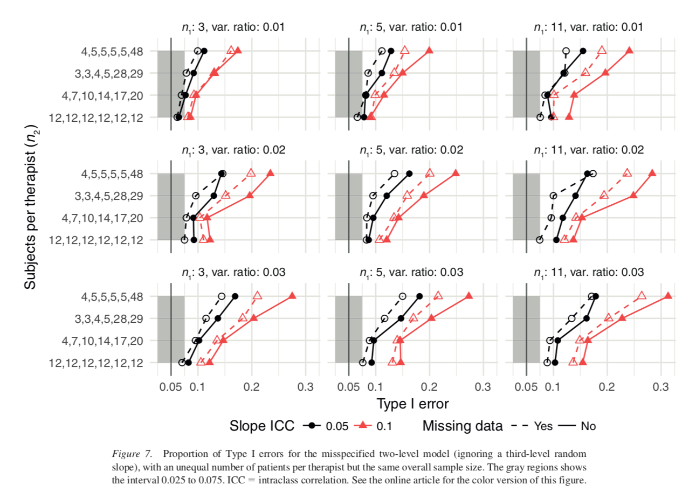

We just published a paper, [The consequences of ignoring therapist effects in trials with longitudinal data: A simulation study](https://dx.doi.org/10.1037/ccp0000333), where we show that trials on psychological interventions continue to ignore the possibility of therapist effects, and show what factors influence the consequences of ignoring therapist effects in longitudinal data analysis. In the paper, we argue that therapist effects should be viewed as the between-therapist differences in the *rate of change*, and modeled using a random slope (not only a random intercept). 


We also reviewed the clinical trials published in JCCP during 2008 to 2017, and found that a majority of the trials performed a longitudinal analysis using linear mixed-effects models (LMM)–however none of the studies allowed for longitudinal therapist effects.

In the paper we show that when investigators incorrectly ignore even small therapist effects in longitudinal data, the Type I errors could be notably increased when:

- more subjects are allocated to each therapist
- more of the random slope variance is at the therapist level
- the total random slope variance is increased compared to the within-subject variance.
- allocation of patients to therapists is unbalanced.




We investigate the 3-level model with a random slope at the therapist level, and show that it offers an easy way to keep Type I errors at the correct level–even with as few as 2 therapists (when Satterthwaite *dfs* were used). A large number of different simulation conditions were used, including missing data, partially nesting, and unbalanced allocation of patients to therapists.

We conclude that investigators should include enough therapists both so that the 3-level model has enough power, and that the variance components can be investigated without bias. There are several reasons for this; in clinical psychology, the treatment and the study therapists are intimately intertwined, and they cannot be easily separated in the analysis. The importance of the therapists is basically recognized in all trials and a lot of effort is put into training, supervising, monitoring adherence, etc. Which makes it the more strange that all studies assume all therapists are equally effective in their analysis. 

In the paper, we focus on LMMs, but we are aware that there are other options to deal with therapist effects, like fixed effects or design-based methods. We do not investigate these models in this article. These models have been extensively discussed in clinical psychology and there is wide agreement that random effects models are preferred. Personally, I agree, and especially regarding therapist effects, that a random effects (partial pooling) model is generally preferred compared to e.g. fixed effects (no pooling/dummy coding) models. 

# Software & Code
All code is available from [https://osf.io/egj4m/](https://osf.io/egj4m/). The simulations use my R package `powerlmm`, which can be used to:

- investigate the consequences of ignoring therapist effects
- calculate power (will depend a lot on the number of therapists)
- see if the variance components are estimated with bias when few therapists are included.

Basically, the simulations in the article are based on the following code (using a large combination of parameter values)

```r
library(powerlmm)
p <- study_parameters(n1 = 11,
                      n2 = 30,
                      n3 = 3,
                      icc_pre_subject = 0.5,
                      icc_pre_cluster = 0,
                      icc_slope = 0.05,
                      var_ratio = 0.02,
                      cor_subject = -0.4, 
                      partially_nested = FALSE,
                      dropout = dropout_weibull(0.3, 1),
                      cohend = 0)

## lme4 formula for correct and misspecified model
f0 <- "y ~ treatment * time + (1 + time | subject) + (0 + time | cluster)"
f1 <-  "y ~ treatment * time + (1 + time | subject)"
f <- sim_formula_compare("Correct 3-lvl" = f0,
                         "Wrong 2-lvl" = f1)

# perform simulation
res_bal <- simulate(object = p,
                    nsim = 2000,
                    formula = f,
                    satterthwaite = TRUE,
                    cores = 1)

summary(res_bal)
```

# Reference
Magnusson, K., Andersson, G., & Carlbring, P. (2018). [The consequences of ignoring therapist effects in trials with longitudinal data: A simulation study](https://dx.doi.org/10.1037/ccp0000333). Journal of Consulting and Clinical Psychology, 86(9), 711-725. doi:10.1037/ccp0000333
