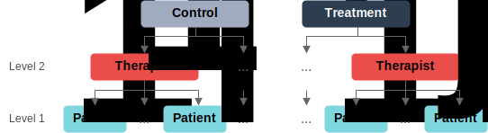

import ImgWrapper from "./wrapper";

Although therapist effects have been discussed for as long as psychotherapy research has existed, they seem poorly understood from a causal inference perspective, and interpretations are mostly based on "variance-explained" measures that confound non-causal and causal factors. This page is a supplemental interactive visualization of the ideas proposed in the paper: Magnusson, K. (2023, in preparation). [*A Causal Inference Perspective on Therapist Effects.*](https://psyarxiv.com/f7mvz)

Therapist effects are usually described and estimated using a 2-level multilevel model. In a 2-level model where the therapists are fully nested within treatments, the regression for the *i*th participant’s outcome $y_{ij}$ belonging to therapist *j* is given by,
$$
y_{ij} = \beta_{0j} + e_i
$$

The second level, the therapist level, includes the treatment effect,
$$
\beta_{0j} = \gamma_0 + \delta_1 x_j + u_j,
$$
where the random effects are assumed to be normally distributed and independent, $u_{j} ~ \sim\mathcal{N}(0, \sigma_u^2)$ and
$e_{ij} ~ \sim\mathcal{N}(0, \sigma_e^2)$. The treatment indicator $x_j$ is coded 0 for the control and 1 for the treatment group. The multilevel structure is illustrated in Figure 1 below. Of course, this app can be used to understand other types of clustering as well, such as pupils nested within teachers, patients nested within centers, and so on.

<ImgWrapper>

</ImgWrapper>

The sliders below can be used to control how much therapists from the different treatment groups overlap. The distributions represent the variability in treatment effects depending on the therapist delivering the treatment. The distance between the two distributions is controlled by the Cohen's *d* slider, which changes $\delta_1$, and the ICC slider controls the spread of the distributions by changing $\sigma_u$.